#Parte 1 - Creación de recursos 
<span class="alert alert-info">
Los titulos estan en español y los screenshos en inglés de forma intencional para poder guiar a personas con el portal configurado en cualquier de los dos idiomas</span>

<span id="Tarea1" />
##Tarea 1 - Creación de recursos desde el desde el portal
1. Ingresa e inicia sesión en http://portal.azure.com
1. Damos click en "Grupo de Recursos"

	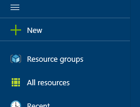
1. Seguidamente damos click adicionar 

	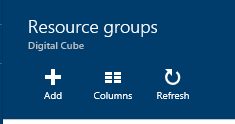
1. En el panel que se abre ponemos como nombre al grupo de recursos "NinjaLab", nos aseguramos de tener el checkbox habilitado y damos click en crear

	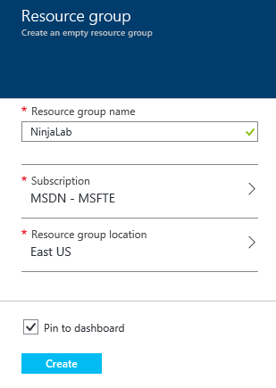
1. Recibiermos una notificación cuando el cambio se haya aplicado

	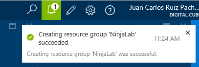
1. Desde el menú principal damos click en "Nuevo", "Computo" y finalmente en "Ubuntu Server" tal como se ve en la gráfica

	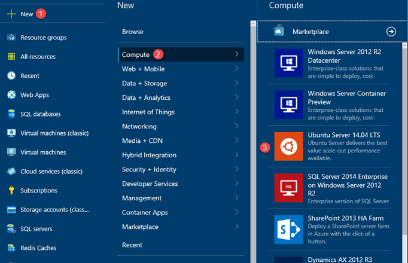
1. En la parte inferior del nuevo panel abierto seleccionamos "Administrador de recursos" y damos click en "Crear"

	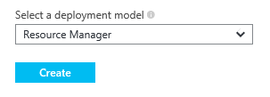	
1. El panel "Básico" se abre automáticamente, allí establecemos como nombre de la máquina virtual el que desees, en este caso "ninja-vm", debes utilizar otro nombre porque seguro este ya estará utilizado.
1. Ingresamos como nombre del administrador "ninja-admin" y en password aségurte de usar uno que puedas recordar.
1. Damos click en "Grupo de recursos"  y en la lista desplegada seleccionamos "Ninja-Lab"

	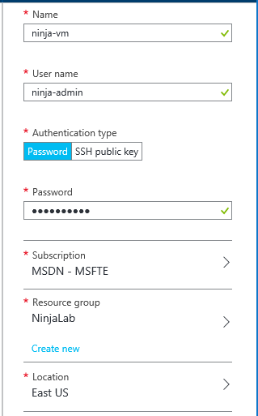	
1. Damos click en "Crear", luego de esto estaremos en la etapa "2 - Tamaño "
1. En el panel que se abre podemos escoger un tamaño para la máquina virtual, antes de escogerlo damos click en "Ver todo" para ver todas las opciones posibles.

	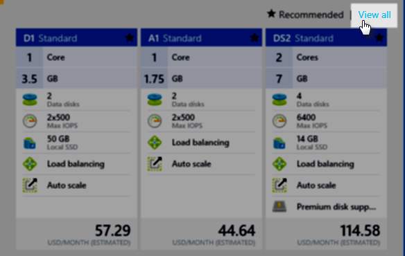	
1. De las opciones desplegadas selecionamos "A2 Standard" y damos click en el botón de la parte de abajo que dice "Seleccionar"
1.  Ahora estamos en la etapa "3 - Configuración"

	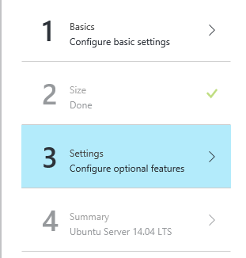
1. Aquí podemos seleccionar el tipo de almacenamiento para la MV, la configuración de la red , el monitoreo y los grupos de disponibilidad. Sin embargo para efectos de este laboratorio las opciones por defecto funcionan de manera adecuada, así que damos click en "OK".

	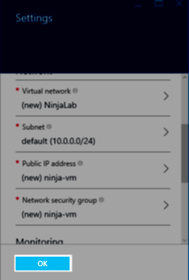
1. Ahora estamos en la etapa 4, que no es otra cosa que el resumen de las configuraciones que acabamos de hacer. Damos click en "OK"
1. En este punto los 4 item de la lista deben aparecer con un check verde, sino es así navega por ellos y acepta los cambios en cada uno.
1. Se generará una notificación indicando que se esta creando el recurso, en este caso una máquina virtual.

	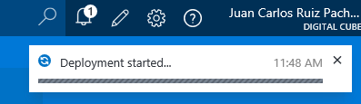
1. Este último paso tomará unos minutos, pero una vez finalice tu máquina virtual estará creada. **Puedes seguir avanzando con otras tareas del laboratorio** mientras el proceso sigue adelante.
1. Una vez termina el proceso recibiras una nueva notificación en el portal

	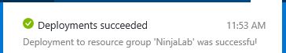
1. Descarga el [PuTTY](http://the.earth.li/~sgtatham/putty/latest/x86/putty.exe) para conectarte remotamente a tu máquina virtual
1. Desde PuTTY conétate con los datos de tu MV, utiliza la dirección IP pública que aparece en el dashboard de la MV en el portal de Azure

	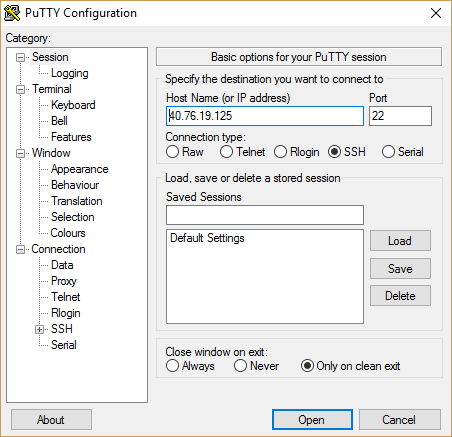
1. Al aparecer la siguiente pantalla ingresa como administrador "ninja-admin" y utliza el password que estableciste previamente

	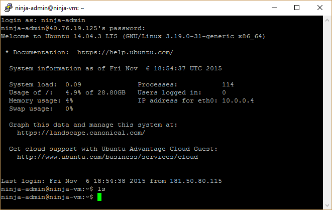
1. Fin 

<span id="Tarea2" />
##Tarea 2 - Configurar la consola multiplataforma de Azure

1. Desde la consola de comandos escribir `azure` y presionar ENTER, si tienes instalada la consola multiplataforma de Azure aparecerá lo siguiente en pantalla de lo contrario debes instalarla desde aquí: [Xplat](http://go.microsoft.com/?linkid=9828653&clcid=0x40a)

	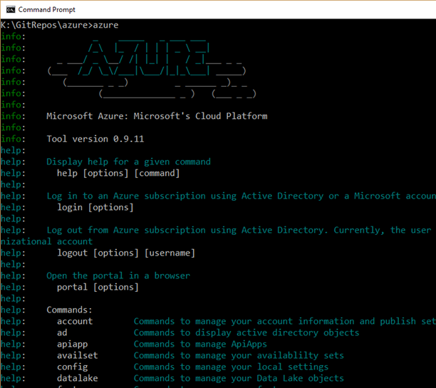
1. Para efectos de este NinjaLab debemos configurar la consola de comandos de Azure en modo ARM (Azure Resource Manager) que es como seguira evolucionando Azure en adelante.

	```console
	azure config mode arm
	```
1. Seguidamente ingresamos este comando, el cual arroja un mensaje similar al que se ve abajo

	```console
	azure login
	```
	```console
	To sign in, use a web browser to open the page http://aka.ms/devicelogin. 
	Enter the code FR6MCKRPA to authenticate. 
	If you're signing in as an Azure AD application, 
	use the --username and --password parameters.
	```
1. Así que... hacemos caso vamos a http://aka.ms/devicelogin en el browser y allí ingresamos el código que aparecio por la consola, en este caso `FR6MCKRPA` y damos click en continuar

	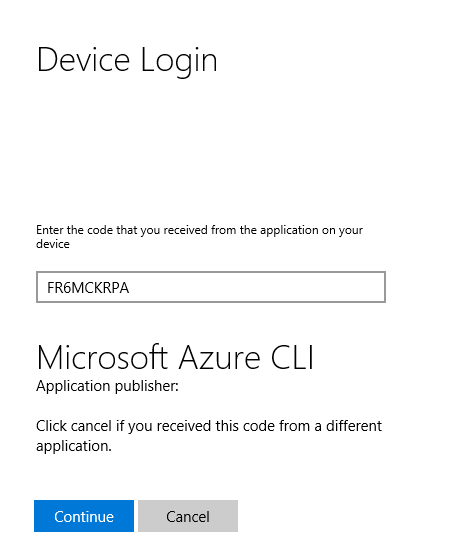
1. Luego de ello iniciamos sesión en el browser el cual confirmara que ya puedes cerrar la pagina, y despues de unos segundos en la consola aparecerá

	```console
	login command OK
	```
1. Puede que tengas varias suscriptiones de azure asociadas al mismo live Id, con este comando listamos las suscripciones disponibles

	```console
	azure account list
	```
	```console
	data:    Name                       Id                                    Current  State
	data:    -------------------------  ------------------------------------  -------  -------
	data:    MSDN - MSFTE               adcbda71-4f93-427c-9ce0-fd7d100a4e1d  true     Enabled
	data:    MSDN - MVP                 e5a421e7-e4b5-4eda-8512-d810d21040dc  false    Enabled
	data:    Demos Azure Subscriptions  cbf6d47d-b985-4018-ac3a-9da7a60a092e  false    Enabled
	```
1. de la lista desplegada idenifica cual corresponde a la suscripción con la que deseas trabajar, en mi caso "MSDN - MSFTE" así que ingreso el siguiente comando para establecerla como predeterminada

	```console
	azure account set "MSDN - MSFTE"
	```
1. Finalmente ingresamos este comando y verificamos que todo este en orden

	```console
	azure account show	
	```	
	```console
	info:    Executing command account show
	data:    Name                        : MSDN - MSFTE
	data:    ID                          : adcbda71-4f93-427c-9ce0-fd7d100a4e1d
	data:    State                       : Enabled
	data:    Tenant ID                   : bcc54008-4288-4ccd-b041-3225637c7154
	data:    Is Default                  : true
	data:    Environment                 : AzureCloud
	data:    Has Certificate             : No
	data:    Has Access Token            : Yes
	data:    User name                   : jnk@outlook.com
	```
1. Fin - NHK

<span id="Tarea3" />
##Tarea 3 - Creación de una máquina virtual desde la línea de comandos multiplataforma

1. Lo primero que debemos crear es un "Grupo de Recursos", lo llamaremos NinjaLabCMD

	```console
	azure group create -n NinjaLabCMD -l EastUS
	```
1. Crearemos una MV por consola, para ello necesitamos establecer los mismos parámetros de creación que en nuestra má1quina creada en la [Tarea 1](#Tarea1), esos son los pasos que seguiremos a continuación para crear el comando
1. Para crear una máquina virtual desde Xplat se pueden usar cualquiera de los siguientes comandos, Si los ejecutas cada uno seguido del comando -h obtendrás ayuda de la consola

	```console
	azure vm quick-create
	azure vm create
	```
1. Para efectos de este NinjaLab haremos uso de `quick-create` el cual nos permite crear la MV con un mínimo de opciones, para una configuración completa es necesario hacer uso de `create`.
1. Ingresamos este comando para establecer el grupo de recursos y el nombre de la máquina virtual, recuerda escoger un nombre de MV diferente al del ejemplo, que de seguro ese ya esta usado

	```console
	azure vm quick-create -g NinjaLabCMD -n ninja-vm-cmd 
	```  
1. Presiona *(Ctrl + C)* 2 veces y luego ENTER para cancelar el comando, ya que te pide parámetros adicionales
1. El primer parámetro adicional que necesitamos es la ubicación de la MV, como no sabemos las ubicaciones ingresamos el siguiente comando para obtenerlas

	```console
	azure location list > Locations.csv
	```
1. Esto genera un archivo separado por comas donde se listan todas las ubicaciones para cada uno de los servicios de Azure, puedes manipular este archivo desde excel para determinar las ubicaciones permitidas para el servicio de máquinas virtuales.
1. Sin embargo ya he hecho ese trabajo por ti, estos son los valores permitidos, al usarlos en la consola se deben suprimir los espacios en blanco
	* Brazil South
	* Central US
	* East Asia
	* East US
	* Japan East
	* Japan West
	* North Central US
	* North Europe
	* South Central US
	* Southeast Asia
	* West Europe
	* West US
1. Así que seleccionaremos la ubicación "EastUS", por lo que nuestro script ahora luce así. Al ejecutarlo pedirá más parámetros, cancela nuevamente la ejecución

	```console
	azure vm quick-create -g NinjaLabCMD -n ninja-vm-cmd -l EastUS
	```
1. El siguiente parámetro es el tipo de OS que queremos instalar, le indicaremos "Linux", ejecutalo pero de nuevo cancela la ejecución.

	```console
	azure vm quick-create -g NinjaLabCMD -n ninja-vm-cmd -l EastUS -y Linux
	```
1. Seguidamente adicionamos parámetros para el usuario y la contraseña, ejecutalo pero de nuevo cancela la ejecución.

	```console
	azure vm quick-create -g NinjaLabCMD -n ninja-vm-cmd -l EastUS -y Linux -u ninja-admin -p TUPASSWORD
	```
1. Ahora las cosas se ponen más interesantes, si seguiste los pasos la consola te estará pidiendo el parámetro `ImageURN` en el cual pones `Canonical:UbuntuServer:14.04.2-LTS:14.04.201507060` y LISTO... HEY pero estos son **NinjaLabs** para que te vuelvas un duro, un maestro!! de dónde sale ese valor
1. Para obtener ese valor debemos seguir los siguientes pasos, ese varlor es basicamente el medio (imagen) de instalación que usaremos para instalar Ubuntu, si recuerdas la [Tarea 1](#Tarea1) El OS que seleccionamos era **Ubuntu Server 14.04 LTS** así que navegaremos por la consola de comandos para que con ese datos logremos obtener el `ImageURN`
1. Con el siguiente comando obtendremos la lista de publishers que han publicado imagenes de MV en Azure, lo único 'raro' allí es la ubicación, pero ya aprendimos de donde se obtienen

	```console
	azure vm image list-publishers -l EastUS
	```
1. Ejecutar este comando nos trae una lista bastante larga, pero sabemos que Ubuntu es creado por "Canonical" así que buscaremos algo parecido a "Canonical" en la lista y allí deberiamos encontrar lo siguiente

	```console
	data:    Publisher                                             Location
	data:    ----------------------------------------------------  --------
	...
	data:    bwappengine                                           eastus
	data:    Canonical                                             eastus
	data:    catechnologies                                        eastus
	data:    cautelalabs                                           eastus
	data:    cds                                                   eastus
	```
1. Ahora que tenemos certeza de como Azure 'conoce' a "Canonical" le preguntaremos que ofertas de imagen tiene canonical en Azure

	```console
	azure vm image list-offers -l EastUs -p Canonical
	```
	```console
	data:    Publisher  Offer                    Location
	data:    ---------  -----------------------  --------
	data:    Canonical  Ubuntu15.04Snappy        eastus
	data:    Canonical  Ubuntu15.04SnappyDocker  eastus
	data:    Canonical  UbunturollingSnappy      eastus
	data:    Canonical  UbuntuServer             eastus
	```
1. La que nos interesa es `UbuntuServer`, ahora necesitamos conocer que versiones de `UbuntuServer` soporta "Canonical" en Azure , y esa pregunta la hacemos de las siguiente manera

	```console
	azure vm image list-skus -l EastUS -p Canonical -o UbuntuServer
	```
	```console
	data:    Publisher  Offer         sku                Location
	data:    ---------  ------------  -----------------  --------
	data:    Canonical  UbuntuServer  12.04.2-LTS        eastus
	data:    Canonical  UbuntuServer  12.04.3-LTS        eastus
	data:    Canonical  UbuntuServer  12.04.4-LTS        eastus
	data:    Canonical  UbuntuServer  12.04.5-DAILY-LTS  eastus
	data:    Canonical  UbuntuServer  12.04.5-LTS        eastus
	data:    Canonical  UbuntuServer  12.10              eastus
	data:    Canonical  UbuntuServer  14.04-beta         eastus
	data:    Canonical  UbuntuServer  14.04.0-LTS        eastus
	data:    Canonical  UbuntuServer  14.04.1-LTS        eastus
	data:    Canonical  UbuntuServer  14.04.2-LTS        eastus
	data:    Canonical  UbuntuServer  14.04.3-DAILY-LTS  eastus
	data:    Canonical  UbuntuServer  14.04.3-LTS        eastus
	data:    Canonical  UbuntuServer  14.10              eastus
	data:    Canonical  UbuntuServer  14.10-beta         eastus
	data:    Canonical  UbuntuServer  14.10-DAILY        eastus
	data:    Canonical  UbuntuServer  15.04              eastus
	data:    Canonical  UbuntuServer  15.04-beta         eastus
	data:    Canonical  UbuntuServer  15.04-DAILY        eastus
	data:    Canonical  UbuntuServer  15.10              eastus
	data:    Canonical  UbuntuServer  15.10-alpha        eastus
	data:    Canonical  UbuntuServer  15.10-beta         eastus
	data:    Canonical  UbuntuServer  15.10-DAILY        eastus
	```
1. Al terminar la lista identificamos que hay varias versiones de "Ubuntu 14.04 LTS" así que seleccionaremos la más reciente, en este caso `14.04.3-LTS`
1. Ahora que ya tenemos esos datos probemos preguntando a Azure la lista de imagenes y sus correspondientes URN con este comando

	```console
	azure vm image list EastUS Canonical
	```
1. Genial hay tantas que no se puede ni leer, pero para eso tenemos los parámetros adicionales
	* Canonical
	* East US
	* Ubuntu Server
	* 14.04.3-LTS
 	```console
	azure vm image list -l EastUS -p Canonical -o UbuntuServer -k 14.04.3-LTS
	```
	```console
	data:    Publisher  Offer         Sku          OS     Version          Location  Urn
	data:    ---------  ------------  -----------  -----  ---------------  --------  --------------------------------------------------
	data:    Canonical  UbuntuServer  14.04.2-LTS  Linux  14.04.201503090  eastus    Canonical:UbuntuServer:14.04.2-LTS:14.04.201503090
	data:    Canonical  UbuntuServer  14.04.2-LTS  Linux  14.04.201505060  eastus    Canonical:UbuntuServer:14.04.2-LTS:14.04.201505060
	data:    Canonical  UbuntuServer  14.04.2-LTS  Linux  14.04.201506100  eastus    Canonical:UbuntuServer:14.04.2-LTS:14.04.201506100
	data:    Canonical  UbuntuServer  14.04.2-LTS  Linux  14.04.201507060  eastus    Canonical:UbuntuServer:14.04.2-LTS:14.04.201507060
	```
1. En la última columna tenemos el Urn de cada una de las imágenes con "UbuntuServer 14.04.2-LTS", seleccionaremos la versión más reciente, en este caso `14.04.201507060` a la cual le corresponde el siguiente Urn `Canonical:UbuntuServer:14.04.2-LTS:14.04.201507060`
1. Ahora si, el comando completo para crear nuestra MV con las especificaciones necesarias es el que se ve abajo , adicionandole como 'condimento' el parámero --json lo cual puede servirnos de ayuda más adelante. Este parámetro hace que el resumen de los recursos creados aparezca en este formato; no tiene impacto sobre la infraestrctura creada.

	```console
	azure vm quick-create -g NinjaLabCMD -n ninja-vm-cmd -l EastUS -y Linux -Q Canonical:UbuntuServer:14.04.2-LTS:14.04.201507060 -u ninja-admin -p TUPASSWORD --json
	```
1. Este proceso tomará varios minutos, puedes seguir avanzando en el NinjaLab mientras tanto.
1. La salida por consola genera una cadena json similar a esta, guardemosla en un archivo ya que la necesitaremos en una Tarea más adelente

	```.json
	{
	"extensions": [],
	"tags": {},
	"hardwareProfile": {
		"virtualMachineSize": "Standard_D1"
	},
	"storageProfile": {
		"dataDisks": [],
		"imageReference": {
		"publisher": "Canonical",
		"offer": "UbuntuServer",
		"sku": "14.04.2-LTS",
		"version": "14.04.201507060"
		},
		"oSDisk": {
		"operatingSystemType": "Linux",
		"name": "cli5594cf420000779d-os-1446842103219",
		"virtualHardDisk": {
			"uri": "https://cli5594cf420000779d14468.blob.core.windows.net/vhds/cli5594cf420000779d-os-1446842103219.vhd"
		},
		"caching": "ReadWrite",
		"createOption": "FromImage"
		}
	},
	"oSProfile": {
		"secrets": [],
		"computerName": "ninja-vm-cmd",
		"adminUsername": "ninja-admin",
		"linuxConfiguration": {
		"disablePasswordAuthentication": false
		}
	},
	"networkProfile": {
		"networkInterfaces": [
		{
			"referenceUri": "/subscriptions/adcbda71-4f93-427c-9ce0-fd7d100a4e1d/resourceGroups/NinjaLabCMD2/providers/Microsoft.Network/networkInterfaces/ninja-eastu-1446842102603-nic"
		}
		]
	},
	"diagnosticsProfile": {
		"bootDiagnostics": {
		"enabled": false
		}
	},
	"provisioningState": "Succeeded",
	"id": "/subscriptions/adcbda71-4f93-427c-9ce0-fd7d100a4e1d/resourceGroups/NinjaLabCMD2/providers/Microsoft.Compute/virtualMachines/ninja-vm-cmd",
	"name": "ninja-vm-cmd",
	"type": "Microsoft.Compute/virtualMachines",
	"location": "eastus"
	}
	```

<span id="Tarea4" />
##Tarea 4 - Creación de un website desde el portal 

1. Ahora en el mismo grupo de recursos **NinjaLabCMD** crearemos un sitio web, para ello primero identificaremos los web farms disponibles en nuestra suscripción, desde el portal de azure damos click en "Buscar" 

	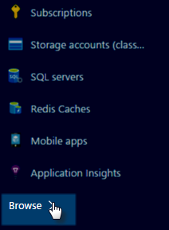
1. En el nuevo panel abierto buscamos "Planes de servicio de Apps"

	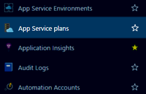
1. Verificamos si en la lista que aparece hay algún plan para la región "East US", sino lo hay continuamos
1. En el portal vamos a Nuevo, Web + Mobile , Web App y en este panel entramos a "App Service plan / Location"

	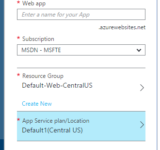
1. Allí damos click en "Crear Nuevo", lo nombramos "Ninja-WebPlan" y nos aseguramos de que este ubicado en "East US" y tenga como "Price Tier" **B1 Basic**, y damos click en "OK"

	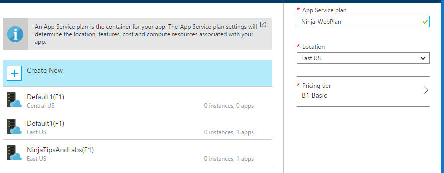
1. Seguidamente al sitio lo nombramos "ninja-web" ,utiliza otro nombre ya que este ya queda usado.
1. En el grupo de recursos selecciona el grupo de recursos "NinjaLab" creado en [Tarea 1](#Tarea1)
1. Dale click en crear, esto tomara unos pocos minutos
1. Una vez creado desde el portal de Azure ve a "Grupos de Recursos"

	
1. Y en la lista que aparece seleccionamos "NinjaLabs"
1. En el panel que aparece encontramos la lista completa de recursos creados hasta el momento en ese grupo de recursos incluyendo todo lo necesario para nmuestra máquina virtual de [Tarea 1](#Tarea1) y todo lo necesario para este website incluyendo el "App Service Plan" y un servicio de "App Insights"

	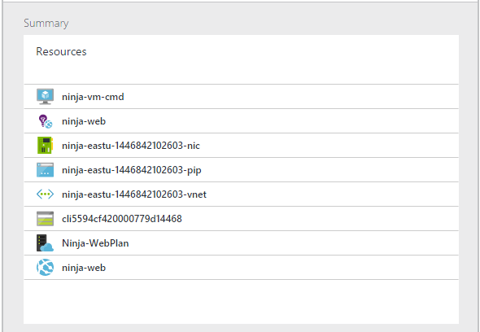
1. Ingresa a tu nuevo sitio dando click

	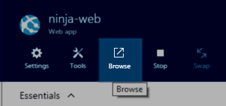
1. El sitio que se abre se debe ver como este

	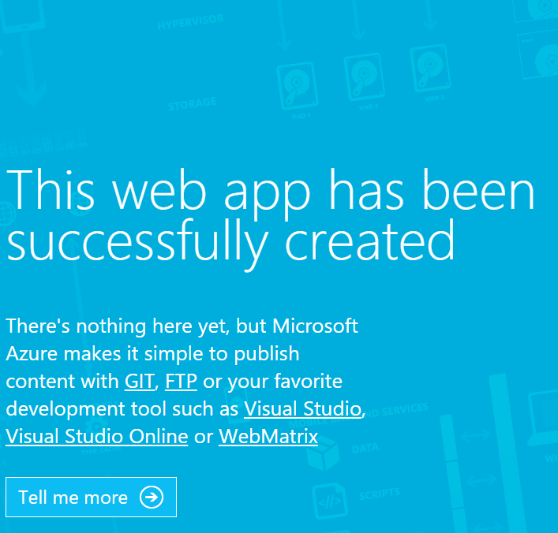

	
<span id="Tarea5" />
##Tarea 5- Creación de un website desde la línea de comandos multiplataforma 

1. Desde la línea de comandos ejecutamos el siguiente comando para crear un web site 
	* en el grupo de recursos **NinjaLabCMD** donde creamos la MV por consola en la [Tarea 3](#Tarea3)
	* Región **East US**
	* En el mismo "App Service Plan" creado en la [Tarea 4](#Tarea4)
	
	```console
	azure webapp create -g NinjaLabCMD -n ninja-webcmd  -l EastUs -p "Ninja-WebPlan"
	```
1. Como veras ahora que sabemos más de la consola de comandos las cosas parecen ser mucho más fáciles y comprensibles, no entraremos en detalles por ello mismo.

	```console
	info:    Executing command webapp create
	+ Creating webapp ninja-webcmd
	info:    Webapp ninja-webcmd has been created
	info:    webapp create command OK
	```
1. Desde el portal de Azure revisamos el grupo de recursos "NinjaLabCMD" y allí aparecen los recursos de la MV y del nuevo web site creado.

1. Fin NHK


###Final Parte 1

>Hemos visto como podemos crear recursos en Azure y mantenerlos agrupados por medio del grupo de recursos, esto es muy importante ya que las soluciones de software usualmente constan de una infraestructura compleja con muchos componentes, como pudimos observar el grupo de recursos contiene todos los elementos necesarios para sostener la infraestructura incluyendo Maquinas Viertuales, Websites, Bases de Datos y decenas de componentes más.

#Parte 2 - Infraestructura como código 

Ahora que tenemos claro que son los grupos de recursos y estamos más familiarizados en la creación de recursos tanto desde el portal como desde la consola de comandos llegamos al concepto de **IAC** : **I**nfrastructure **A**s **C**ode.

En escencia los conocimientos que acabamos de adquirir nos permiten pensar en la posibilidad de crear infraestructura de manera automatizada, y con ello la posibilidad de mantener nuestros ambientes de ejecución como otro asset más en el ciclo de vida del software.

De esta forma, no solo el código de la aplicación es versionado sino que tambien la infraestructura puede serlo. Esto nos permite crear nuevas infraestructuras de manera muy rápida ya que un ambiente confugurado a manera de script puede reproducirse muy rápidamente con tan solo un click.

Así podemos clonar nuestros ambientes de manera muy rápida y precisa, pero tambien podemos enlazar la integridad del ambiente y la manera como se conecta con la aplicación a traves de provesos de Integración continua.

A la final contamos con la posibilidad de desplegar diferentes versiones de la infraestructura de la aplciación de acuerdo a las necesidades de esta misma en diferntes versiones o branch, y podemos disparar modificaciones de la infraestructura de manera automática con el despliegue de nuevas versiones, llevando nuestra capacidad de implemetación de soluciones a un nuevo nivel de productividad y eficiencia.

Este será el tema de esta parte del Ninja Lab

<span id="Tarea6" />
##Tarea 6 - Creación de un sitio web básico en Visual Studio

1. Abrimos Visual Studio 2015 y agregamos un nuevo proyecto Web de tipo ASP.Net MVC como se ve a continuación

	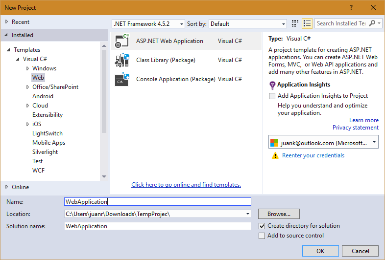
1. Y lo configuramos de la siguiente forma

	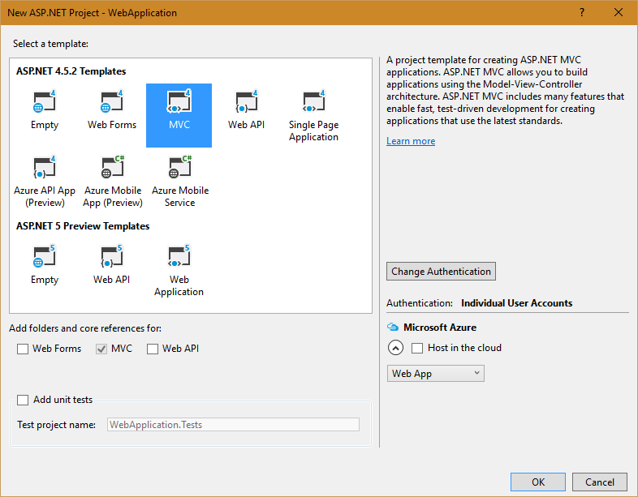
1. Una vez se haya creado lo enviamos a ejecución y se debe ver así

	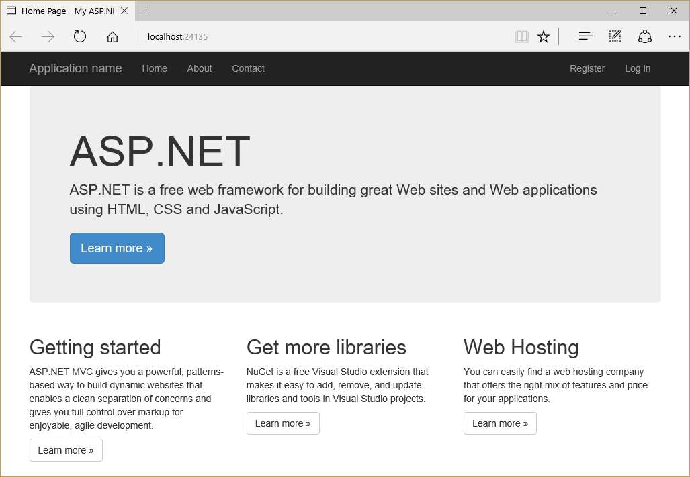
1. 	Detenemos la ejecución
1. En la solución creada agregamos un nuevo proyecto
	
	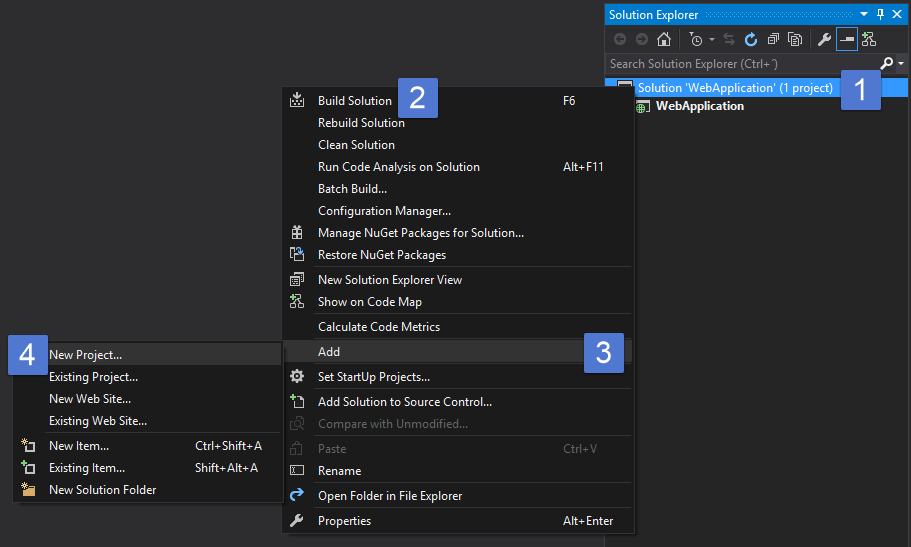
1. 	Seleccionamos Cloud, Azure Resource Group y lo nombramos "Ninja-ResourceGroup"
		
	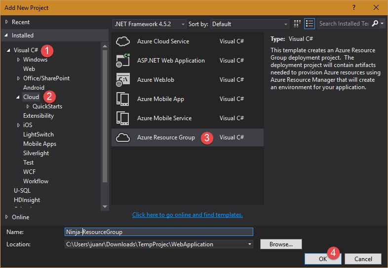
1. En el recuadro que se abre seleccionamos el template de "Ubuntu Server"
		
	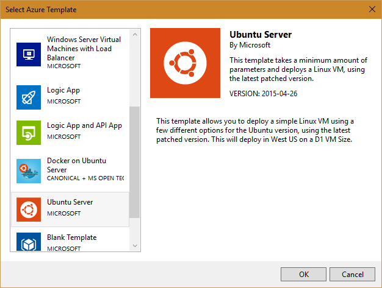
1. 	El nuevo poyecto creado luce así, cada unos de sus componentes es descrito a continuación.
		
	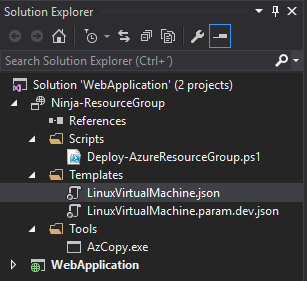
	* **Scripts/Deploy-AzureResourceGroup.ps1** : Archivo de powershell para crear infraestructura con base en un archivo que representa un grupo de recursos
	* **Templates/LinuxVirtualMachine.json** : Template que representa un grupo de recursos **¡HEY ALTO!**
	Se te parece al archivo **json** que generó la creación de la máquina Virtual en la  [Tarea 3](#Tarea3) ? por supuesto, este es un poco más elaborado ya que algunos valores estan establecidos de manera genérica para recibirlos como parámetros, pero es en escencia el mismo! Así que ya sabes que podemos describir todo un recurso o grupo de recursos en nu archivo Json y no solo eso sino que de ser necesario podemos hacerlo paramétrico :clap: /play greatjob
	* **Templates/LinuxVirtualMachine.param.dev.json** : Desde luego el archivo que contiene los parámetros que se solicitan en el archivo anterior. Con algo de tiempo puedes examinar el script de powershell y encontrarás que entre todas las cosas que hace tambien llama al archivo **JSon** que define el grupo de recursos y le pasa los parámetros establecidos en el otro archivo
1. Desde el portal de Azure creamos un nuevo Grupo de Recursos y lo llamaremos "Ninja-ResourceGroupVS", ya sabes como crearlo pues lo hemos hecho enlas tareas anteriores.	
1. Editamos el archivo **LinuxVirtualMachine.param.dev.json** colocando los valores faltantes quedando de la siguiente forma. (recuerda usar un nombre de storage diferente pues este ya esta usado)

	```.json
	{
		"$schema": "https://schema.management.azure.com/schemas/2015-01-01/deploymentParameters.json#",
		"contentVersion": "1.0.0.0",
		"parameters": {
			"newStorageAccountName": {
				"value": "ninjastorage899"
			},
			"adminUsername": {
				"value": "ninja-admin"
			},
			"dnsNameForPublicIP": {
				"value": "ninja-vm-iac"
			}
		}
	} 
	```
1. Editamos el archivo **Scripts/Deploy-AzureResourceGroup.ps1** cambiando el nombre del Resource Group por "Ninja-ResourceGroupVS" de la siguiente forma

	```.json
	Param(
		[string] [Parameter(Mandatory=$true)] $ResourceGroupLocation,
		[string] $ResourceGroupName = 'Ninja-ResourceGroupVS',  
		[switch] $UploadArtifacts,
		[string] $StorageAccountName,
		[string] $StorageAccountResourceGroupName, 
		[string] $StorageContainerName = $ResourceGroupName.ToLowerInvariant() + '-stageartifacts',
		[string] $TemplateFile = '..\Templates\LinuxVirtualMachine.json',
		[string] $TemplateParametersFile = '..\Templates\LinuxVirtualMachine.param.dev.json',
		[string] $ArtifactStagingDirectory = '..\bin\Debug\staging',
		[string] $AzCopyPath = '..\Tools\AzCopy.exe',
		[string] $DSCSourceFolder = '..\DSC'
	)	
	```
1. Cuando abrimos este archivo Visual Studio nos puede mostrar ayudas adicionales de edición entre ellas
	* Intellisense (o sea autocompletado de código)
	* JSON Outline
1. Para abrir el JSON Outline vamos al menú y seguimos estos pasos
		
	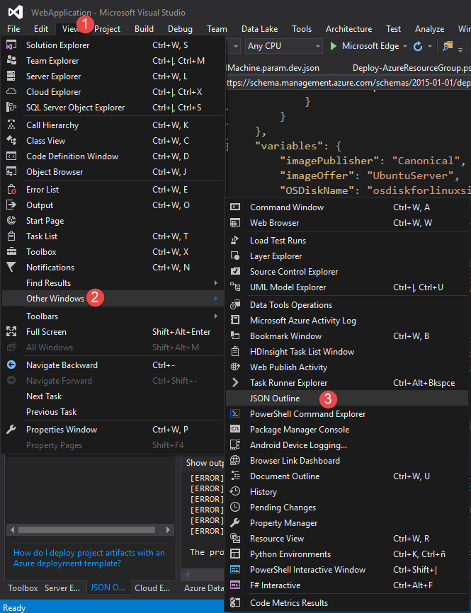
1. Una vez abierto vamos a la sección variables y vemos esto, al dar click en cada variable el editor se posiciona en la línea de código correspondiente.
		
	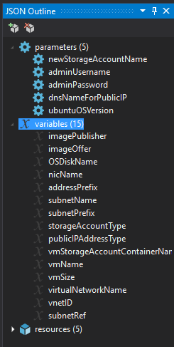
1. Editamos algunas de las variables, recuerda seleccionar un nombre diferente de MV, esto es para el valor por defecto.

	```.json
	"vmName": "ninja-vm-iac-u",
	"vmSize": "Standard_A2",
	```	
1. En el mismo archivo buscamos el parámetro `adminPassword` y cambiamos el tipo a `string` quedando así

	```.json
	"adminPassword": {
		"type": "string",
		"metadata": {
			"description": "Password for the Virtual Machine."
		}
	```	
1. Guardamos los cambios
1. Abrimos una consola de Azure PowerShell que se debe ver de la siguiente forma
		
	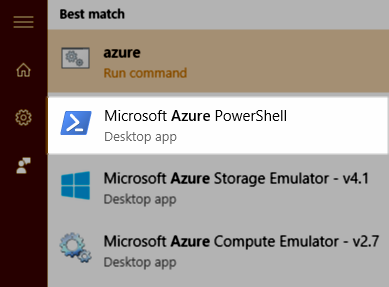		
1. Una vez abierta debemos ejecutarn el siguiente comando ya que por seguridad powershell no permite la ejecución de scripts
	
	```posh
	Set-ExecutionPolicy Unrestricted -Scope CurrentUser	
	```	
1. Ahora adicionaremos nuestra cuenta de azure con el siguiente comando

	```posh
	Add-AzureAccount
	```
1. Esto despliega una ventana de browser para hacer login, procedemos a hacerlo, una vez se cierre la ventana del browser en PowerShell presionamos ENTER y aparecerá algo como esto, mostrando nuestras suscripciones.

	```posh
	VERBOSE: Account "juank@outlook.com" has been added.
	VERBOSE: Subscription "MSDN - MSFTE" is selected as the default subscription.
	VERBOSE: To view all the subscriptions, please use Get-AzureSubscription.
	VERBOSE: To switch to a different subscription, please use Select-AzureSubscription.
	
		Id                             Type       Subscriptions                          Tenants
		--                             ----       -------------                          -------
		juank@outlook.com              User     adcbda71-4f93-427c-9ce0-fd7d100a4e1d   bcc54008-4288-4ccd-b041-3225637c7154
												e5a421e7-e4b5-4eda-8512-d810d21040dc   a204ff99-191e-48c1-a0c5-0c64fde30837
												cbf6d47d-b985-4018-ac3a-9da7a60a092e   1247fb4d-0044-46b1-b5e2-695aefe6aaca
																					398b62cc-1670-4ec4-a30d-bc07073c1775
	```	
1. Sino estamos seguros de cual corresponde a nuestra suscripción podemos ejecutar el siguiente comando para tener más detalles

	```posh
	Get-AzureSubscription
	```		
1. Seleccionamos nuestra suscripción y la ingresamos con el siguiente comando

	```posh
	Select-AzureSubscription "El nombre de mi suscripción"
	```
1. Cerramos Visual Studio y luego volvemos a abrir la solución
1. Abrimos nuevamente el archivo de PowerShell
1. Damos click con el botón derecho del mouse y seleccionamos Ejecutar Script
 		
	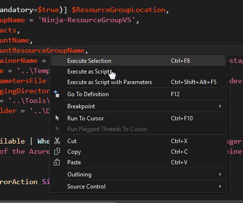	 	
1. Ingresamos los parámetros que se solicitan con los siguientes valores
 		
	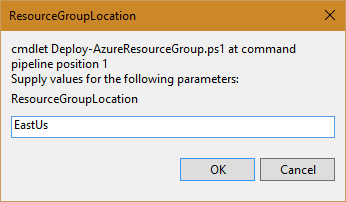	
	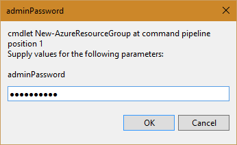
1. La ejecución tardará un poco, notaras que se esta ejecutando aún porque el toolbar de Visual Studio muestra la opción Stop

	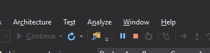
1. Si todo salio bien al revisar en la ventana **output** de Visual Studio veras algo similar a esto

	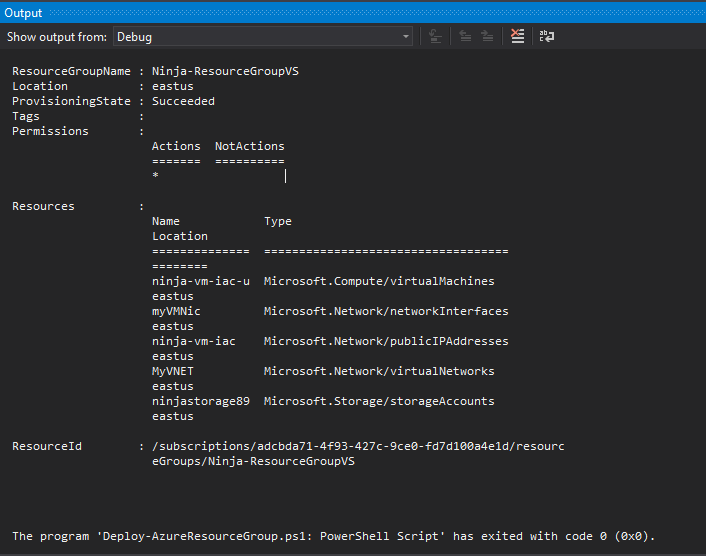
1. Sin embargo la prueba de fuego es revisar en el portal, revisa el grupo de recursos **Ninja-ResourceGroupVSResource**	 y podrás ver allí los recursos creados para la MV.

	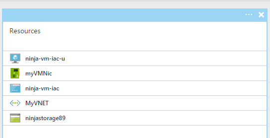

1. Fin NHK	
	
<span id="Tarea7" />
##Tarea 7 - Configuración de la cuenta y repositorio en Visual Studio Online

1. Visitamos http://visualstudio.com
1. Iniciamos sesión diligenciando los datos que se soliciten
1. Si sale este recuadro damos click en crear una cuenta nueva

	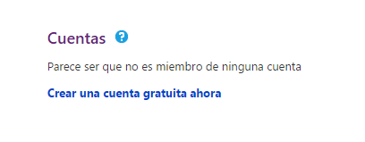
1. diligenciamos los datos soliictados y creamos la cuenta
1. Entramos a la url de nuestro Visual Studio Online similar a esta pero con el nombre que cada uno haya seleccionado https://juank.visualstudio.com/_createproject
1. Allí creamos un nuevo proyecto llamado **Ninja-VSO** y seleccionamos como control de código fuente: **Git**

	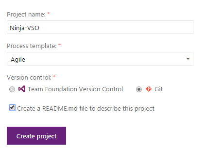
1. Creamos el proyecto
1. Una vez creado aparece un panel, damos click en "Add Code" 
1. En el panel que aparece copiamos la URL del repositorio de Git
1. De regreso en Visual Studio 2015 damos click derecho sobre la solución y adicionamos el control de codigo fuente de Git

	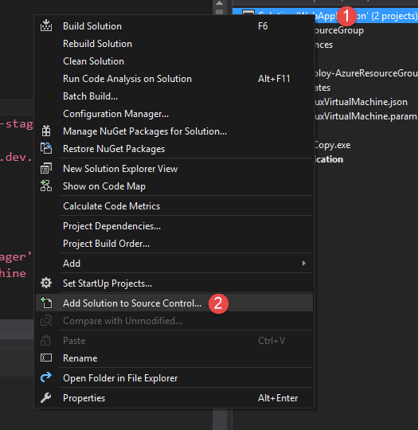
	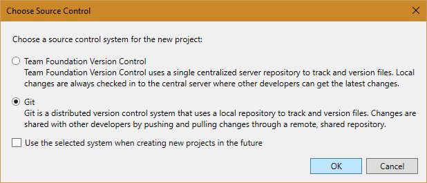
1. Hacemos nuestro primer commit

	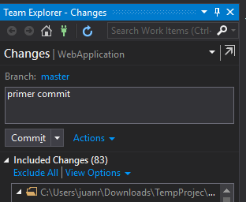
1. Cuando finalice damos click en Sync

	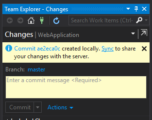
1. En donde dice "Publish to remote repository" pegamos la URL del repositorio de Git y luego presionamos el botón publicar

	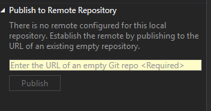
1. Si nos piden usuario y contraseña utilizamos los que salen en el portal
1. Cuando termine vamos a VSO (Visual Studio Online) y verificamos que aparezca nuestro código, entrando al proyecto y luego a la sección CODE.

	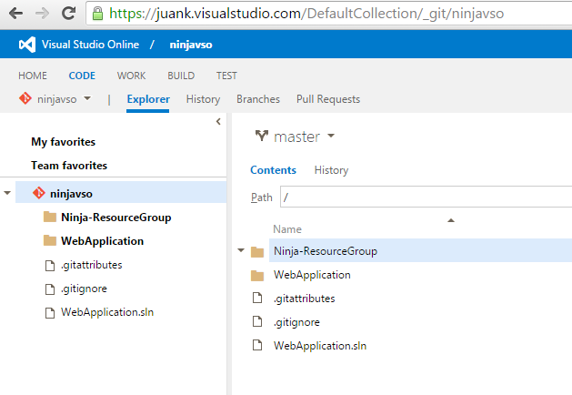

1. FIN

<span id="Tarea8" />
##Tarea 8 - Integrar el Release Management desde VSO con la solución de IAC

1. En VSO ir a la pestaña BUILD

	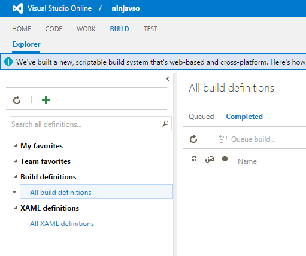
1. Dar click en el signo + y luego ir a la pestala "Deployment", donde seleccionaremos **empty** y luego damos click en Next.

	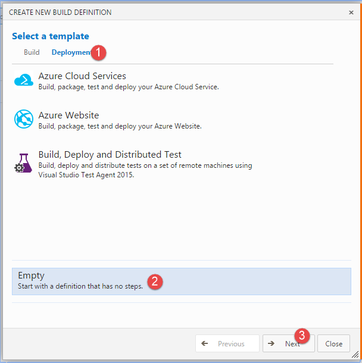
1. En la siguiente ventana habilitamos el check box y damos click en **Create**	

	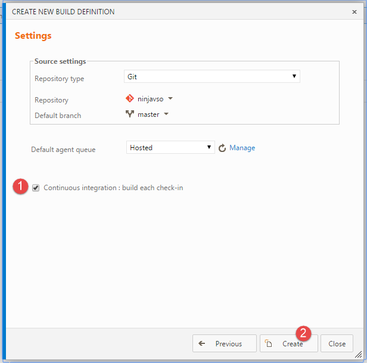
1. Ahora damos click en Guardar y le ponemos como nombre el valor que tiene por defecto
1. Adicionamos un nuevo paso de construcción siguiendo las indicaciones de la imagen

	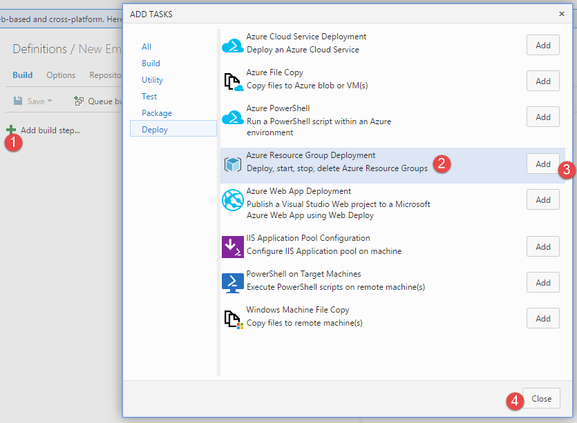
1. Allí aparecerá algo como esto

	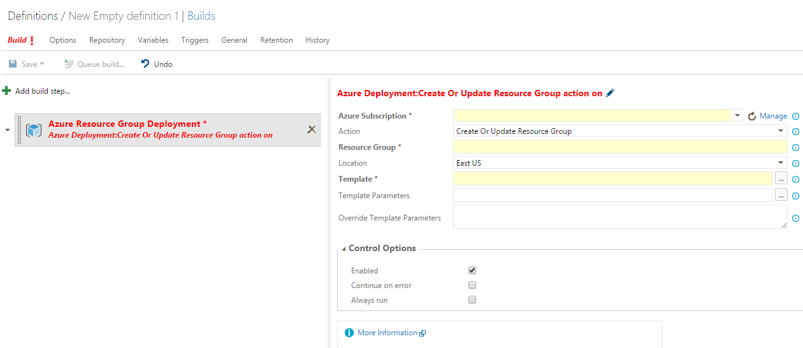
1. Para poder diligenciar estos campos es necesario que autoricemos nuestra App desde El diretorio actuvo de nuestra cuenta de Azure
1. Navegamos a https://manage.windowsazure.com
1. Allí seleccionamos el directorio activo de nuestra suscripción

	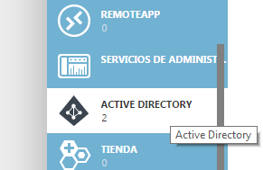
1. Vamos a la pestaña APLICACIONES y damos click en Agregar

	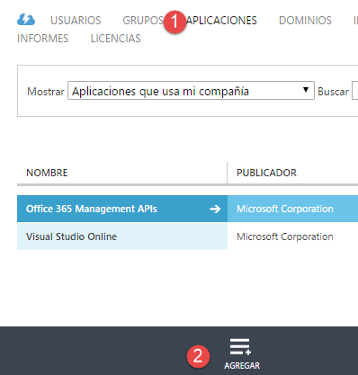
1. Seleccionamos luego la primera opción

	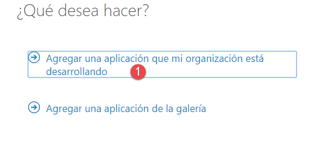
1. En el nombre de la aplicación escribimos "Ninja-IAC" y damos click en siguiente

	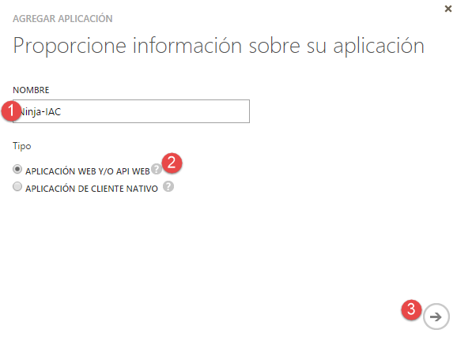
1. En las url que se solicitan escribimos alguna url similar a esta https://ninja-web-iac

	
1. Una ves procesado vamos a la pestaña Configurar, allí encontramos un valor llamado **Id del Cliente**, tomamos nota de el.
1. Más abajo aparece una sección llamada claves, seleccionamos 2 años y damos click en GUARDAR, una vez guardado aparecerá el valor de la clave, tomamos nota de ella porque este valor no vuelve a aparecer.

	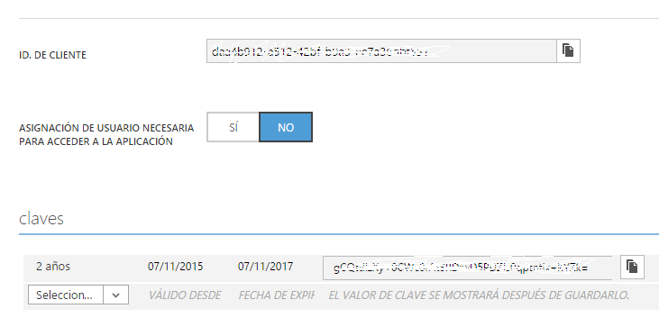
1. Ahora damos click en el botón VER EXTREMOS

	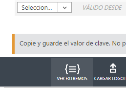
1. Cada una de las URL que aparecen allí tienen un GUID asociado, tomamos nota de ese GUID que debe ser similar a este , este GUID se conoce como **Tenant ID** `bcc54008-4288-4ccd-b041-3225637c7154`
1. Habiendo tomado nota de estos tres valores vamos de nuevo a la consola de PowerShell, al igual que como hicimos con la consola multiplataforma, debemos configurar esta consola en modo **Resource Manager**

	```posh
	Switch-AzureMode -Name AzureResourceManager
	```
1. Confiuramos la cuenta con este comando que nos hará iniciar sesión desde el browser

	```posh
	Add-AzureAccount
	```
1. La url que le pusimos a nuestra aplicación al matricularla en el Azure Active Directory la debemos usar para indicarle a Azure que ese será el identificador principal de nuestra aplicación para hacer contribuciones a azure desde aplicaciones externas. Tambien podemos utilizar el valor del Client ID si así lo preferimos. 	

	```posh
	New-AzureRoleAssignment -ServicePrincipalName https://ninja-web-iac -RoleDefinitionName Contributor
	```
	```posh
	RoleAssignmentId   : /subscriptions/adcbda71-4f93-427c-9ce0-fd7d100a4e1d/providers/Microsoft.Authorization/roleAssignme
						nts/b8f6a2b9-4d00-407f-988a-d3b31e4ae90f
	Scope              : /subscriptions/adcbda71-4f93-427c-9ce0-fd7d100a4e1d
	DisplayName        : Ninja-IAC
	SignInName         :
	RoleDefinitionName : Contributor
	RoleDefinitionId   : b24988ac-6180-42a0-ab88-20f7382dd24c
	ObjectId           : 64d8e43d-3860-4d8f-bf86-925d1f1902c7
	ObjectType         : ServicePrincipal
	```
1. Volvemos a VSO
1. Damos Click en MANAGE

	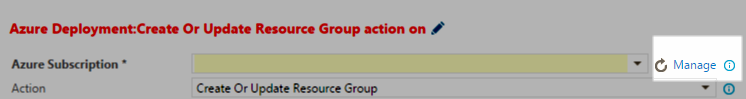
1. Esto abre una nueva ventana, allí seleccionamos las opciones que se ven en la imagen

	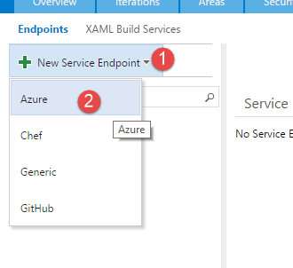
1. Colocamos el suscription Id , sino lo tenemos a la mano lo podemos obtener fácilmente, desde http://portal.azure.com en el grupo de recursos "Ninja-ResourceGroupVS" que hemos creado lo encontramos

	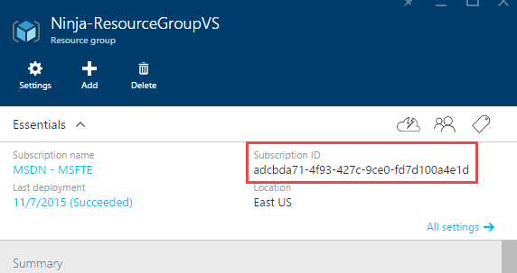
1. Diligenciamos los campos, le ponemos el nombre que querramos y en el check box marcamos "Service Principal"
1. En cada uno de los tres campos restantes ponemos respectivamente los datos que hemos anotado del portal de azure
	* Client ID
	* Key
	* Tenant ID
	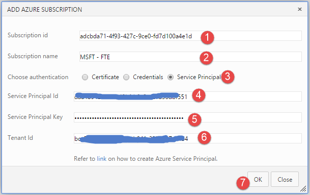	
1. De regreso a la ventana de VSO anterior diligenciamos los campos, ya que hora si hay suscripción de azure esta aparecer en lista desplegable, de paso los campos **Template** y **Template Parameters** damos click en el botón y buscamos los archivos respectivos en nuestra solución

	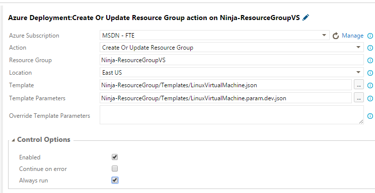	
1. Una vez puestos todos los valores damos click en SAVE y renombramos como "IAC Definition"

	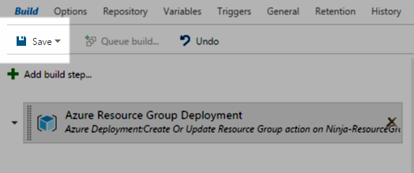	
1. Si observamos atentamente las mismas variables que nos pedia la ejecución del script las hemos ingresado en el panel, con excepción de una variable `adminPassword`
1. En el recuadro **Override Parameters** escribimos lo siguiente para sobre escribir el valor de esa variable del script `-adminPassword  $(password)` en este caso estamos indicando que tome el valor desde otra variable que configuraremos desde VSO.

	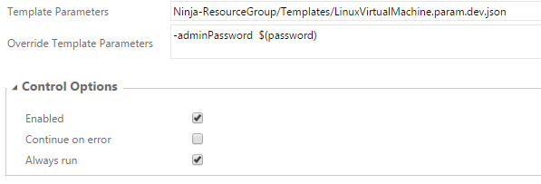	
1. En el panel de definiciones damos click en variables y allí creamos la variable password asignándole el valor que deseamos para la contraseña de la Máquina Virtual
	
	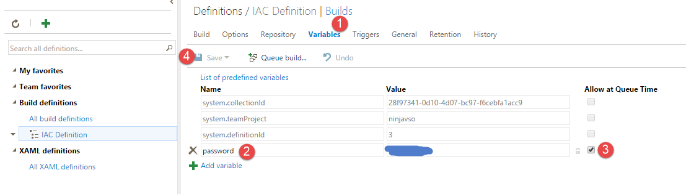	
1. Fin

<span id="Tarea9" />
##Tarea 9 - Prueba de integración

1. Desde el portal de Azure vamos al recurso "Ninja-ResourceGroupVS" en la lusta de recursos seleccionamos la máquina virtual existente y la borramos, este proceso tardará unbnos minutos.
1. Una vez borrada, vamos a Visual Studio 2015 y en la solución ASP.Net abrimos el archivo `Views/Home/Index.cshtml` al que le cambiaremos la etiqueta `<h1>` dejándola como aparece a Continuación

	```aspx
	<h1>Cambio para testear IAC</h1>
	<p class="lead">ASP.NET is a free web framework for building great Web sites and Web applications using HTML, CSS and JavaScript.</p>
	<p><a href="http://asp.net" class="btn btn-primary btn-lg">Learn more &raquo;</a></p>
	```
1. Guardamos y hacemos commit de los cambios
	
	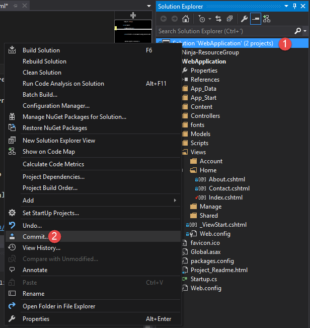	
	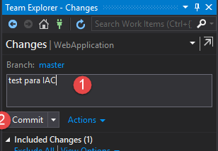	
1. Seguidamente hacemos **Sync** con el repositorio	
	
	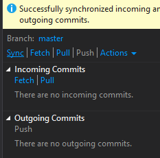	
1. Vamos al portal de VSO, sobre la definición damos click derecho y seleccionamos "View Builds"		
  	
	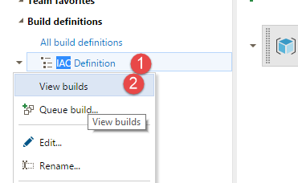	
1. Y en el panel derecho en la pestaña **Queued** aparecerá una nueva build encolada en proceso. Este build se generó al subir los cambios al repostorio.

	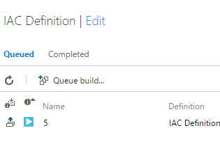	
1. Esto tardará unos minutos, revisa cuando la build desaparezca y una vez lo haya hecho ve a la pestaña **Completed**
1. Si todo salio como lo esperamos la build esta marcada como exitosa.
  	
	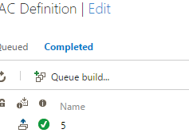	
1. Vamos al portal de Azure a revisar nuevamente el recurso "Ninja-ResourceGroupVS" 
1. La máquina virtual aparece nuevamente creada.
  	
	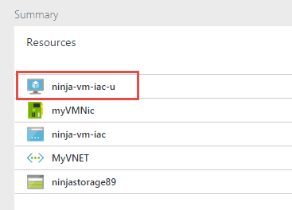	
1. FIN NHK

###Final Parte 2

>Hemos integrado la infraestructura con nuestra solución, ahora la infraestructura puede ser versionada y tratada como código. Cada vez que la aplicación genera una nueva versión el proceso de integración continua dispara los procesos de **build** definidos, el build "IAC Definition" lo hemos configurado para conectarse con nuestra cuenta de azure y desde allí lanzar un proceso en el Azure **Resource Manager** que validará la definición en el código de infraestructura de la aplicación (los archivos .json) **versus** lo que existe en ese momento. Las cosas que esten diferentes serán modificadas, los sobrantes serán borrados y las cosas nuevas serán incluidas.

>De esta forma garantizamos la integridad de la aplicación en todo momento. En este Lab hemos usando archivos de configuración sencillos pero podrian ser mucho más complejos incluyendo componentes como la escalabilidad de la maquina virtual, aplicaciones instaladas, bases de datos, web sites, cache y cualquiera de los otros servicios existentes en la nube de Azure.
