# Aprendizaje Automatizado con Windows Azure
En este laboratorio utilizaremos la suite de aprendizaje automatizado de Azure para crear modelos de clasificación y predicción de datos.

## Paso 1 - Ingresar a la suite de Aprendizaje Automatizado
1. Ingresar a **http://studio.azureml.net/**
1. Logearse con una cuenta de hotmail o outlook
1. Asegurarse de tener seleccionado el "Free-Workspace"  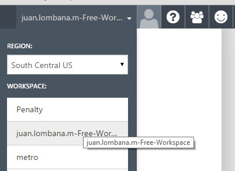
## Paso 2 - Crear el experimento
1. Hacer click en el botón "New" ubicado en la parte inferior derecha.  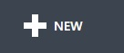
1. Seleccionar "Blank Experiment".
## Paso 3 - Diseñar el Experimento
1. En la parte izquierda encontrará el panel de herramientas.  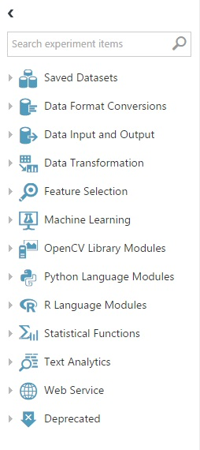
	* Aquí verá todas los elementos que puede arrastrar al Área de Diseño del experimento.
1. Arrastre al experimento el DataSet de ejemplo "Iris Two Class Data"  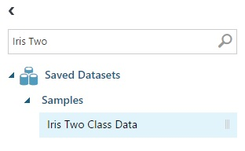 
	* Puede probar buscando por el nombre del componente en la parte superior del panel de herramientas.
	* Referencia del DataSet:
		* http://archive.ics.uci.edu/ml/datasets/Iris
		* http://cogmaster-stats.github.io/python-cogstats/auto_examples/plot_iris_analysis.html
		* https://azure.microsoft.com/en-us/documentation/articles/machine-learning-use-sample-datasets/
1. Arrastre al experimento el componente "Split Data", ubicado en la categoria "Data Transformation" / "Sample and Split"  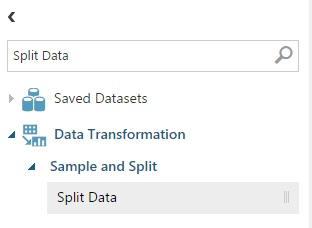
1. Conecte el nodo de salida del DataSet "Iris Two Class Data" con el nodo de entrada del componente "Split Data". (Los nodos compatibles se iluminarán en color verde).
1. Modifique la propiedad "Fraction of rows in the first output dataset" que inicialmente se encuentra en 0.5 a 0.8, esto indica que la división del conjunto de datos será de 80% para la primera salida y de 20% para la segunda salida.
1. Arrastre al área de diseño el componente "Train Model" ubicado en la categoria "Machine Learning" / "Train"
	* Conecte el nodo de salida izquierdo del componente "Split Data" al nodo de entrada derecho del componente "Train Model". 
	* En el panel de propiedades haga click en el boton "Launch column selector"
	* Escriba la palabra "Class" en el campo de texto de la ventana emergente.
	* Finalice haciendo click en el boton "Check" de la parte inferior.  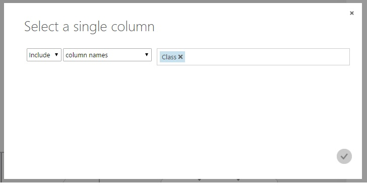
1. Arrastre al área de diseño el componente "Two-Class Neural Network" desde el panel de herramientas ubicado en la categoria "Machine Learning" / "Initialize Model" / "Clasification"  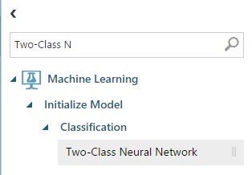
	* Conente el nodo de salida del componente "Two-Class Neural Network" al nodo de entrada izquierdo del componente "Train Model".
1. Arrastre al área de diseño el componente "Score Model" ubicado en la categoria "Machine Learning" / "Score".
	* Conecte el nodo de salida del componente "Train Model" al nodo de entrada izquierdo del componente "Score Model".
	* Conecte el nodo de salida derecho del componte "Split Data" al nodo de entrada derecho del componente "Scorte Model".

### Resultado del Ejercicio
 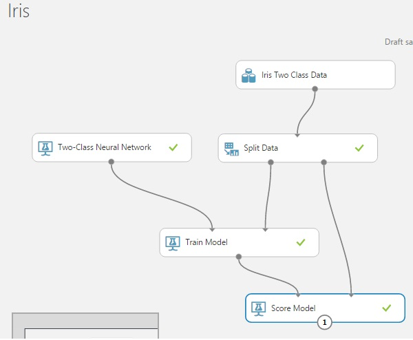

### Paso 4 - Ejecutar el modelo
1. Haga click en el botón "Run"  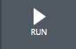
	* Esto validara el modelo y entrenará la red neuronal, además tomará el 20% de los datos de prueba y realizará una ejecución de prueba para que verifiquemos el resultado del entrenamiento.

### Paso 5 - Publicar el servicio web
1. Haga click en el botón "Set Up Web Service" y seleccione la opción "Predictive Web Sercice [Recommended]"  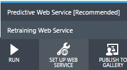
	* El Modelo se trasnformará en un servicio con entradas y salidas, verá en la parte superior dos pestañas, donde podrá editar el modelo y republicarlo.  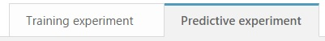
1. Ejecute el experimento configurado como servicio web
	* Haga click en el boton "Run"  
1. Despliegue el servcio web para consultarlo, haga click en el boton "Deploy Web Service"
 

### Paso 6 - Ejecutar prueba desde el cliente de pruebas de la suite.
1. Haga click en el botón "Test"  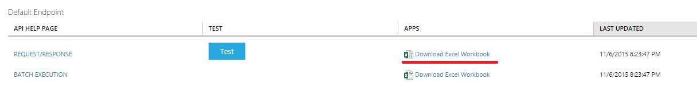
1. Ingrese los datos en la ventana para realizar la clasificación en la ventana  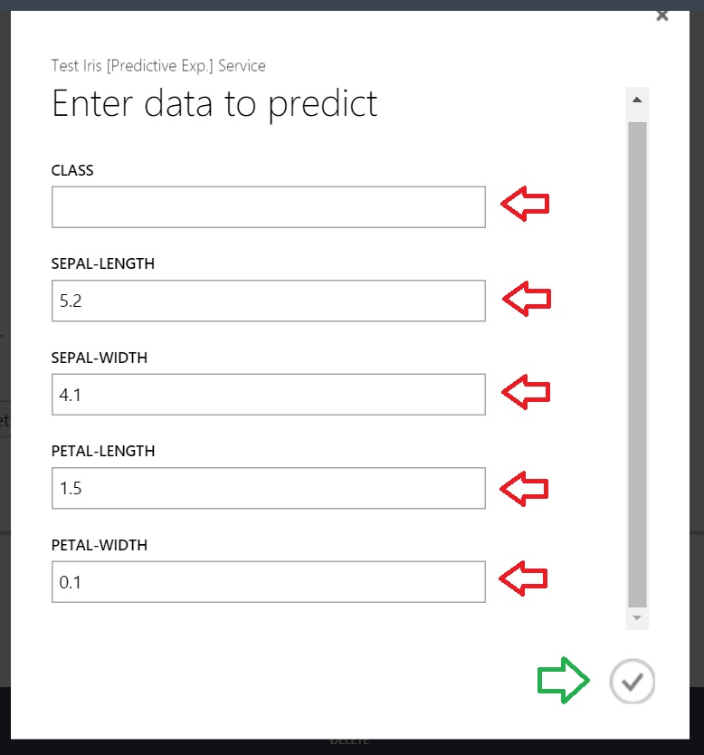
	* Ingrese los siguientes datos para realizar la primera clasificación: class: En blanco sepal-length: 5.2 sepal width: 4.1 petal length: 1.5 petal width: 0.1
	* Repita la prueba con los siguientes datos: class:En blanco sepal-length: 5.6 sepal width: 2.8 petal length: 4.9 petal width: 2
1. Al ejecutar cada una de las pruebas verá en la parte inferior una barra con el resultado de la ejecución  
	* Los primeros valores son los datos ingresados(resaltados en verde), los últimos dos valores son el resultado de la ejecución (reslatados en rojo)