# Aprendizaje de Máquinas con Windows Azure
El aprendizaje de máquinas es un mecanismo mediante el cual utilizamos datos reales de referencia en un problema y multiples algoritmos para crear modelos que nos ayuden a analizar futuros nuevos datos basados en la experiencia y conocimiento previo. 
En este laboratorio utilizaremos la suite de Azure Machine Learning (Azure ML) para implementar un modelo de clasificacion de datos.

##Parte 1 - Configuracion del Ambiente
En esta seccion, crearemos un espacio de trabajo para la realizacion del taller. 

###Tarea 1 - Crear espacio de Trabajo
1. Ingresar a **http://studio.azureml.net/**
1. Iniciar sesion con su cuenta de hotmail o outlook para tener acceso al espacio de trabajo gratuito
1. Puede tomar o no el tour en el workspace, es un rapido tutorial en el que se muestran algunas tareas comunes en AzureML studio

 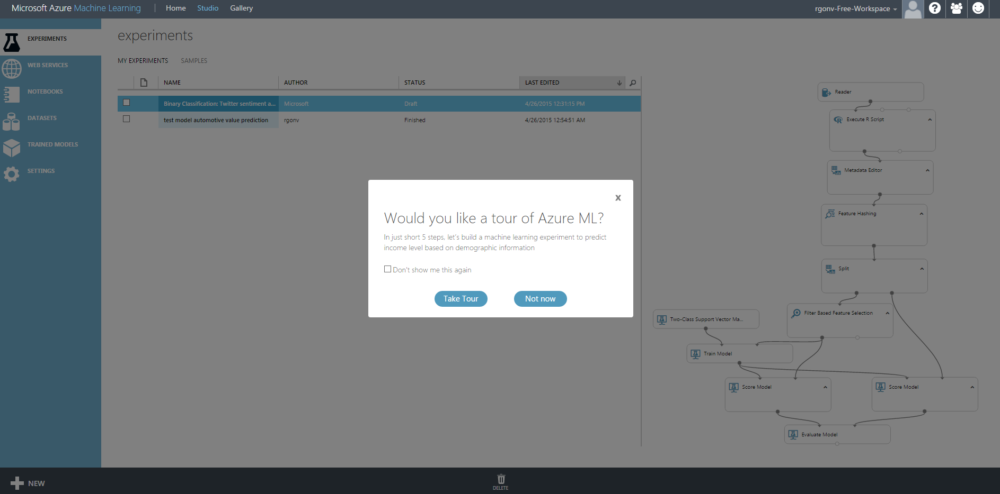
 
 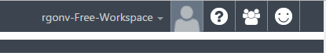
 
1. Iniciaremos con la creacion de un nuevo experimento
 
  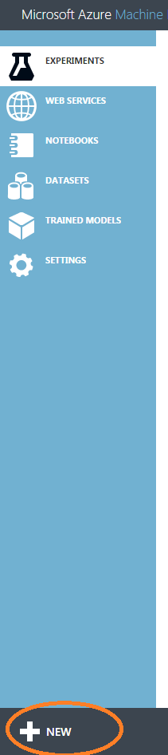

1. Le damos un titulo al experimento, en nuestro caso: "Analisis para deteccion de Cancer de seno"

  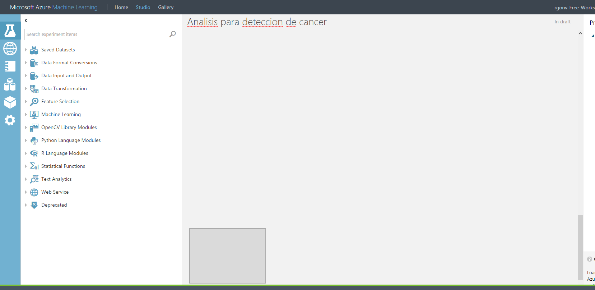

###Tarea 2 - Preparacion de los datos de referencia  
1. Como paso inicial, requerimos leer los datos de referencia que vamos a utilizar. Para ello, AzureML studio provee algunos datos de ejemplo, pero nosotros vamos a utilizar una fuente de datos externa. Tomaremos datos de analisis de cancer provistos por el repositorio de datos para aprendizaje de maquinas, de la Universidad de California Irvine. La descripcion de los datos se encuentra en **http://archive.ics.uci.edu/ml/datasets/Breast+Cancer+Wisconsin+%28Diagnostic%29**

  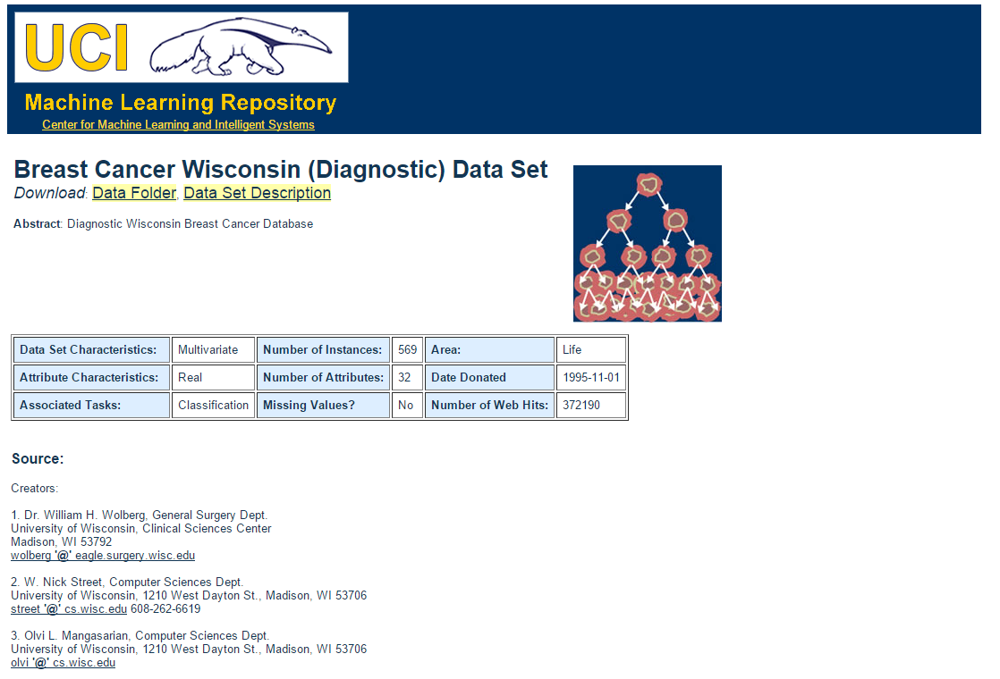
  
1. Para poder usar dicho conjunto de datos, podemos hacerlo de varias maneras. Una de ellas es utilizar un "Reader" provisto por AzureML studio, para capturar el conjunto de datos desde un URL o una fuente externa. Tomamos de la paleta el componente "Reader" de la seccion "Data Input and Output", y lo arrastramos sobre nuestro experimento:

  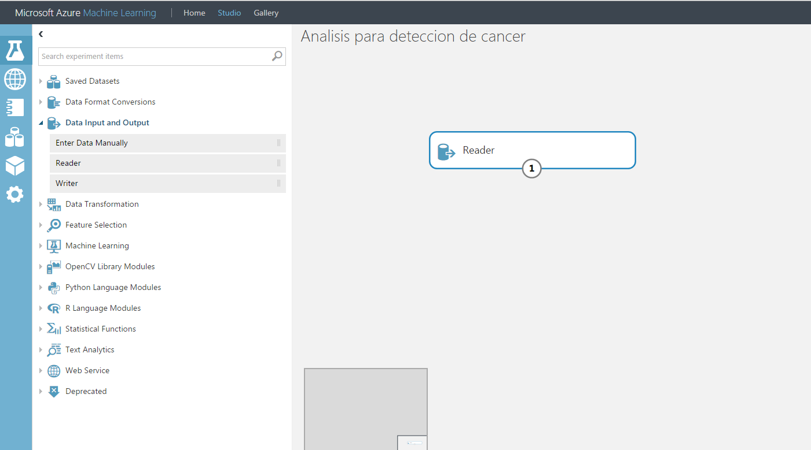
  
1. Debemos configurar el reader para poder leer del origen de datos. Seleccionamos el reader y en el panel de configuracion del componente, adicionamos el url de origen de los datos 
**http://archive.ics.uci.edu/ml/machine-learning-databases/breast-cancer-wisconsin/breast-cancer-wisconsin.data**

  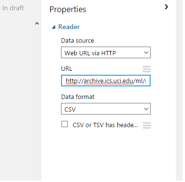
  
1. Para leer los datos, ejecutamos el experimento y podemos tomar la salida del reader, para guardar el resultado como un nuevo datase:

  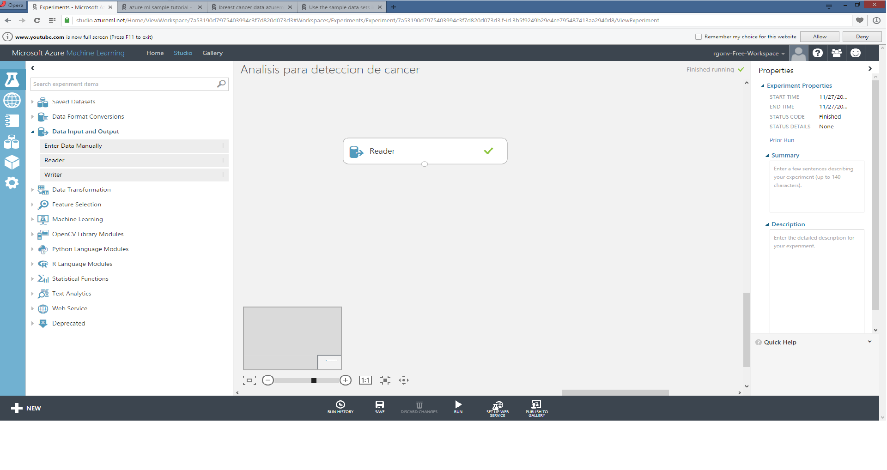
  
  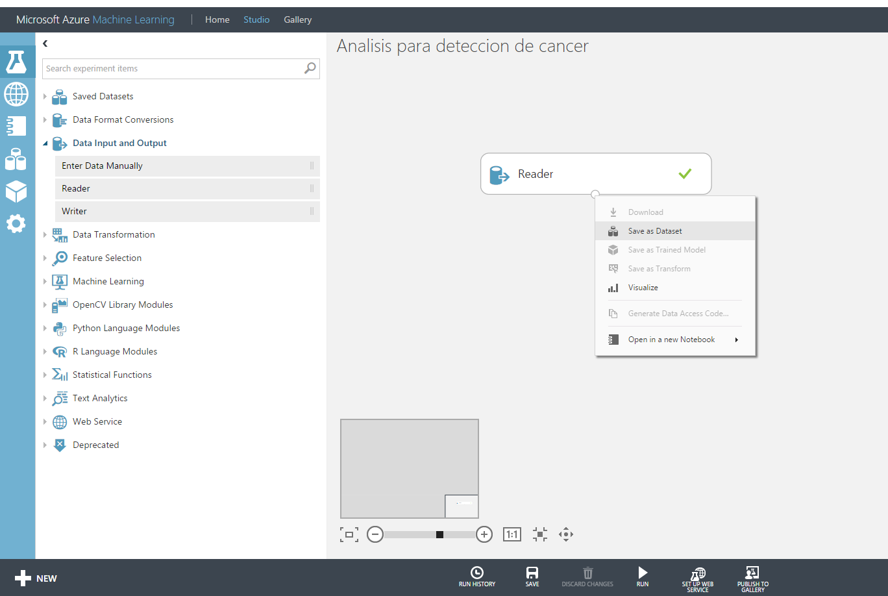
  
1. Le damos un nombre y descripcion alnuevo dataset:

  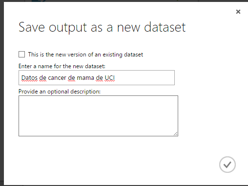
  
  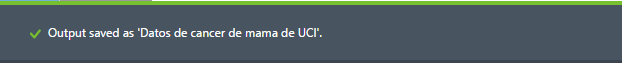

1. Podemos ver luego de esto el nuevo conjunto de datos disponible en la paleta:

  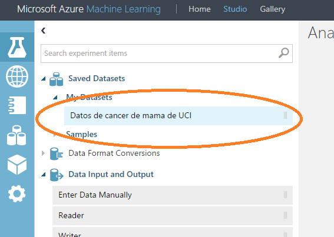
  
1. Ahora podemos reemplazar el reader por nuestro propio dataset. 

  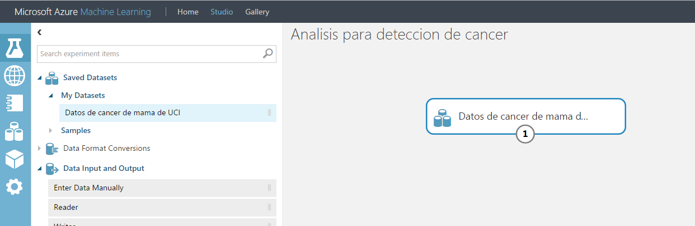
  
1. Podemos ver los detalles del dataset directamente en AzureML studio.La columna "Col11" representa el valor de tipo de presencia de tumor. 2 Benigno, 4 Maligno. Haremos algunas transformaciones para cambiar la estructura de los datos. primero, retirar la primera columna, que identifica el caso; para nuestro ejercicio es irrelevante. La segunda transformacion  es convertir los valores de benigno y maligno a 0 y 1 respectivamente.

  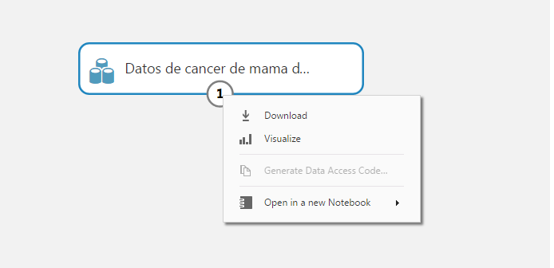
  
  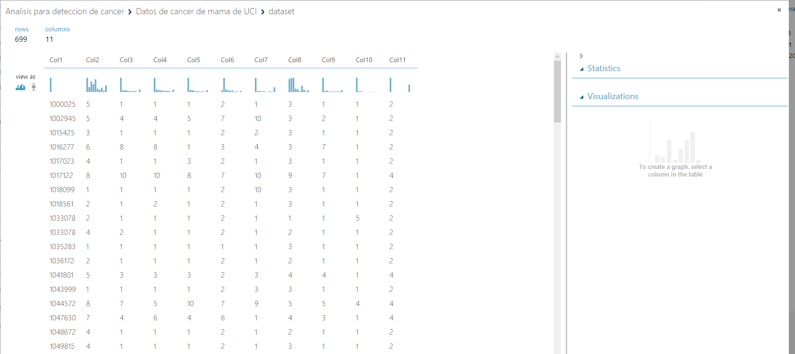
  
1. Adicionamos un componente de "Project Columns" desde la seccion "Data Transformation/Manipulation". La configurar las columnas, seleccionamos: "All columns", "Exclude", "column names", "Col1"

  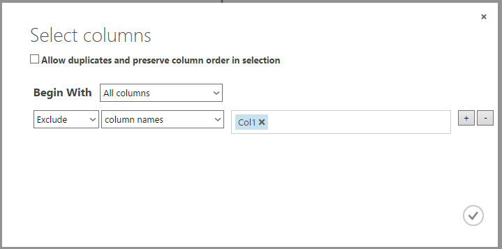
  
1. Para la transformacion, vamos a dividir los datos por 2, para tener un primer paso de la transformacion, luego aplicamos una nueva transformacion , correspondiendo a sustraer 1 del resultado, teniendo al final que los tumores benignos valen 0 y los malignos valen 1.

  
 
  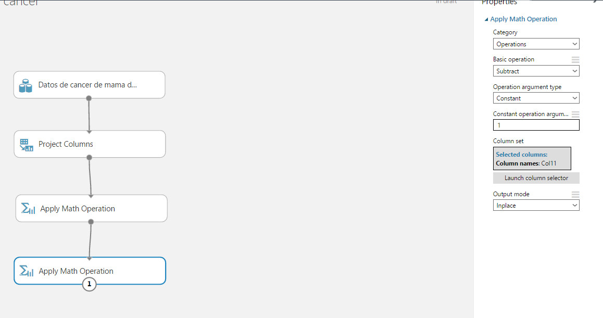
  
1. De existir la posibilidad de datos faltantes, se debe tener en cuenta para limpiarlo. Se puede generar un valor calculado a partir del conjunto de datos, o simplemente eliminar la fila

  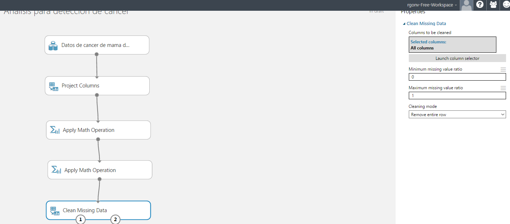
 
1. Una vez eliminados los datos incompletos, lo recomendable es normalizarlos para reducir el efecto de datos desnormalizados en el entrenamiento del modelo. Para ello usamos un componente "Normalize Data" y normalizamos todas las columnas excepto la "Col11" con el metodos ZScore

  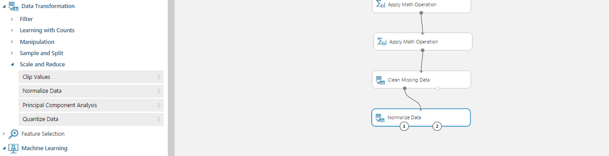
  
  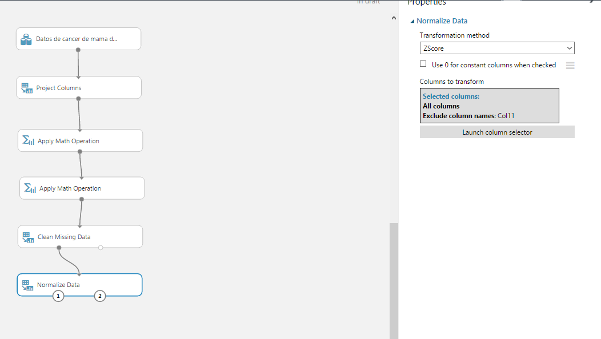
  
1. Como ultimo paso, necesitamos dividir nuestro conjunto de datos en dos. Una parte para entrenar el modelo y otra parte, para probar el modelo. Por lo general, se distribuye 80/20.

  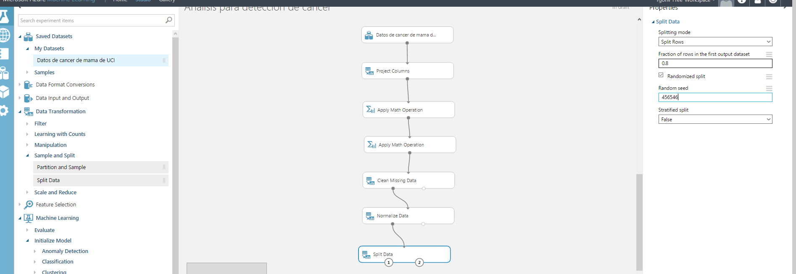
  
  
## Parte 2 - Seleccion y Entrenamiento del modelo

Cuando utilizamos tecnologias como Aprendizaje de maquinas, uno de los elementos mas importantes es poder entender y y aplicar el algoritmo mas adecuado dependiendo del problema que estamos tratando. En nuestro caso, el problema, es un problema de clasificacion. Esta clasificacion se puede hacer con diferentes algoritmos, como redes neuronales, regresiones, maquinas de bayes, etc. Una ventaja de trabajar con AzureML es que resulta muy facil intercambiar los modelos para poder probar y adaptar en la medida en que nuestro problema lo requiera.

Para nuestro caso, vamos a iniciar con una Regresion logistica. "Two class logistic regression" que permite clasificar los resultados en dos categorias. 

Hay tres elementos que hacen parte del ciclo basico de entrenamiento: 

1. Escoger y configurar el clasificador: el algoritmo que vamos a usar en la tare
1. Modelo de entrenamiento : determina los valores con los que el clasificador debe funcionar basado en los datos de entrenamiento
1. Calificar el modelo : Evalua el resultado del entrenamiento tomando otro subconjunto de datos y comparando el resultado obtenido con el resultado esperado 

### Tarea 1 - Configurar el clasificador, el modelo de entrenamiento y el modelo de evaluacion

1. Arrastramos el clasificador "Two class logistic regression" de la seccion de "Machine Learning", "Initialize Model", "Two class logistics regression"

  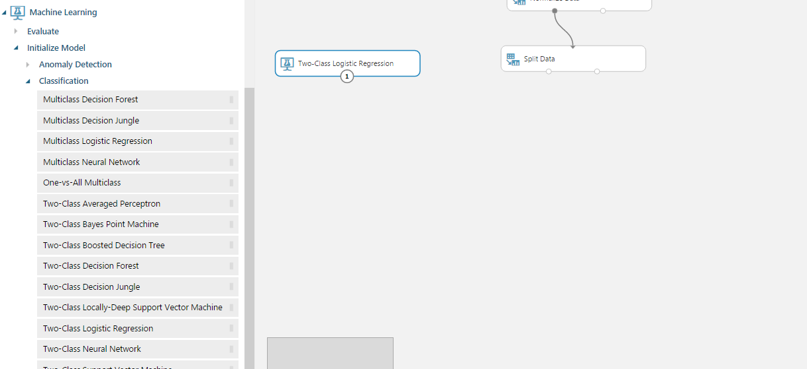
  
1. Vamos a arrastrar y conectar un "Train Model" de la seccion "Machine Learning", "Train" y lo conectamos al clasificador y a la fuente de datos de entrenamiento 

  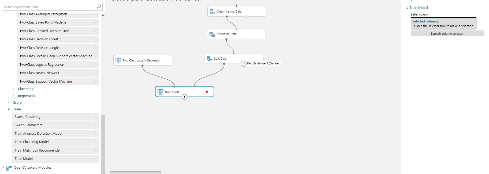

1. Para el "Train Model" debemos escoger la columna que tiene el resultado de la clasificacion, en este caso "Col11"
  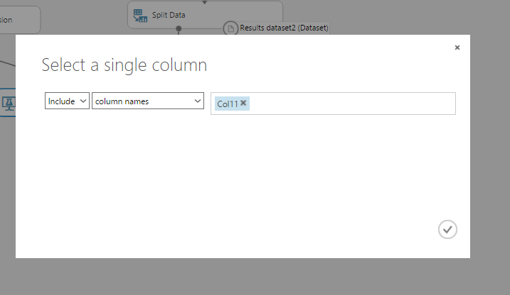
  
1. Adicionalmente vamos a arrastrar y conectar un modelo de calificacion de la seccion "Machine Learning", "Score" y lo conectamos al modelo entrenado y a la fuente de datos de evaluacion
  
  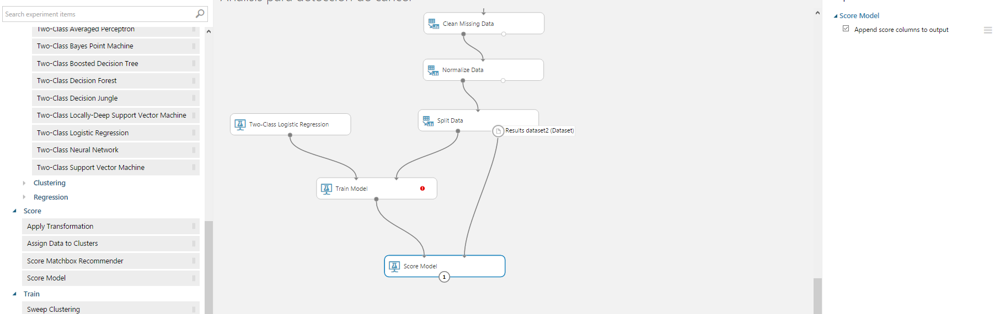
  
1. Vamos a colocar un evaluador del modelo, el cual nos dirá que tan efectivo fue el entrenamiento.

  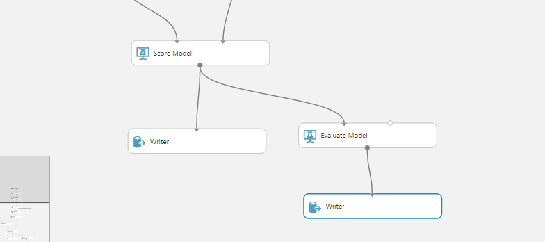
  
1. Podemos ver los resultados del entrenamiento y los resultados de la evaluacion directamente desde la opcion de visualizacion de los componentes, o tambien podemos exportar los datos a Azure Storage, Azure Database o Hive para procesamiento posterior  
  
  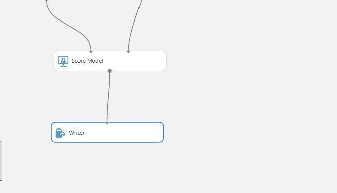
  
  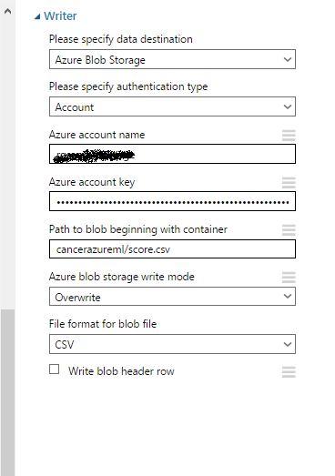

### Tarea 2 - Configurar un nuevo clasificador para comparar con los resultados previos (Opcional)

1. Vamos a probar el uso de una red neuronal para nuestro problema. Ya se han hecho las tareas basicas de limpieza de datos y entrenamiento con un modelo. Vamos a adicionar otro y comparar los resultados entre los dos modelos. Para ello, arrastramos un componente "Two class neural network", igual que el algoritmo anterior, tambien adicionamos un train model, y un score model. debe quedar algo como esto:

  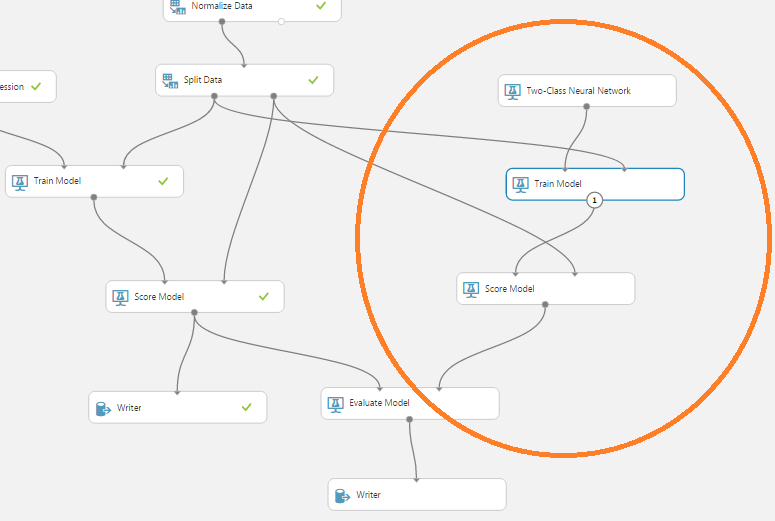
   
1. Al igual que en el modelo anterior, se puede exportar el resultado de calificacion y evaluacion 
   
  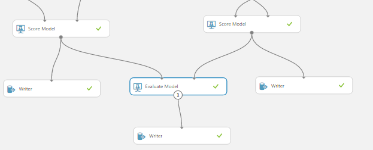

1. Al ejecutar nuevamente el experimento, podemos comparar los resultados de ambos algoritmos simultaneamente para determinar si se requiere ajustes o para escoger el modelo que mayor efectividad tenga para nuestro problema

  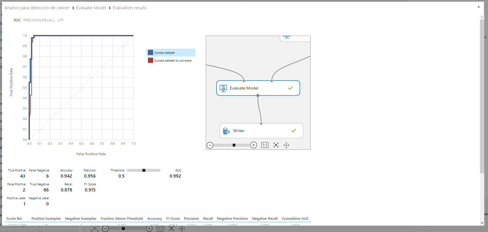

### Parte 3 - Publicar el modelo entrenado como un servicio 

Para poder usar el modelo, AzureML provee un mecanismo para exponer el modelo entrenado como un servicio, el cual tiene como entradas los datos a evaluar y salida el resultado de ejecutar el modelo sobre esos datos. En el proceso de publicacion, se crea un runtime model de prediccion. 

1. Para hacerlo, seleccionamos el algoritmo ("Train Model") que mas nos gusta en su rendimiento dentro del experimento.  Una vez seleccionado, se selecciona "Set Up Web Service"

  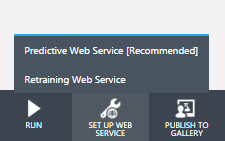
  
1. Cuando se crea el modelo predictivo, se transforma el experimento para tomar los datos que entrenaron el modelo en el experimento y expone un servicio web para consumirlo

  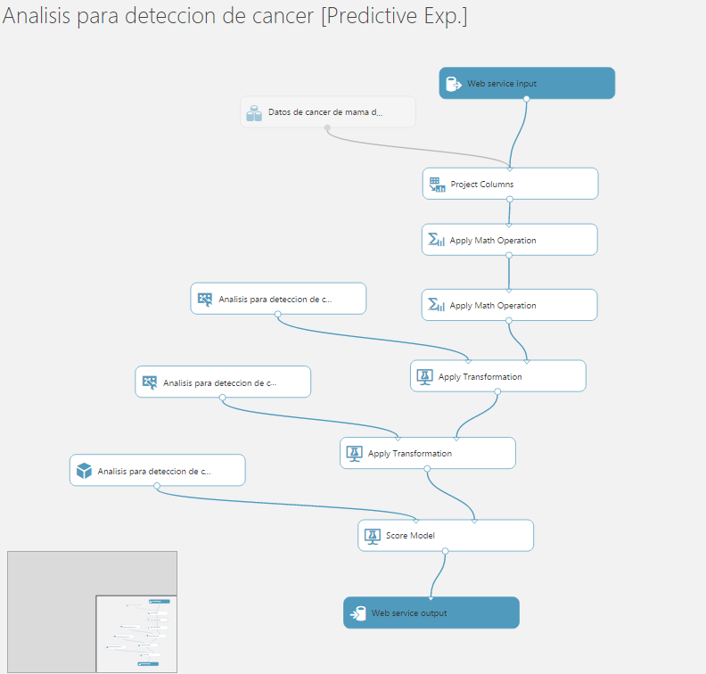
  
1. Para poderlo exponer, debe primero ejecutarse :
  
  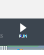
  
1. Una vez ejecutado, se puede desplegar
  
  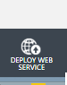

  
    
1. El despliegue crea el web service  y provee una interfaz grafica de prueba para ingresar los valores a ser evaluados

  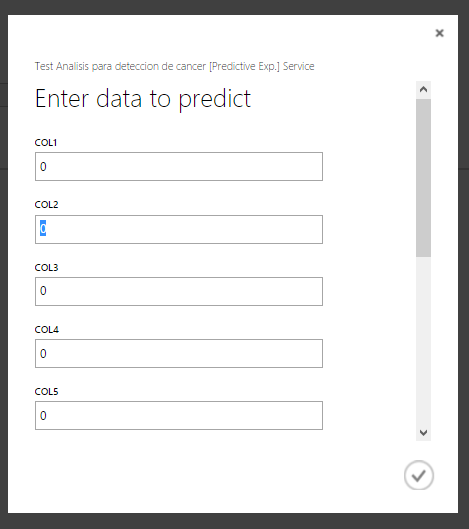
  
1. Tomaremos un registro del conjunto de datos de entrada para probar el servicio: 
  
  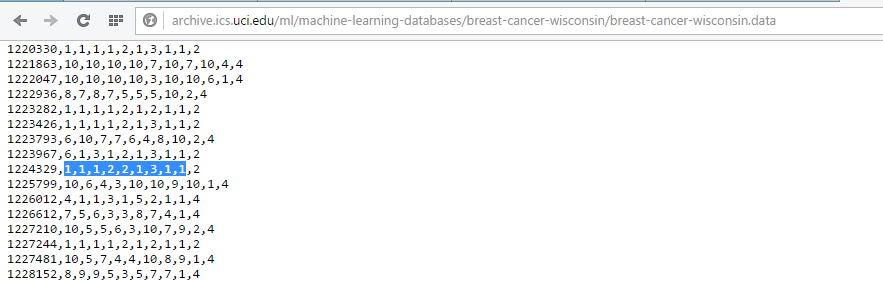
  
1. El resultado de la evaluacion viene en el ultimo par de campos del valor de respuesta:

  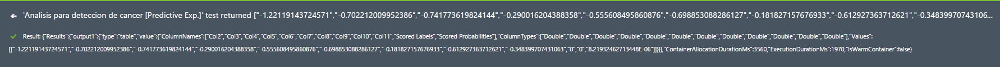
  
  

