#Ninja Lab de Redis cache 
<span class="alert alert-info">
A continuación, se describen los pasos correspondientes 
para realizar un aplicativo Asp.Net Mvc utilizando el servicio de Redis 
cache proporcionado por Microsoft Azure, en esta ocasión utilizando la librería
de ServiceStack.Redis, pero recuerda que puedes implementar Redis en diferentes 
plataformas y lenguajes de programación.
</span>

###Paso 1: Creación del servicio de Redis cache en Azure
1. Ingresamos al portal de Microsoft Azure (http://portal.azure.com) y seleccionamos la opción de menú
lateral +Nuevo --> Datos y almacenamiento --> Caché en Redis
1. Posteriormente ingresamos un nombre de DNS requerido para crear nuestra cache de Redis.
1. Damos click en Guardar y esperamos su creación.

	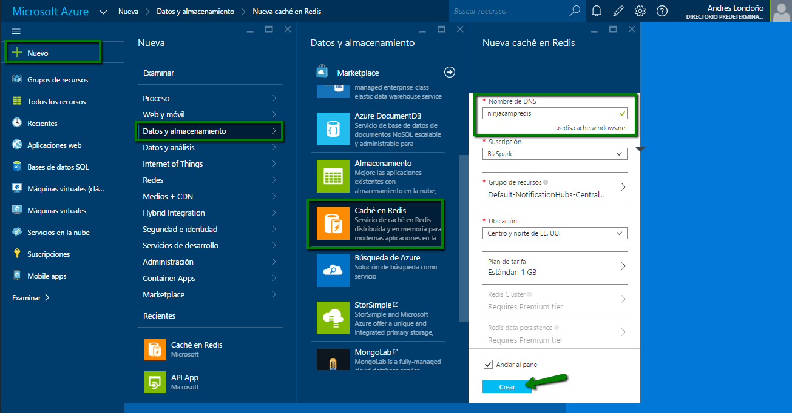
	
1. Ya creado nuestro servicio Redis, accedemos a él y nos mostrará el nombre de host definitivo.
1. Damos click sobre "Mostrar claves de acceso...", podremos obtener la llave necesaria para nuestra conexión. 
1. Guarda los datos del host y llave generados, pronto los necesitaremos.

	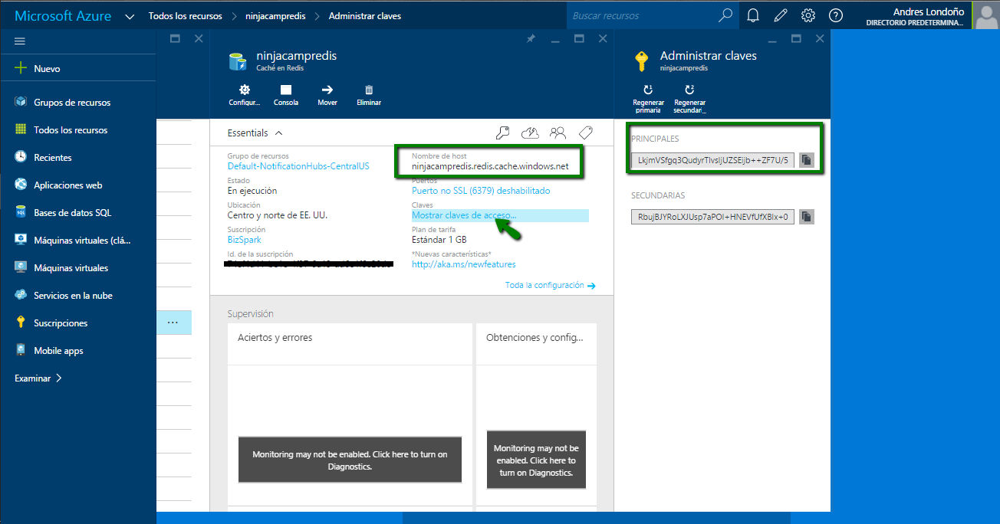

###Paso 2: Creación de proyecto Asp.Net Mvc

1. Abrimos nuestro visual studio y procedemos a dar click en "Nuevo proyecto".
1. Abierta nuestra ventana de creación de nuevo proyecto buscamos la plantilla de C# --> Web.
1. Seleccionamos Aplicación web Asp.Net.
1. Indicamos el nombre de nuestro proyecto.
1. Damos click en "Aceptar".
	
	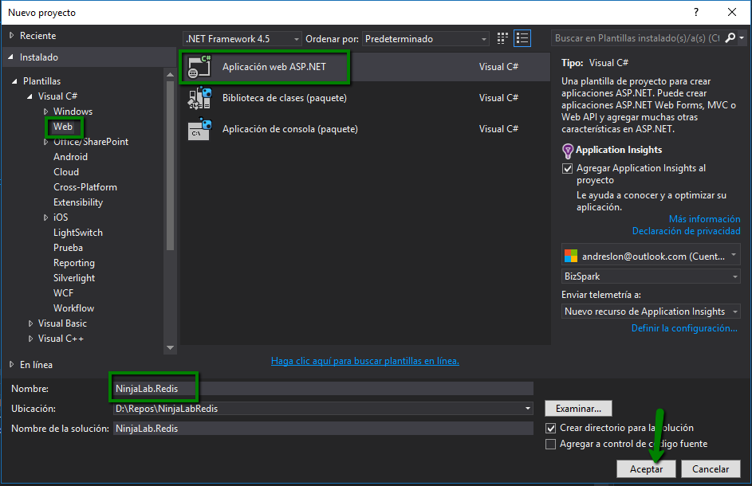

1. Al crear nuestro proyecto web se abrirá la ventana correspondiente para seleccionar nuestra plantilla.
1. Seleccionamos la plantilla MVC.
1. Para evitar crear todo el esquema de ejemplo de nuestro proyecto MVC que implementa Autenticación, procedemos a quitarla, damos click en "Cambiar autenticación".

	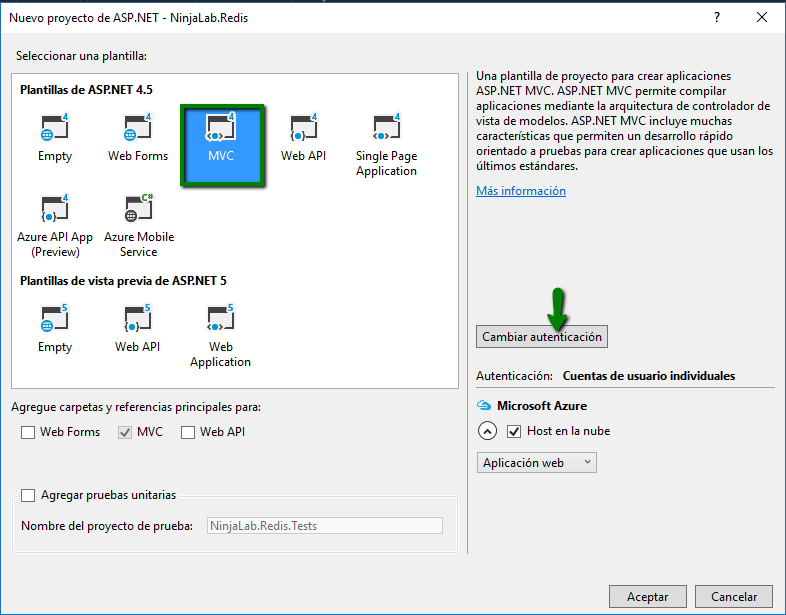
	
1. Seleccionamos la opción de "Sin autenticación" y presionamos "Aceptar".
	- Ya de regreso en la ventana de la plantilla, volvemos a presionar "Aceptar"

	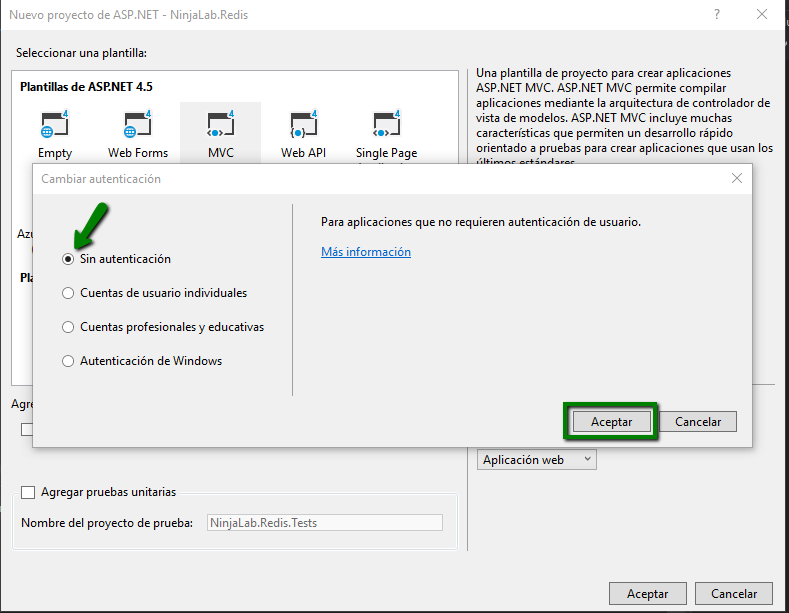

###Paso 3: Instalación de librerías necesarias (Redis, Entity Framework)

1. Creado nuestro proyecto, presionamos click derecho sobre References y seleccionamos "Administrar paquetes Nuget..."
1. En el cuadro de búsqueda ingresamos "Redis"
1. Seleccionamos "ServiceStack.Redis".
1. Presionamos "Instalar" y posterior aceptamos la licencia de esta librería.
	
	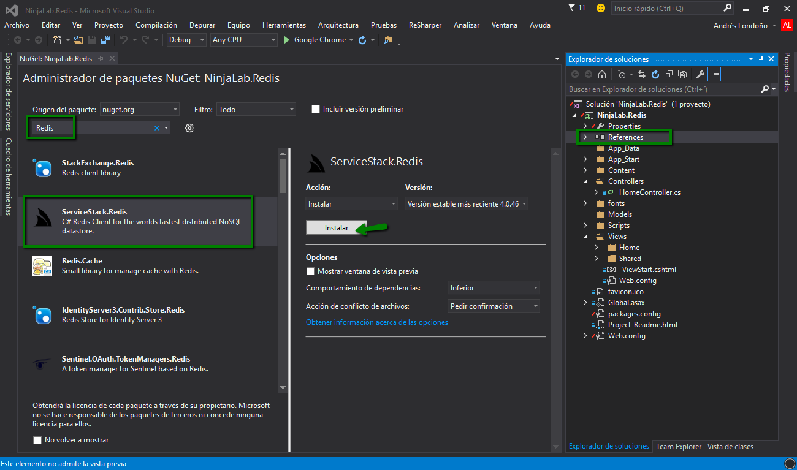
1. Permanecemos en la ventana de administración de paquetes de nuget
1. En el cuadro de búsqueda ingresamos "Entity"
1. Seleccionamos "EntityFramework".
1. Presionamos "Instalar" y posterior aceptamos la licencia de esta librería.
	
	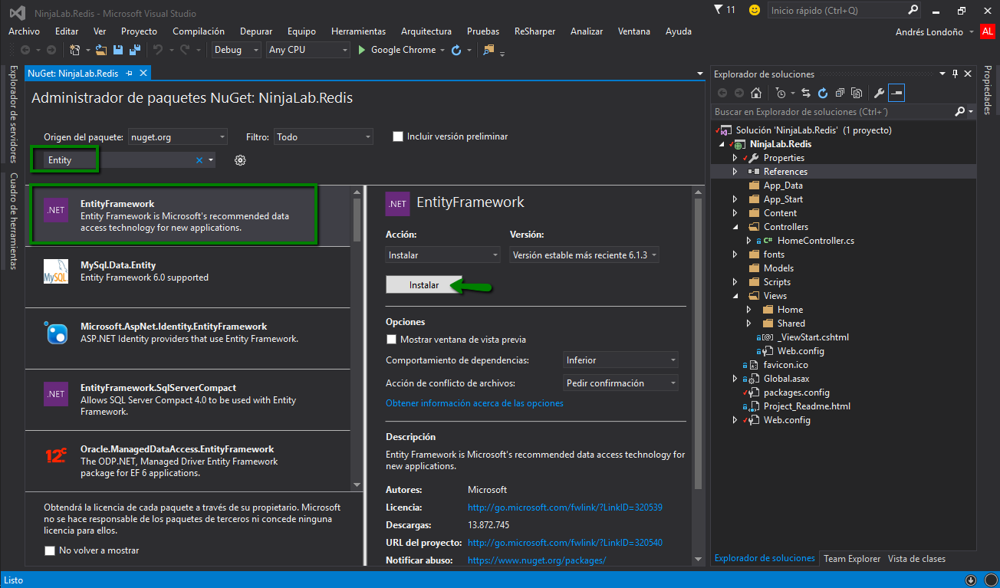
	
###Paso 4: Creación de Modelo para demo

1. En la carpeta Models presionamos click derecho y vamos Agregar --> "Clase..." la cual nombraremos "Event.cs" 
1. Importamos las librerías necesarias para crear nuestra propiedad de identificación.
 	```
	using System.ComponentModel.DataAnnotations;
	using System.ComponentModel.DataAnnotations.Schema;
	```
1. Creamos las diferentes propiedades requeridas para nuestro demo.
	
	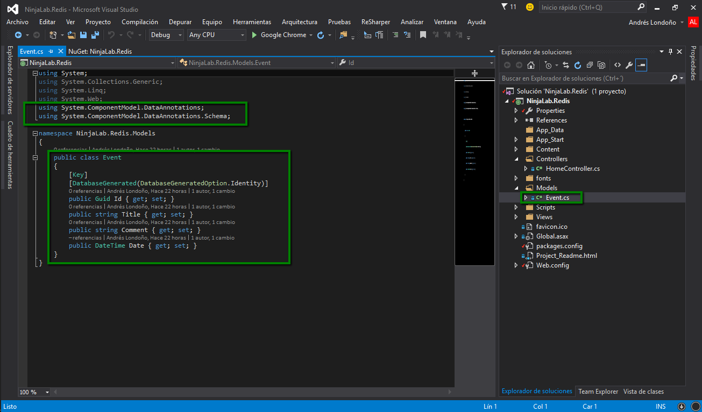 
	
###Paso 5: Implementación para consumo de Redis cache

1. En la raíz de nuestro proyecto damos click derecho y vamos a Agregar --> Nueva Carpeta y la llamamos Helpers.
1. Dentro de nuestra nueva carpeta Helpers presionamos click derecho y vamos Agregar --> "Clase..." la cual nombraremos "RedisHelper.cs"
1. Importamos las librerías necesarias.

	```
	using Newtonsoft.Json;
	using NinjaLab.Redis.Models;
	using ServiceStack.Redis;
	```
1. Agregamos nuestra cadena de conexión con los datos respectivos creados en el paso uno bajo la siguiente estructura "password@hostredis?ssl=true" .
1. Creamos nuestro método de conexión para conectarnos con la cache de redis creada.

	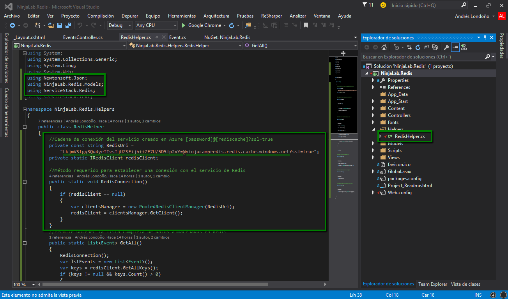 

1. Creamos los métodos correspondientes para realizar acciones sobre Redis cache, dicho almacenamiento se realiza con la estructura de clave-valor, la cual será mediante una clave creada con la clase GUID y el valor será un string serializado del objeto Event.
	- + Set(), almacena el objeto serializado con su clave respectiva
	- + Get(), Obtiene el objeto almacenado mediante la respectiva y lo de-serializa 
	- + GetAll(), obtiene todos los datos almacenados en Redis mediante las claves
	- + Remove(), elimina el objeto almacenado en redis mediante la clave respectiva
	
	Nota: La actualización de los objetos se realiza mediante el método set.
	
	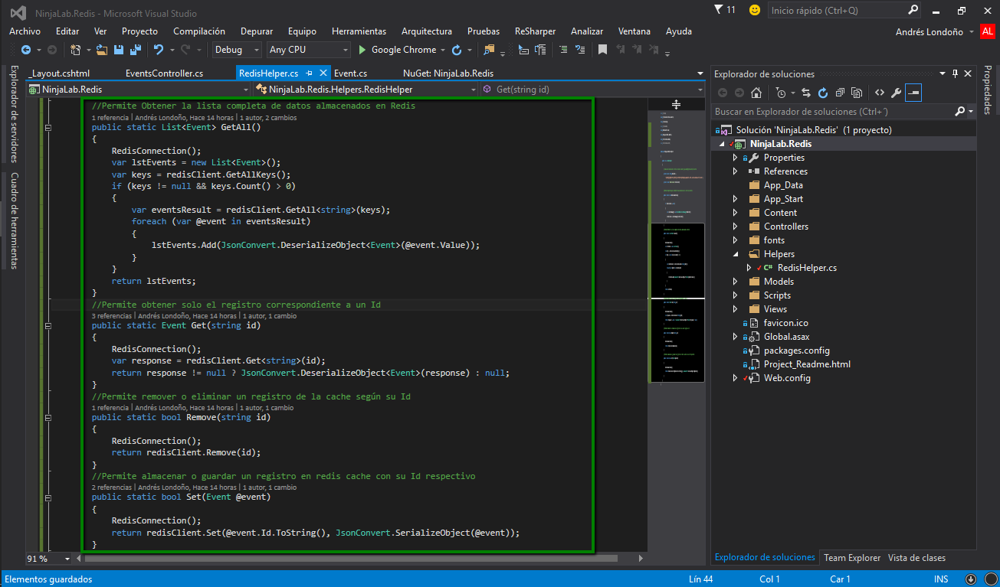

###Paso 6: Utilización de Redis

1. Es hora de comenzar a crear nuestra aplicación para ver el uso de redis, damos click derecho sobre la carpeta "Controllers" y seleccionamos controlador.
1. Se abrirá una ventana para agregar el controlador respectivo, en nuestro caso como el objetivo es crear la aplicación de la forma más rápida posible nos ayudaremos de la técnica Scaffolding, seleccionaremos "Controlador de MVC 5 con vistas que usa Entity Framework" y damos click en "Agregar"

	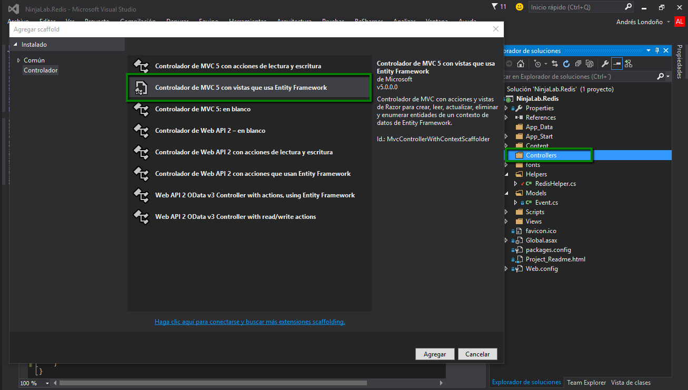

1. Al agregar el controlador se abrirá un wizard para ayudarnos a generar el esquema del controlador y la vista según el modelo, en clase de modelo seleccionamos "Event (NinjaLab.Redis.Models)"
1. Para establecer el contexto de los datos hacemos click en el botón "+"(Agregar)

	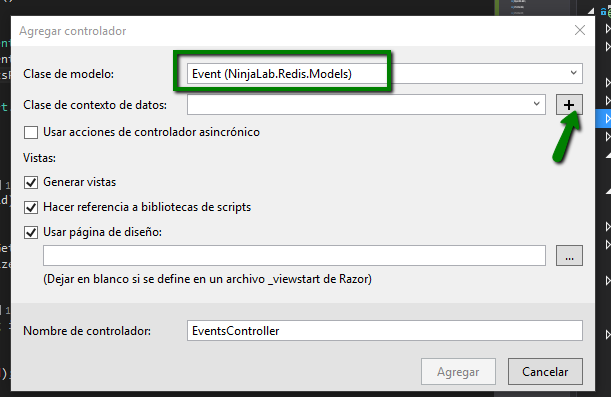
	
1. Automáticamente se pondrá el nombre del contexto de datos a utilizar, todo eso con la ayuda de la librería de EntityFramework utilizada, finalmente damos click en "Agregar".
1. De regreso en la ventana de Agregar controlador, damos click en "Agregar".

	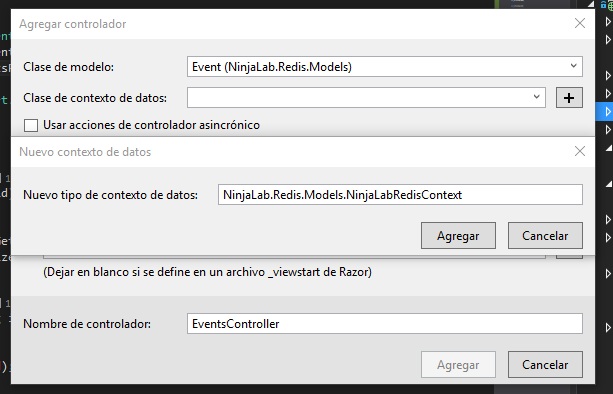
	
Se ha creado el controlador EventsController.cs y las diferentes vistas de las acciones pertenecientes a un Crud, así bien tendremos que anclarlo en nuestro menú para poder acceder.
 1. Abrimos el archivo _Layout.cshtml ubicado en Views --> Shared
 1. Implementamos dentro de la etiqueta "<ul></ul>" el actionlink que nos llevara hacia la nueva vista que hemos creado.
	
	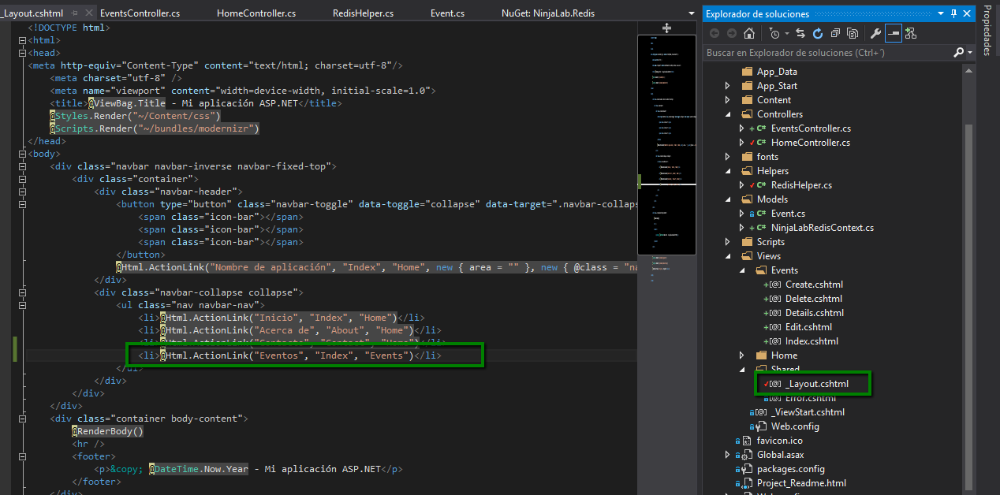
 
 Es hora de implementar el código correspondiente para utilizar las características de redis cache, para ello abrimos nuestro archivo "EventController.cs"
 
 1. Importamos las clases a utilizar
 
 	```
	using NinjaLab.Redis.Models;
	using NinjaLab.Redis.Helpers;
	```
 
 1. En el método Index, obtenemos todos los datos de Redis con GetAll()
 1. En el método Details obtenemos el objeto según el id seleccionado
 
	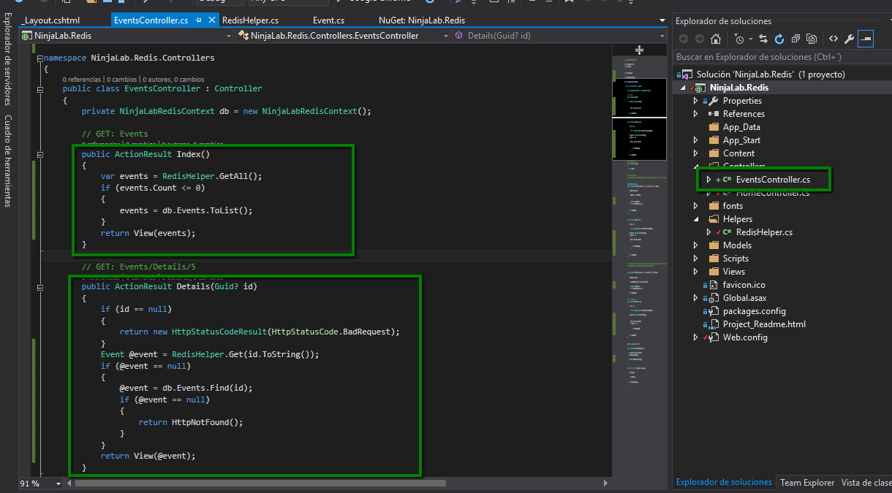
 
 1. En el método Create guardamos el objeto en Redis
 1. En el método Edit obtenemos el objeto según el id seleccionado
  
	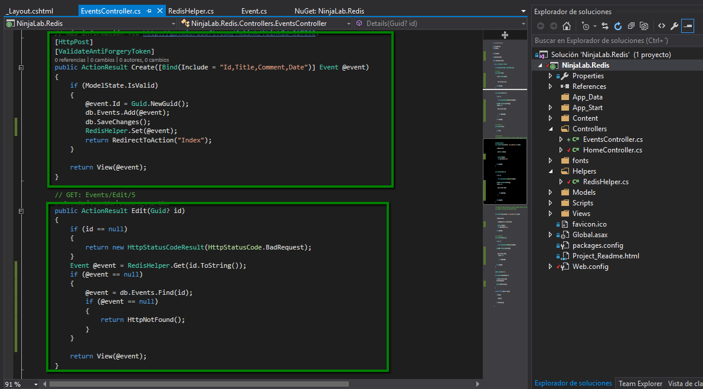
	
1. En el método Edit donde se actualiza el registro Guardamos de nuevo en Redis para que actualice el registro según el Id
1. En el método Delete obtenemos el objeto según el id seleccionado
   
	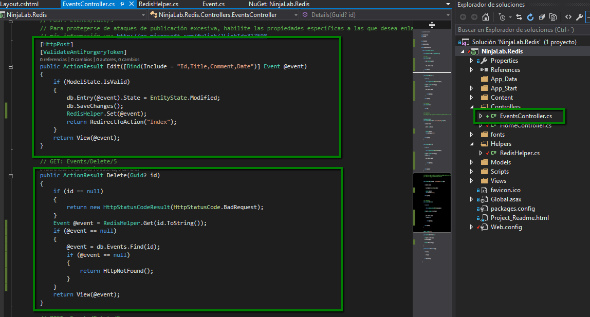
	
1. En el método DeleteConfirmed, Eliminamos el registro de Redis con el id respectivo
	   
	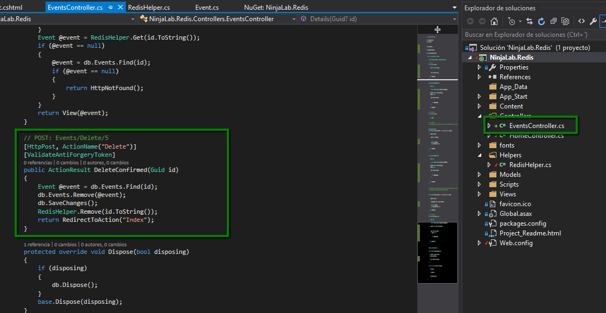
	
1. Nuestra Aplicación esta lista y utilizando Redis cache para todas sus operaciones :)
	   
	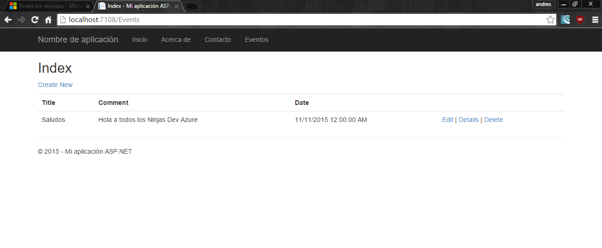

<br/>	

###Links de referencia sobre el tema:
* [How to use Azure Redis Cache] (http://azure.microsoft.com/en-us/documentation/articles/cache-dotnet-how-to-use-azure-redis-cache/)
* [Trying Redis Caching as a Service on Azure] (http://www.hanselman.com/blog/TryingRedisCachingAsAServiceOnWindowsAzure.aspx)
* [Página principal de Redis] (http://redis.io/)
* [Redis para Windows (Port hecho por MSOpenTech)] (https://github.com/MSOpenTech/redis)


