#Application Insights

##Qué vamos a hacer?
En este laboratorio veremos como usar Azure Application Insights para el monitoreo de una aplicación en la detección de fallos y problemas de performance.

##Cómo lo vamos a hacer?
Para esto, integraremos Application Insights a una aplicación a la cual le hemos introducido fallas puntuales, el objetivo al finalizar este laboratorio es poder detectar las fallas y poder darles solución.

> El reto: Vamos a simular que la aplicacion se encuentran en producción y verificaremos su comportamiento en ejecución sin revisar el código.

##Pre-requisitos
* Una suscripción activa a Azure
* Visual Studio 2015
* Visual Studio Code (Opcional)

##Objetivos
- [ ] Identificar problemas de desempeño sobre la aplicación ContosoUniversity
- [ ] Identificar los fallos de la aplicación ContosoUniversity
- [ ] Interactuar con el tablero de Application Insights
- [ ] Conocer las herramientas que ofrece Applications Insights

##Treas
- [Tarea 1 - Descargar la aplicación de ejemplo y publiquela en un WebSite de Azure](#tarea-1)
- [Tarea 2 - Integrar Application Insights](#tarea-2)
- [Tarea 3 - Agregar información de excepciones a Application Insights](#tarea-3)
- [Tarea 4 - Registrar información de Trazas en Application Insights](#tarea-4)

###Tarea 1
####Descargar la aplicación ContosoUniversity
Diríjase al directorio "aplicaciones" de este repositorio y copie la aplicación [ContosoUniversity](./aplicaciones/ContosoUniversity/) en su directorio de trabajo.

Abra la aplicación desde Visual Studio 2015.

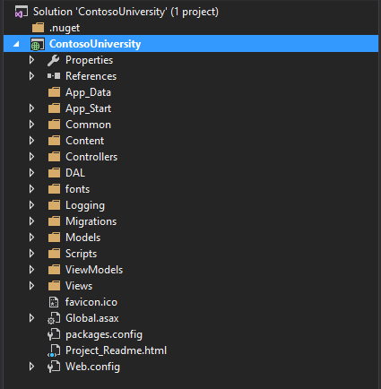

Compile la aplicación y verifíque que la compilación este correcta antes de realizar el paso de publicación.

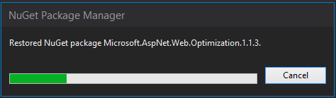

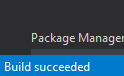

####Publicar la aplicación en Azure
Realize la publicación de la aplicación ContosoUniversity a su cuenta en Azure desde Visual Studio 2015

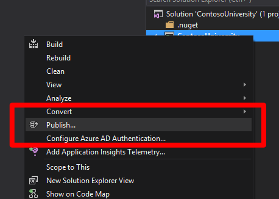

Cree un nuevo perfil de publicación para Web Apps

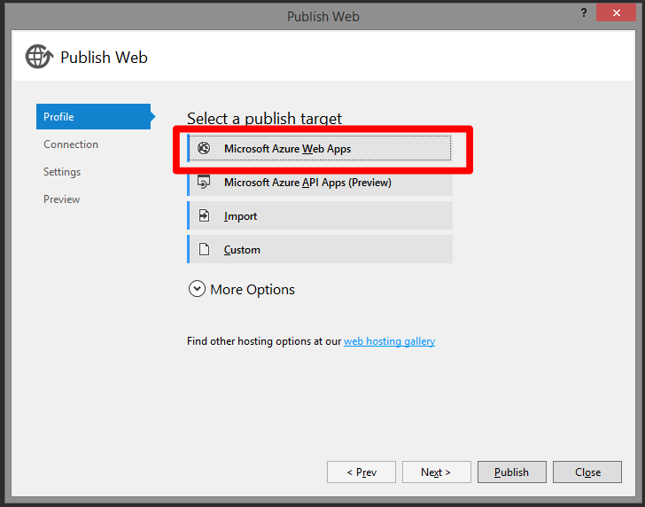

Recuerde que debe iniciar sesión con la cuenta que tenga asociada para acceder a su subscripción de Windows Azure

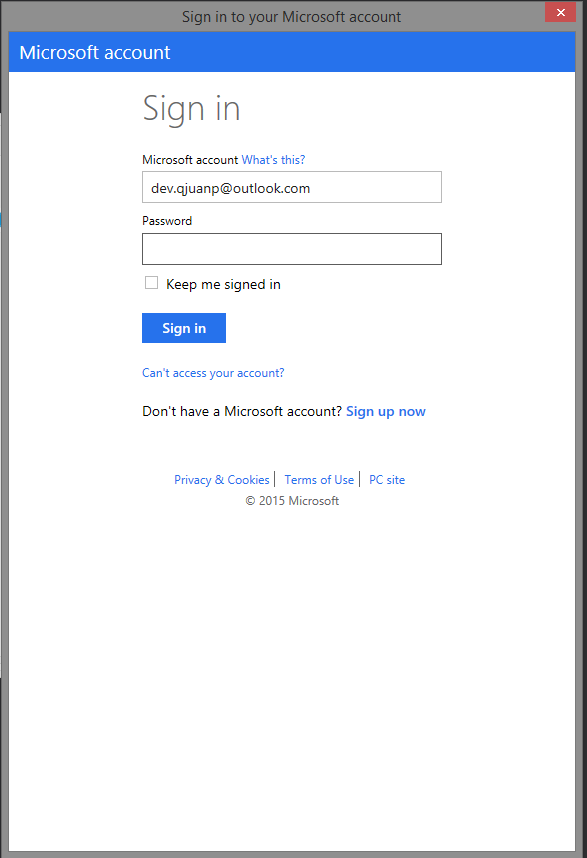

Defina para la publicación de su Web App
- El **Service Plan** al que va a pertenecer la Web App (Plan Free por defecto)
- El **Resource Group** que va a contener la Web App
- La **Región de Azure** en donde se van a publicar la Web App
- Crear una nueva **Base de Datos** para los datos de la aplicación ContosoUniversity

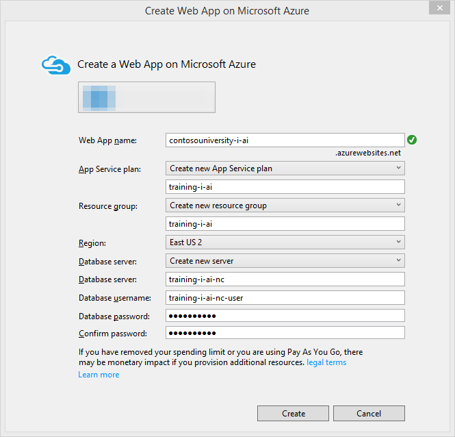

Active la migración para que se puedan desplegar los datos de la base de datos de ContosoUniversity

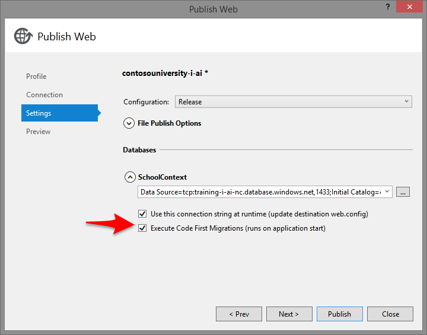

Y Publique la Web App

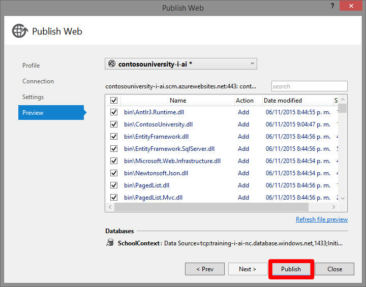

Verifique las diferentes secciones de la aplicación e ingrese datos adicionales en cada una de ellas
- Instructores
- Departamentos
- Clases
- Estudiantes
- Acerca de
- etc...


#####**¿Qué sucedio con la aplicación en este punto en este punto?**
La aplicación tiene algunos problemas de performance y errores dificilmente visibles

###Tarea 2
####Integrar Application Insights
Primero, vamos a crear nuestro Application Insight desde el [Portal de Azure](https://portal.azure.com)

Primero ubique la sección de servicios de Application Insights 

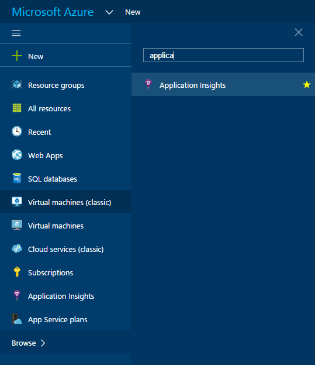

Cree un nuevo Application Insights

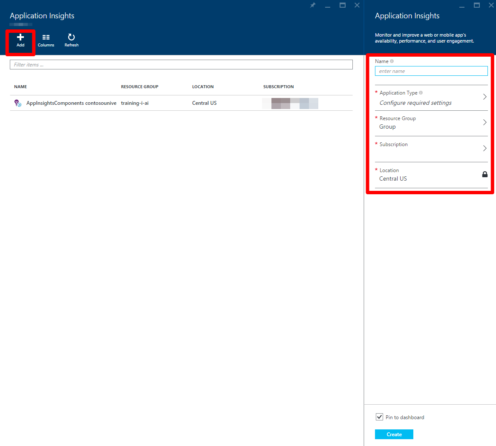

Defina los parámetros necesarios para el Application Insights

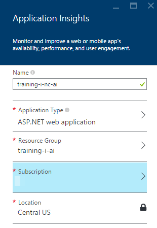

Ahora desde Visual Studio 2015 vamos a integrar nuestra aplicación con Application Insights
Desde el proyecto principal, click derecho -> Add Application Insights Telemetry...

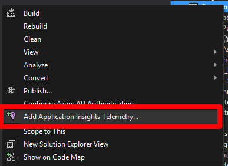

Luego, despues de seleccionar la cuenta y la subscripción en la que se encuentra definido nuestro Application Insight, seleccionamos el que habiamos creado previamente, y le damos agregar.


Despues de publicar de nuevo la aplicación, vamos a navegar de nuevo por donde habiamos detectado en la [Tarea 1](#tarea-1) los errores y problemas de performance para comenzar a recopilar datos con Application Insigths.

#####**¿Qué información nos arroja Application Insight sobre ContosoUniversity?**
¿En donde se encuentran los problemas de performance?
¿En donde se reportan errores 500?
¿Nos hace falta información?

###Tarea 3
####Agregar información de excepciones a Application Insights
Para integrarlo facilmente a MVC5 creamos el siguiente filtro en nuestro código

```C#
using System;
using System.Web.Mvc;
using Microsoft.ApplicationInsights;

namespace ContosoUniversity.Common
{
    [AttributeUsage(AttributeTargets.Class | AttributeTargets.Method, Inherited = true, AllowMultiple = true)]
    public class AiHandleErrorAttribute : HandleErrorAttribute
    {
        public override void OnException(ExceptionContext filterContext)
        {
            if (filterContext != null && filterContext.HttpContext != null && filterContext.Exception != null)
            {
                //If customError is Off, then AI HTTPModule will report the exception
                if (filterContext.HttpContext.IsCustomErrorEnabled)
                {
                    // Note: A single instance of telemetry client is sufficient to track multiple telemetry items.
                    var ai = new TelemetryClient();
                    ai.TrackException(filterContext.Exception);
                }
            }
            base.OnException(filterContext);
        }
    }
}
```

Y registramos el filtro de manera global en el `FilterConfig` de nuestro código

```C#
// ...
public static void RegisterGlobalFilters(GlobalFilterCollection filters)
{
    filters.Add(new AiHandleErrorAttribute());
}
// ...
```

Y publicamos de nuevo nuestra aplicación

#####**¿Qué información nos arroja Application Insight sobre ContosoUniversity?**
¿Cuales son las excepciones que se estan presentando?

###Tarea 4
####Registrar información de Trazas en Application Insights
Para este paso necesitaremos instalar el siguiente paquete [Application Insights TraceListener](https://www.nuget.org/packages/Microsoft.ApplicationInsights.TraceListener/1.0.0)

`PM> Install-Package Microsoft.ApplicationInsights.TraceListener -Version 1.0.0`

Luego... simplemente desplegar.

#####**¿Qué información nos arroja Application Insight sobre ContosoUniversity?**
¿Cuales información se está registrando en las trazas?