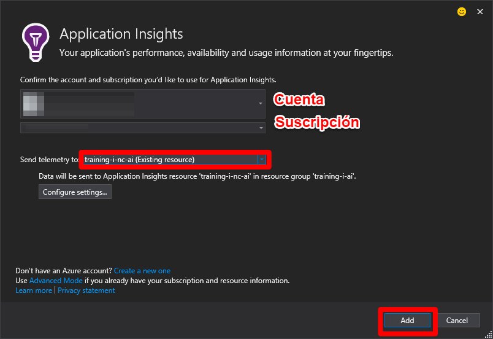
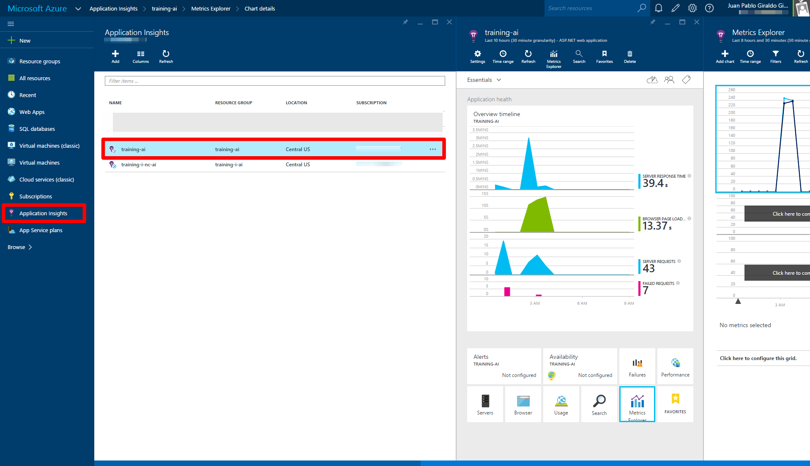
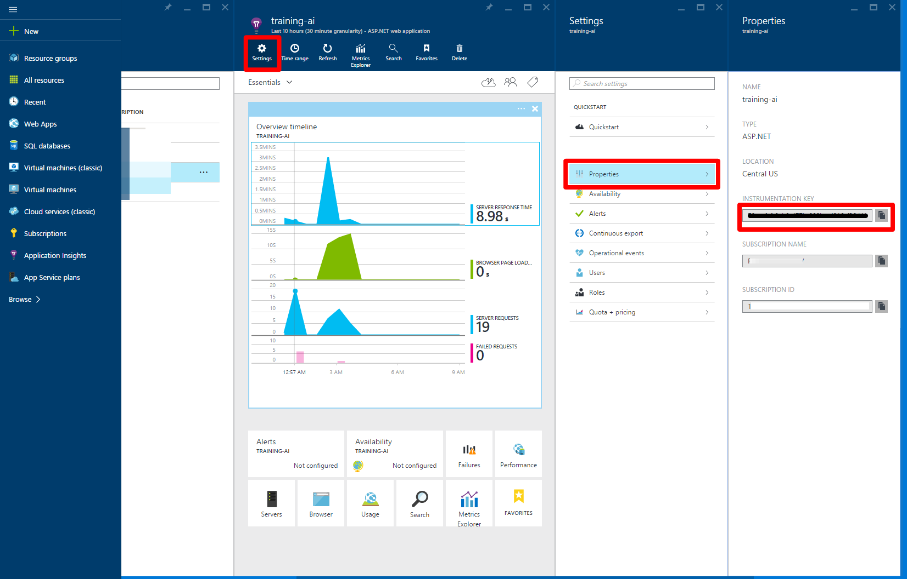

#Application Insights

##¿Qué vamos a hacer?
En este laboratorio veremos cómo usar Azure Application Insights para el monitoreo de una aplicación en la detección de fallos y problemas de performance.

##¿Cómo lo vamos a hacer?
Para esto, integraremos Application Insights a una aplicación a la cual le hemos introducido fallas puntuales, el objetivo al finalizar este laboratorio es poder detectar las fallas y poder darles solución.

> El reto: Vamos a simular que la aplicación se encuentran en producción y verificaremos su comportamiento en ejecución sin revisar el código.

##Pre-requisitos
* Una suscripción activa a Azure
* Visual Studio 2015
* Visual Studio Code (Opcional)

##Objetivos
- [ ] Identificar problemas de desempeño sobre la aplicación ContosoUniversity
- [ ] Identificar los fallos de la aplicación ContosoUniversity
- [ ] Interactuar con el tablero de Application Insights
- [ ] Conocer las herramientas que ofrece Applications Insights

##Tareas
- [Tarea 1 - Descargar e instalar la aplicación ContosoUniversity](#tarea-1)
- [Tarea 2 - Integrar Application Insights](#tarea-2)
- [Tarea 3 - Agregar información de excepciones a Application Insights](#tarea-3)
- [Tarea 4 - Registrar información de Trazas en Application Insights](#tarea-4)
- [Tarea 5 - Conteo de eventos](#tarea-5)
- [Tarea 6 - Páginas visitadas por el usuario](#tarea-6)

###Tarea 1
####Descargar la aplicación ContosoUniversity
1.Diríjase al directorio "aplicaciones" de este repositorio y copie la aplicación [ContosoUniversity](./aplicaciones/ContosoUniversity/) en su directorio de trabajo.

> Tambien lo pueden descargar desde https://github.com/qjuanp/nc-azure-ai/tree/example-nc

1.Abra la aplicación desde Visual Studio 2015.


1.Compile la aplicación y verifique que la compilación este correcta antes de realizar el paso de publicación.


####Publicar la aplicación en Azure
1.Realice la publicación de la aplicación ContosoUniversity a su cuenta en Azure desde Visual Studio 2015


1.Cree un nuevo perfil de publicación para Web Apps


1.Recuerde que debe iniciar sesión con la cuenta que tenga asociada para acceder a su subscripción de Windows Azure


Defina para la publicación de su Web App
- El **Service Plan** al que va a pertenecer la Web App (Plan Free por defecto)
- El **Resource Group** que va a contener la Web App
- La **Región de Azure** en donde se van a publicar la Web App
- Crear una nueva **Base de Datos** para los datos de la aplicación ContosoUniversity


1.Active la migración para que se puedan desplegar los datos de la base de datos de ContosoUniversity


Y Publique la Web App


1.Verifique las diferentes secciones de la aplicación e ingrese datos adicionales en cada una de ellas
- Instructores
- Departamentos
- Clases
- Estudiantes
- Acerca de
- etc...


#####**¿Qué sucedió con la aplicación en este punto en este punto?**
La aplicación tiene algunos problemas de performance y errores difícilmente visibles

###Tarea 2
####Integrar Application Insights
Vamos a crear nuestro Application Insight desde el [Portal de Azure](https://portal.azure.com)

1.Primero ubique la sección de servicios de Application Insights 


1.Cree un nuevo Application Insights


1.Defina los parámetros necesarios para el Application Insights


Ahora desde Visual Studio 2015 vamos a integrar nuestra aplicación con Application Insights
1.Desde el proyecto principal, click derecho -> Add Application Insights Telemetry...


1.Después de seleccionar la cuenta y la subscripción en la que se encuentra definido nuestro Application Insight, seleccionamos el que habíamos creado previamente, y le damos agregar.



1.Después de publicar de nuevo la aplicación, vamos a navegar de nuevo por donde habíamos detectado en la [Tarea 1](#tarea-1) los errores y problemas de performance para comenzar a recopilar datos con Application Insigths.



#####**¿Qué información nos arroja Application Insight sobre ContosoUniversity?**
¿En dónde se encuentran los problemas de performance?
¿En dónde se reportan errores 500?

###Tarea 3
####Agregar información de excepciones a Application Insights
1.Para integrarlo fácilmente a MVC5 creamos el siguiente filtro en nuestro código

```C#
using System;
using System.Web.Mvc;
using Microsoft.ApplicationInsights;

namespace ContosoUniversity.Common
{
    [AttributeUsage(AttributeTargets.Class | AttributeTargets.Method, Inherited = true, AllowMultiple = true)]
    public class AiHandleErrorAttribute : HandleErrorAttribute
    {
        public override void OnException(ExceptionContext filterContext)
        {
            if (filterContext != null && filterContext.HttpContext != null && filterContext.Exception != null)
            {
                //If customError is Off, then AI HTTPModule will report the exception
                if (filterContext.HttpContext.IsCustomErrorEnabled)
                {
                    // Note: A single instance of telemetry client is sufficient to track multiple telemetry items.
                    var ai = new TelemetryClient();
                    ai.TrackException(filterContext.Exception);
                }
            }
            base.OnException(filterContext);
        }
    }
}
```

Y registramos el filtro de manera global en el `FilterConfig` de nuestro código

```C#
// ...
public static void RegisterGlobalFilters(GlobalFilterCollection filters)
{
    filters.Add(new AiHandleErrorAttribute());
}
// ...
```

1.Y publicamos de nuevo nuestra aplicación

#####**¿Qué información nos arroja Application Insight sobre ContosoUniversity?**
¿Cuáles son las excepciones que se están presentando?

###Tarea 4
####Registrar información de Trazas en Application Insights
1.Para este paso necesitaremos instalar el siguiente paquete [Application Insights TraceListener](https://www.nuget.org/packages/Microsoft.ApplicationInsights.TraceListener/1.0.0)

`PM> Install-Package Microsoft.ApplicationInsights.TraceListener -Version 1.0.0`

1.Luego... simplemente desplegar.

#####**¿Qué información nos arroja Application Insight sobre ContosoUniversity?**
¿Cuales información se está registrando en las trazas?

###Tarea 5
####Conteo de eventos
Podemos urilizar Application Insigths para medir eventos específicos dentro de nuestra aplicación.
Algo como los nuevos estudiantes e instructores que se registran pueden verse con una métrica en el tablero de Application Insigths

Contar cuantos estudiantes se registran en la aplicación
En la clase Controllers\StudentController.cs agergar al método Crear (POST):

```C#
public ActionResult Create([Bind(Include = "LastName, FirstMidName, EnrollmentDate")]Student student)
{
    // .. 
        if (ModelState.IsValid)
        {
            db.Students.Add(student);
            db.SaveChanges();
            
            //----------------------------------------------
            TelemetryClient telemetry = new TelemetryClient();
            telemetry.TrackEvent("NewStudent");
            //----------------------------------------------
            
            return RedirectToAction("Index");
        }
    //..
}
```


Contar cuantos instructores se registran en la aplicación
En la clase Controllers\InstructorController.cs agregar al método Crear (POST):

```C#
public ActionResult Create([Bind(Include = "LastName,FirstMidName,HireDate,OfficeAssignment")]Instructor instructor, string[] selectedCourses)
{
    //..
    if (ModelState.IsValid)
    {
        db.Instructors.Add(instructor);
        db.SaveChanges();

        //----------------------------------------------
        TelemetryClient telemetry = new TelemetryClient();
        telemetry.TrackEvent("NewInstructor");
        //----------------------------------------------

        return RedirectToAction("Index");
    }
    //..
}
```

#####**¿Qué información nos arroja Application Insight sobre ContosoUniversity?**
¿Cuantos usuarios hemos podido crear en nuestra aplicación?

###Tarea 6
####Páginas visitadas por el usuario
Para poder monitorear las páginas visitadas por los usuarios, y tener acceso al cliente de telemetria de desde una aplicación web con javascript, se debe incluir un pequeño script (que más abajo estará) y que debe ser incluido en los encabezados del HTML de la Web App

Antes de incluir el código deben identificar el `InstrumentationKey` asociado al tablero de Application Insights que tenemos definido para nuestra aplicación.



Ya con el `InstrumentationKey` a la mano, podemos usar el siguiente código para el rasteo de los usuarios en las páginas de nuestra aplicación.

```javascript
<script type="text/javascript">
    var appInsights=window.appInsights||function(config){
        function s(config){t[config]=function(){var i=arguments;t.queue.push(function(){t[config].apply(t,i)})}}var t={config:config},r=document,f=window,e="script",o=r.createElement(e),i,u;for(o.src=config.url||"//az416426.vo.msecnd.net/scripts/a/ai.0.js",r.getElementsByTagName(e)[0].parentNode.appendChild(o),t.cookie=r.cookie,t.queue=[],i=["Event","Exception","Metric","PageView","Trace"];i.length;)s("track"+i.pop());return config.disableExceptionTracking||(i="onerror",s("_"+i),u=f[i],f[i]=function(config,r,f,e,o){var s=u&&u(config,r,f,e,o);return s!==!0&&t["_"+i](config,r,f,e,o),s}),t
    }({
        instrumentationKey: "ACÁ VA EL INSTRUMENTATIONKEY!!!"
    });
    
    window.appInsights=appInsights;
    appInsights.trackPageView();
</script>
```

El código debe incluirse en la aplicación de ContosoUniversity en el archivo `Views\_Layout.cshtml`
(Si el antior código ya esta, únicamente reemplace el `InstrumentationKey`)

#####**¿Qué información nos arroja Application Insight sobre ContosoUniversity?**
Después de incluir el código, ¿cuál es la página más visitada por ustedes mismos?