#Application Insights
## ¿Qué es Application Insights?
Es un servicio de análisis extensible que supervisa su aplicación activa. Le ayuda a detectar y a diagnosticar problemas de rendimiento y a comprender qué hacen los usuarios realmente con su aplicación. Está diseñado para desarrolladores, para ayudarle a mejorar continuamente el rendimiento y la facilidad de uso de la aplicación y que permite:
- Supervisar el uso y rendimiento de las aplicaciones activas.
- Supervisar aplicaciones web de ASP.NET o J2EE hospedadas en cualquier lugar: en Azure, en otros servicios en la nube o en sus propios servidores locales.
- Supervisar aplicaciones de Android, iOS, OSX, Windows, etc.
- Obtener alertas inmediatas en caso de problemas de rendimiento o disponibilidad.
- Obtener telemetría para aplicaciones web existentes sin tener que volver a implementarlas.
- Se puede usar con una amplia variedad de tipos de aplicaciones en ejecución en dispositivos, servidores o equipos de escritorio.
- Buscar registros de seguimiento y excepción para diagnosticar los errores.
- Realizar un seguimiento de eventos, métricas, vistas de página, usuarios, bloqueos, dependencias, contadores de rendimiento y tiempos de respuesta.
- Funciona tanto con aplicaciones web como independientes en una amplia variedad de plataformas: .NET o J2EE, hospedadas localmente o en la nube; aplicaciones de dispositivos en Windows, iOS, Android, OSX y otras plataformas.

###Lo que haremos en este laboratorio:
Revisaremos la forma en que podemos integrar nuestras aplicaciones al servicio de Insights para poder realizar un seguimiento a las mismas
Requisitos:
- Una suscripción activa a Azure
- Visual Studio 2015
- Visual Studio Code (Opcional)

##Tareas
- [Tarea 1 - Revisar como adicionar Application Insights a su proyecto de Visual Studio.](#tarea-1)
- [Tarea 2 - Crear una aplicación web ASP.Net MVC con Application Insights.](#tarea-2)
- [Tarea 3 - Implementar y publicar Contoso University.](#tarea-3)
- [Tarea 4 - Crear una instancia de telemetría para asociarlo con la aplicación.](#tarea-4)
- [Tarea 5 - Agregar información de excepciones a Application Insights.] (#tarea-5)
- [Tarea 6 - Conteo de eventos.] (#tarea-6)
- [Tarea 7 - Test de disponibilidad y capacidad de respuesta del web site.] (#tarea-7)
- [Tarea 8 - A manera de repaso.] (#tarea-8)

###Tarea 1
####Revisar como adicionar Application Insights a su proyecto de Visual Studio
1. Se puede adicionar Insights cuando se está creando un proyecto nuevo, abriendo Visual Studio agregando un nuevo proyecto web y se le habilita la opción de Application Insights.

 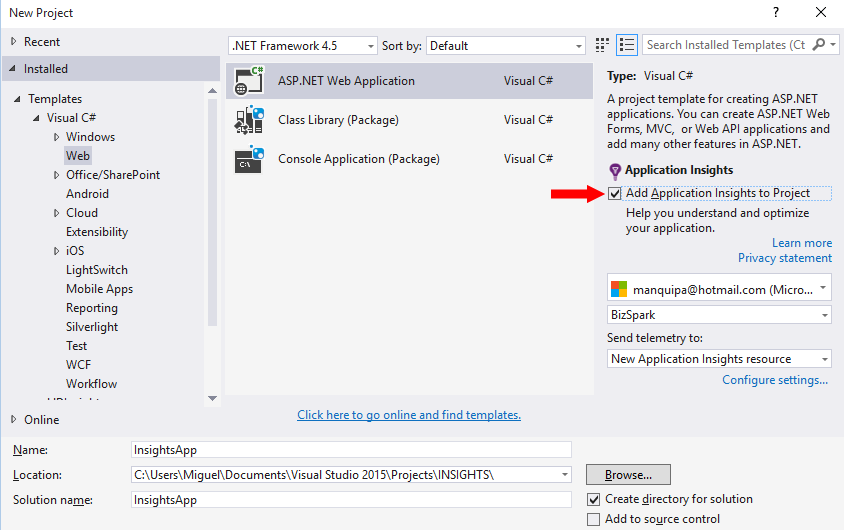

1. O Si se va a realizar desde un proyecto existente, desde el explorador de la solución (Solution Explorer) se hace clic derecho sobre el proyecto y seleccionamos la opción agregar Application Insights.

 

###Tarea 2
####Crear una aplicación web ASP.Net MVC con Application Insights 
1. Abrimos Visual Studio en donde agregaremos una nueva aplicación web seleccionar la opción de Application Insights.


1. Al hacer clic en Ok seleccionamos la plantilla MVC con la autenticación para cuentas de usuario individuales y hacemos clic en ok para que se implementen los elementos básicos de nuestra plantilla.


1. Lo que hicimos al Agregar Application Insights fue (que podría hacer manualmente en su lugar si lo prefiere):
- Crear un recurso de Application Insights en el portal de Azure. Es donde verá los datos. Recupera la clave de instrumentación, que identifica el recurso.
- Agregar el paquete NuGet del SDK web de Application Insights al proyecto. Para verlo en Visual Studio, haga clic con el botón secundario en el proyecto y elija Administrar paquetes de NuGet.
- Colocar la clave de instrumentación en ApplicationInsights.config.


Ejecución del proyecto

1. Ejecute la aplicación con F5 y pruébela. Abra varias páginas para generar telemetría.


1. En Visual Studio, aparecerá un recuento de los eventos que se han enviado.

Al abrir el explorador de soluciones, haremos clic derecho sobre el proyecto para ver las opciones que se encuentran asociadas con Application Insights

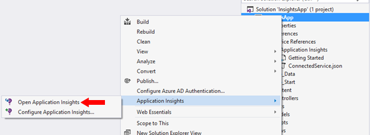

1. Abra el recurso de Application Insights, esto abrirá el portal de Azure.


1. Haga clic sobre cualquiera de las gráficas para ver los detalles de la misma.

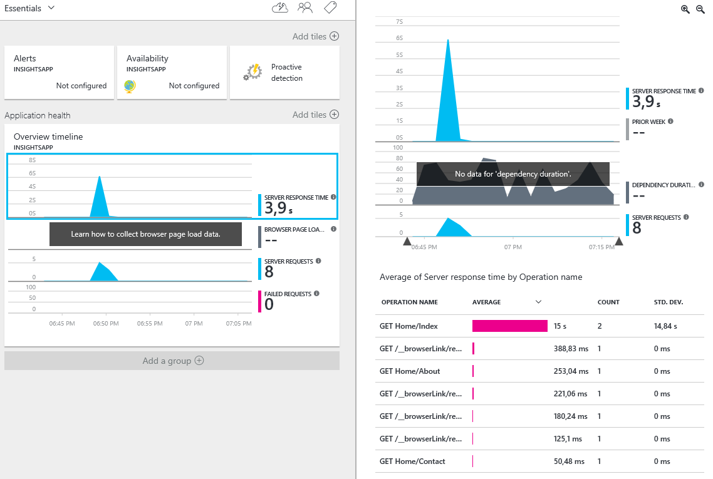

1. Abra Búsqueda para investigar solicitudes individuales y sus eventos asociados.


###¿No hay datos?
- Asegúrese de que está viendo lo correcto. Inicie sesión en el portal de Azure, haga clic en "Examinar" >, "Application Insights" y, a continuación, seleccione la aplicación.
- Use la aplicación y abra varias páginas para generar telemetría.
- Abra la hoja Buscar para ver los eventos individuales. A veces, los eventos tardan un poco en llegar a través de la canalización de métricas.
- Espere unos segundos y haga clic en Actualizar.

###Tarea 3
####Implementar y publicar Contoso University

1. Puede descargar el proyecto desde https://github.com/qjuanp/nc-azure-ai/tree/example-nc

1. Abra la aplicación con Visual Studio 2015.

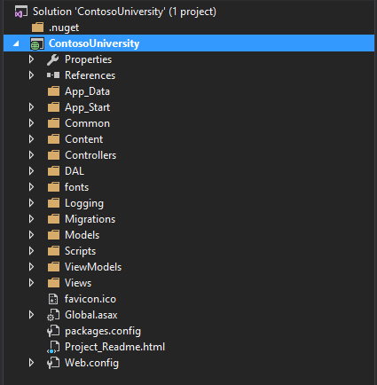

1. Compile la aplicación y verifique que la compilación este correcta antes de realizar el paso de publicación.


Publicar la aplicación en Azure
1. Realice la publicación de la aplicación ContosoUniversity a su cuenta en Azure desde Visual Studio 2015


1. Cree un nuevo perfil de publicación para Web Apps

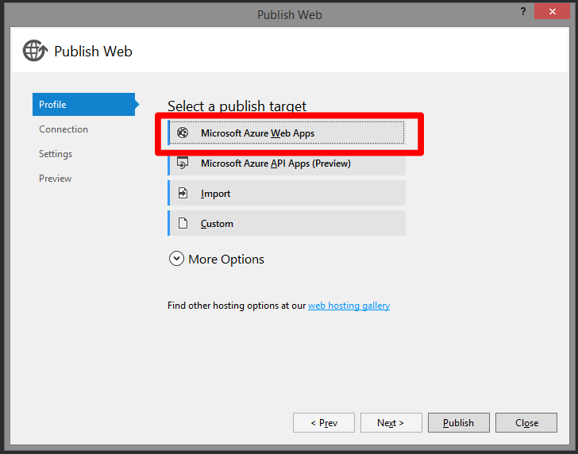

1. Recuerde que debe iniciar sesión con la cuenta que tenga asociada para acceder a su subscripción de Windows Azure

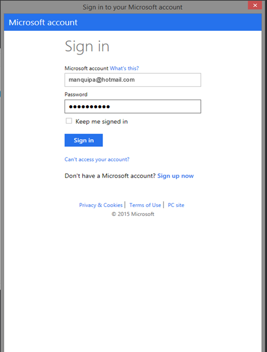

1. Defina para la publicación de su Web App
- El **Service Plan** al que va a pertenecer la Web App (Plan Free por defecto)
- El **Resource Group** que va a contener la Web App
- La **Región de Azure** en donde se van a publicar la Web App
- Crear una **nueva Base de Datos** para los datos de la aplicación ContosoUniversity


 
1. Active la migración para que se puedan desplegar los datos de la base de datos de ContosoUniversity

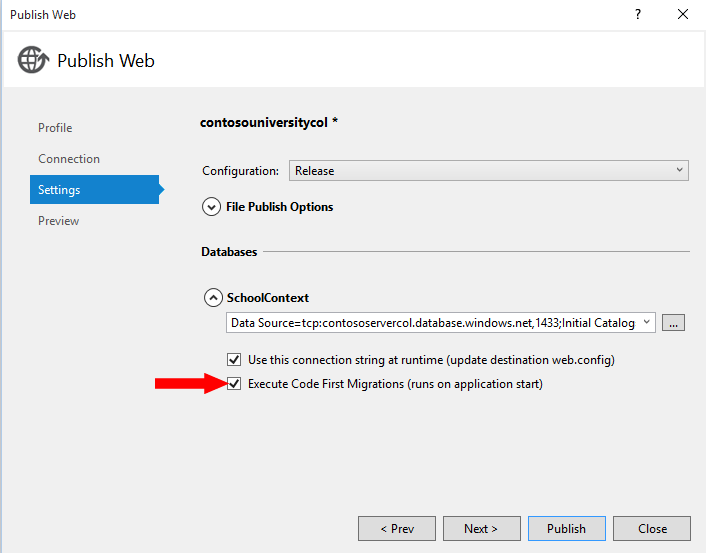

1. Y Publique la Web App

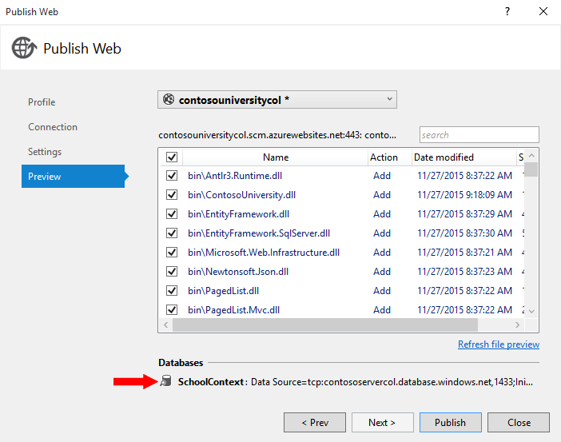

1. Verifique las diferentes secciones de la aplicación e ingrese datos adicionales en cada una de ellas
- Instructores
- Departamentos
- Clases
- Estudiantes
- Acerca de


 
###Tarea 4
####Crear una instancia de telemetría para asociarlo con la aplicación.

La aplicación tiene algunos problemas de performance y errores difícilmente visibles, para lo cual haremos el seguimiento correspondiente utilizando Application Insights.
1. En el portal Preview de Azure vamos a revisar Application Insights nos debe mostrar la aplicación de Contoso University que agregamos.

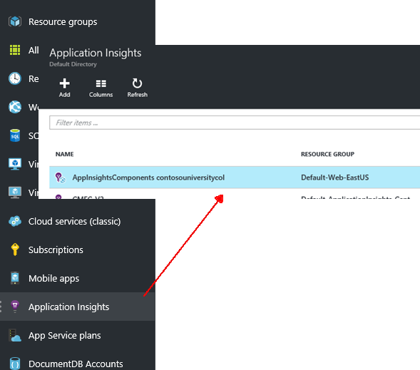
 
1. Ahora crearemos un nuevo recurso de **Application Insight**, el que asociaremos a nuestra aplicación.
 	
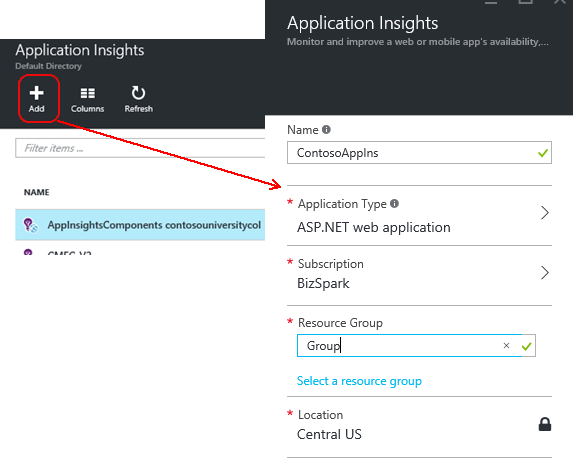

1. Desde Visual Studio 2015 vamos a integrar nuestra aplicación con Application Insights Desde el explorador de la solución hacemos clic derecho sobre el proyecto y Add Application Insights Telemetry (Agregar Telemetría).


1. Si lo solicita, es necesario reingresar las credenciales de acceso a su cuenta de azure.

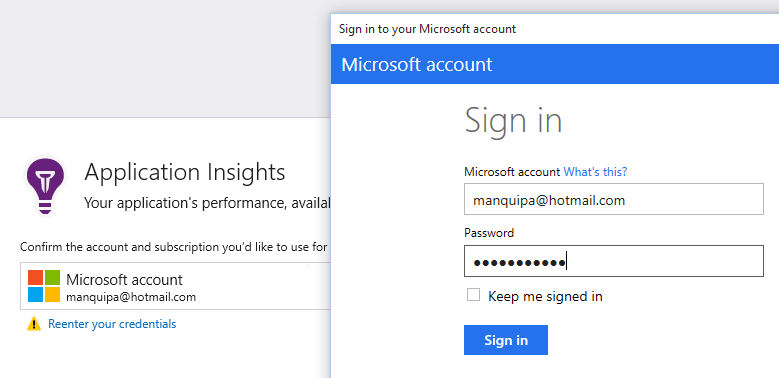

1. Se abrirá la ventana desde donde seleccionaremos la opción que creamos. Y hacemos clic en agregar (Add)


 
1. Ya que se agregaron las librerías asociadas con Insights, debemos publicar nuevamente la aplicación para guardar los cambios realizados.

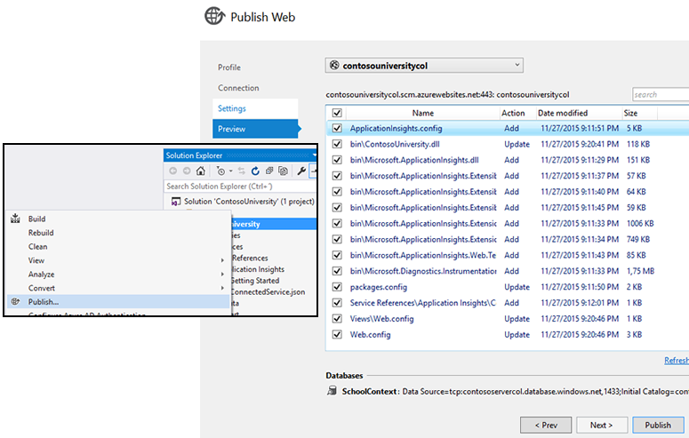

1. Lo que permitirá revisar la aplicación delde Azure Application Insights en donde podemos revisar la información que arroja la telemetría a nivel general, por ejemplo revisemos cuales son las páginas que mostraron error al ingresar a ellas.

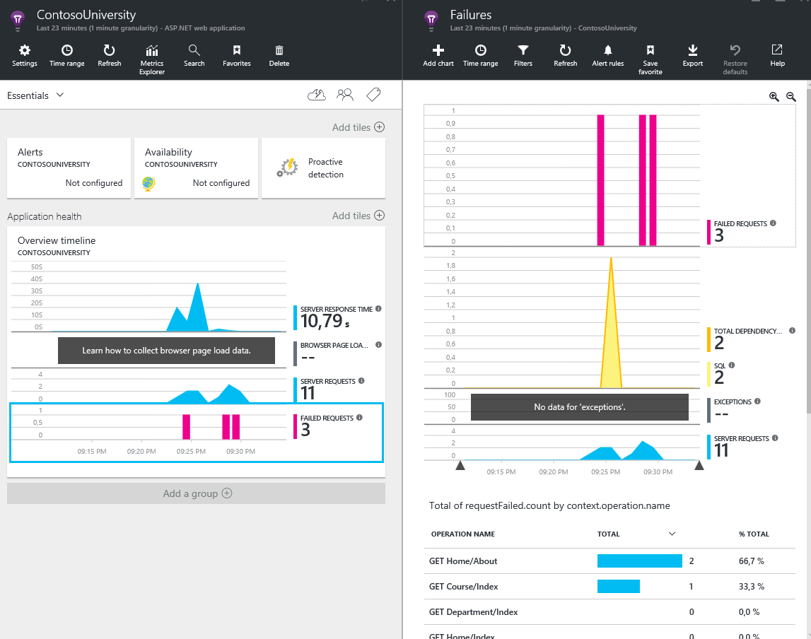


###Tarea 5
####Agregar información de excepciones a Application Insights

1. Crearemos un filtro para integrarnos rápida y fácilmente con nuestro proyecto hecho en MVC5 para lo cual crearemos la clase ContosoHandleErrorAttribute que heredará de la clase HandleErrorAttribute del framework de Insight.

```C#
using System;
using System.Web.Mvc;
using Microsoft.ApplicationInsights;

namespace ContosoUniversity.Common
{
    [AttributeUsage(AttributeTargets.Class | AttributeTargets.Method, Inherited = true, AllowMultiple = true)]
    public class ContosoHandleErrorAttribute : HandleErrorAttribute
    {
        public override void OnException(ExceptionContext filterContext)
        {
            if (filterContext != null && filterContext.HttpContext != null && filterContext.Exception != null)
            {
                //If customError is Off, then AI HTTPModule will report the exception
                if (filterContext.HttpContext.IsCustomErrorEnabled)
                {
                    // Note: A single instance of telemetry client is sufficient to track multiple telemetry items.
                    var telemetry = new TelemetryClient();
                    telemetry.TrackException(filterContext.Exception);
                }
            }
            base.OnException(filterContext);
        }
    }
}
```

1. Luego seleccionamos nuestro archivo Global.asax y registramos el filtro de manera global en el FilterConfig de nuestro código al final de la clase.

```C#
// ...
public static void RegisterGlobalFilters(GlobalFilterCollection filters)
{
    filters.Add(new ContosoHandleErrorAttribute());
}
// ...
```

1. De nuevo publicamos la aplicación para que queden en el servidor los cambios.

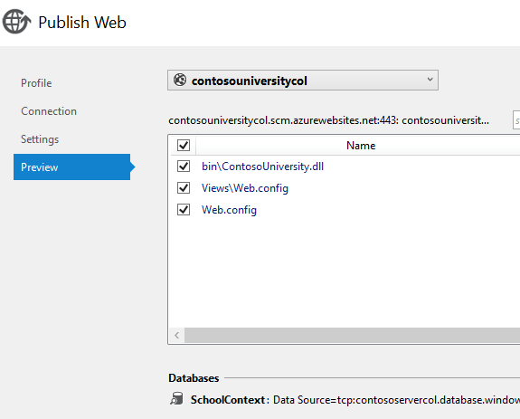
 
1. Observemos cuales son las excepciones que presenta en el momento de navegar por el sitio.


Es un esquema inicial para detectar el filtrado de información asociado con nuestro seguimiento de la aplicación.

###Tarea 6
####Conteo de eventos

Podemos utilizar Application Insigths para medir eventos específicos dentro de nuestra aplicación. Algo como los nuevos estudiantes e instructores que se registran pueden verse con una métrica en el tablero de Application Insigths
1. Contar cuantos estudiantes se registran en la aplicación En la clase Controllers\StudentController.cs agergar al método Crear (POST):

```C#
public ActionResult Create([Bind(Include = "LastName, FirstMidName, EnrollmentDate")]Student student)
{
    // .. 
        if (ModelState.IsValid)
        {
            db.Students.Add(student);
            db.SaveChanges();

            //----------------------------------------------
            TelemetryClient telemetry = new TelemetryClient();
            telemetry.TrackEvent("NewStudent");
            //----------------------------------------------

            return RedirectToAction("Index");
        }
    //..
}
```

1. Contar cuantos instructores se registran en la aplicación En la clase Controllers\InstructorController.cs agregar al método Crear (POST):

```C#
public ActionResult Create([Bind(Include = "LastName,FirstMidName,HireDate,OfficeAssignment")]Instructor instructor, string[] selectedCourses)
{
    //..
    if (ModelState.IsValid)
    {
        db.Instructors.Add(instructor);
        db.SaveChanges();

        //----------------------------------------------
        TelemetryClient telemetry = new TelemetryClient();
        telemetry.TrackEvent("NewInstructor");
        //----------------------------------------------

        return RedirectToAction("Index");
    }
    //..
}
```

- ¿Qué información nos arroja Application Insight sobre ContosoUniversity?
- ¿Cuantos usuarios hemos podido crear en nuestra aplicación?

###Tarea 7
####Test de disponibilidad y capacidad de respuesta del web site

Después de haber implementado la aplicación web, configuraremos pruebas web para supervisar su disponibilidad y capacidad de respuesta. Application Insights enviará solicitudes web a intervalos regulares desde puntos de todo el mundo y puede alertarle si la aplicación responde lentamente o no responde en absoluto.
Puede configurar pruebas web para cualquier punto de conexión HTTP o HTTPS que sea accesible desde la red pública de Internet.

Existen dos tipos de prueba web:
- Prueba de ping de la dirección URL: una prueba sencilla que se puede crear en el portal de Azure.
- Prueba web de varios pasos: que se crea en Visual Studio Ultimate o Visual Studio Enterprise y se carga en el portal.

1. Ahora vamos a seleccionar el recurso con el que hemos trabajado para las tareas anteriores:


1. Si no aparece el icono que nos permite manejar la disponibilidad es necesario agregarlo.

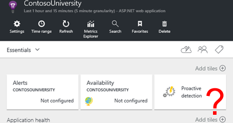

1. Hacemos clic sobre la opción Add tiles

 

1. Lo que nos despliega un menú al lado derecho Tile Gallery.

>
 
1. Seleccionamos la opción Availability arrastrándola al menú de nuestro recurso y hacemos clic en la opción Done sobre éste menú.

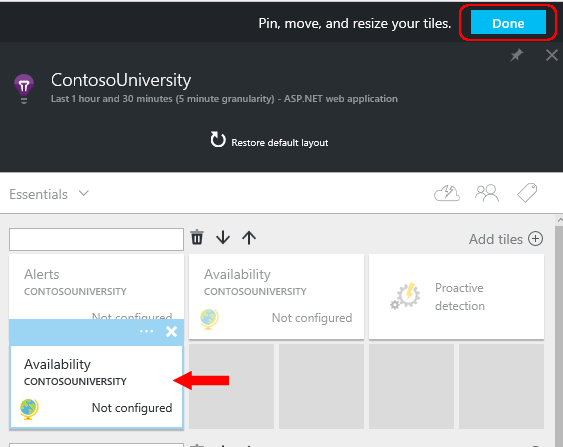

####Configuración de la prueba Ping
1. Hacemos clic sobre el icono que acabamos de implementar (Availability) y hacemos clic en la opción Add web test (Crear una prueba web)

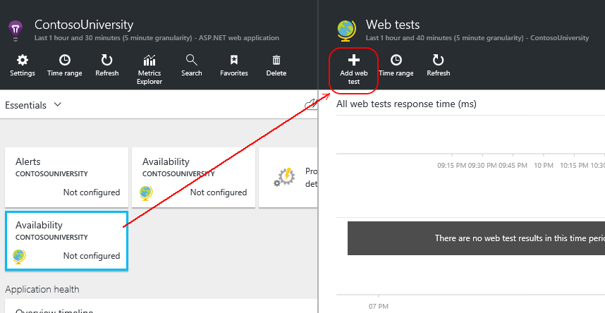

1. Llenamos la información para crear nuestra prueba: Nombre, tipo de test, la url (cargada por defecto), frecuencia, locaciones de carga, criterio, alertas.
Aunque lo vamos a dejar como está cargado por defecto, es bueno revisar las opciones que nos presenta cada uno de los elementos.
1. Hacemos clic en crear para que quede listo nuestro test.

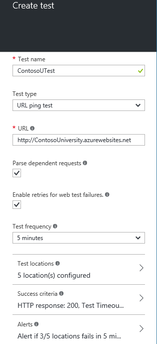
 
#####Para tener en cuenta:
- **La dirección URL** debe ser visible desde la red pública de Internet. Puede incluir una cadena de consulta, así por ejemplo se puede ejercitar un poco la base de datos. Si la dirección URL se resuelve en una redirección, la seguiremos, con un máximo de 10 redirecciones.
- **Analizar solicitudes dependientes**: imágenes, scripts, archivos de estilo y otros recursos de la página se solicitan como parte de la prueba. La prueba da error si todos estos recursos no se pueden descargar correctamente dentro del tiempo de espera de la prueba entera.
- **Habilitar reintentos**: cuando la prueba da error, se reintenta tras un corto intervalo. Se notifica un error únicamente si los tres intentos sucesivos producen un error. Las sucesivas pruebas se realizan según la frecuencia habitual de la prueba. El reintento se suspende temporalmente hasta que uno se complete correctamente. Esta regla se aplica independientemente en cada ubicación de la prueba. (Se recomienda esta configuración. Como media, cerca del 80 % de los errores desaparecen al reintentar).
- **Frecuencia de prueba**: establece la frecuencia con que se ejecuta la prueba desde cada ubicación de prueba. Con una frecuencia de cinco minutos y cinco ubicaciones de prueba, el sitio se prueba cada minuto por término medio.
- **Las ubicaciones de prueba** son los lugares desde donde nuestros servidores envían solicitudes web a la dirección URL. Elija más de una de tal forma que pueda distinguir los problemas del sitio web a partir de los problemas de red. Puede seleccionar hasta 16 ubicaciones.

#####Criterios de éxito:
- Tiempo de espera de prueba: reduzca este valor para recibir una alerta sobre las respuestas lentas. La prueba se considera un error si no se han recibido respuestas de su sitio dentro de este período. Si seleccionó Analizar solicitudes dependientes, todas las imágenes, archivos de estilo, scripts y otros recursos dependientes se deben haber recibido durante este período.
- Respuesta HTTP: el código de estado devuelto que se considera correcto. 200 es el código que indica que se ha devuelto una página web normal.
- Coincidencia de contenido: una cadena, como "Bienvenido". Realizaremos una prueba que tenga lugar en todas las respuestas. Debe ser una cadena sin formato, sin caracteres comodín. No se olvide que si el contenido cambia, es posible que tenga que actualizarla.
- De forma predeterminada, las alertas se le envían cuando hay errores en tres ubicaciones durante cinco minutos. Es probable que un error en una ubicación sea un problema de red y no un problema con su sitio. No obstante, puede cambiar el umbral a más o menos sensible, y también puede cambiar las personas a quienes se deben enviar los correos electrónicos.

1. Al seleccionar el test que acabamos de crear podemos ver el avance del mismo.

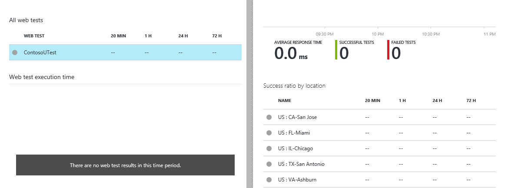
 
1. Agregue más pruebas. Por ejemplo, además de probar la página principal, puede asegurarse de que la base de datos se está ejecutando probando la URL con una búsqueda.

1. Después de uno o dos minutos, haga clic en Actualizar en la hoja de pruebas de disponibilidad o web. (No se actualiza automáticamente).

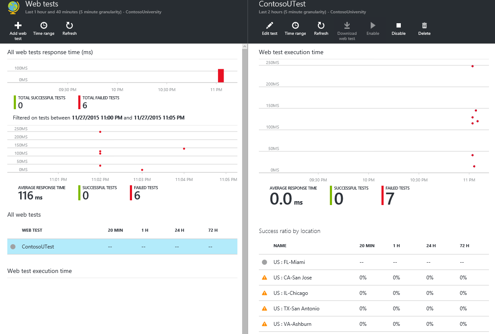
 
Al ubicarse sobre cualquiera de los puntos podrá ver la información relacionada.
 


###Tarea 8
####A manera de repaso.

1. Abramos nuestro ambiente de Azure Insights y seleccionemos el elemento que hemos venido trabajando asociado con Contoso University, luego hagamos clic en Settings para que se desplieguen las diferentes opciones.

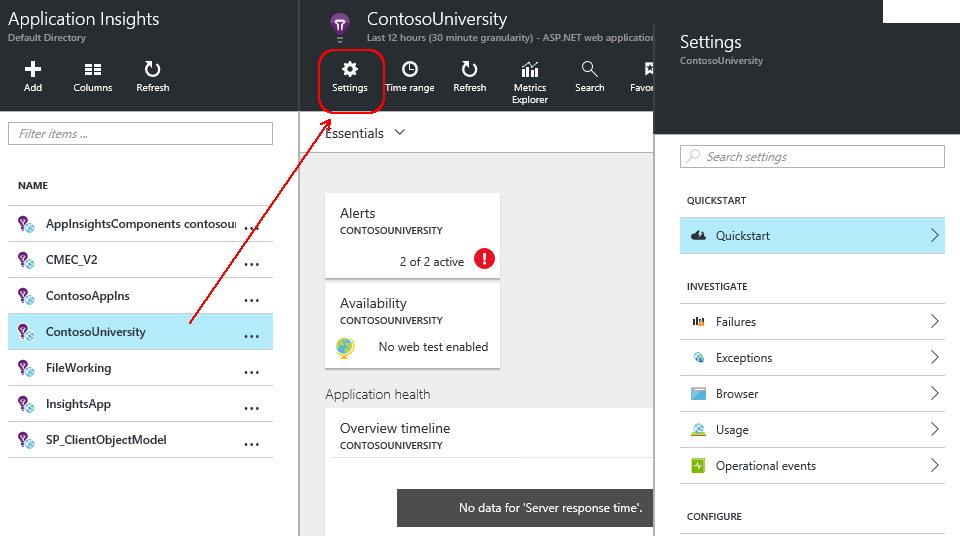

1. Allí podemos ver las diferentes opciones agrupadas por las características generales.

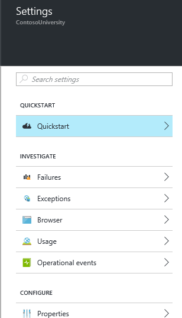

- Quick Start: Nos ofrece una seríe de guías para un inicio rapido, a manera de referencia y autoaprendizaje.
- Investigate (Investigar): Podemos ver el movimiento y los datos relacionados con la navegación, Las fallas, las escepciones, el uso y los eventos asociados con la aplicación a la que le estamos haciendo el seguimiento.
- Properties (Propiedades): Se pueden revisar las propiedades, la disponibilidad, los test y las demás características de nuestro servicio Application Insight.
- Resourse Management (Manejo de recursos): Nos permite manejar los usuarios, los roles y las etiquetas asociados a nuestro elemento Application Insight seleccionado.

#####Agregando un Chart

1. Aprovechemos que estamos ahí y hagamos clic sobre el Setting Browser (Navegación o páginas) y en la ventana que se despliega hagamos clic sobre **Add Chart**.


1. Modifiquemos algunas de las características del chart que estamos creando y veamos como se refleja esto dentro de nuestro sistema de charts.


###Vínculos

Azure Application Insights es una gran herramienta para poder hacer seguimiento en tiempo real a nuestras aplicaciones, para mayor profundidad de este tema recomendamos la siguiente documentación:

- ¿Qué es Application Insights?: https://azure.microsoft.com/es-es/documentation/articles/app-insights-overview/
- Detección, evaluación de errores y diagnóstico con Application Insights: https://azure.microsoft.com/es-es/documentation/articles/app-insights-detect-triage-diagnose/
- Análisis de uso con Application Insights: https://azure.microsoft.com/es-es/documentation/articles/app-insights-overview-usage/
- Vistas de datos de Application Insights en Power BI: https://azure.microsoft.com/es-es/documentation/articles/app-insights-export-power-bi/
- exportación a SQL desde Application Insights mediante Análisis de transmisiones: https://azure.microsoft.com/es-es/documentation/articles/app-insights-code-sample-export-sql-stream-analytics/

Entre otros varios al respecto.


