#Apps Service (Easy Tables) y Aplicaciones Universales
<span class="alert alert-info">
A continuación se describen los pasos correspondientes para crear un backend rápido usando Easy Tables de App Service de Azure. 

Posteriormente crearemos una app que consuma este backend en formato REST/Json usando HttpClient.

**IMPORTANTE:** Este ejercicio es un laboratorio de inducción para los devcamps. Las practicas implementadas aquí con el MVVM no se encuentran implementadas completamente de forma adecuada para una aplicación de producción. Solo es un ejercicio demostrativo.

</span>

##Herramientas:

<span class="alert alert-info">Para este laboratorio necesitas:</span>

1. Visual Studio 2015 
1. Última version del [SDK de Windows 10](https://dev.windows.com/en-us/downloads/windows-10-sdk)
1. Una suscripción a Azure
1. Probador de peticiones web. Use su favorito. En el tutorial se usar [Fiddler](http://www.telerik.com/fiddler) para este propósito.

##Comencemos:
###Parte 1: Creación del Backend con Easy Tables

1. En nuestra suscripción de Azure creamos un nuevo Mobile App siguiendo los pasos de la imagen
	
	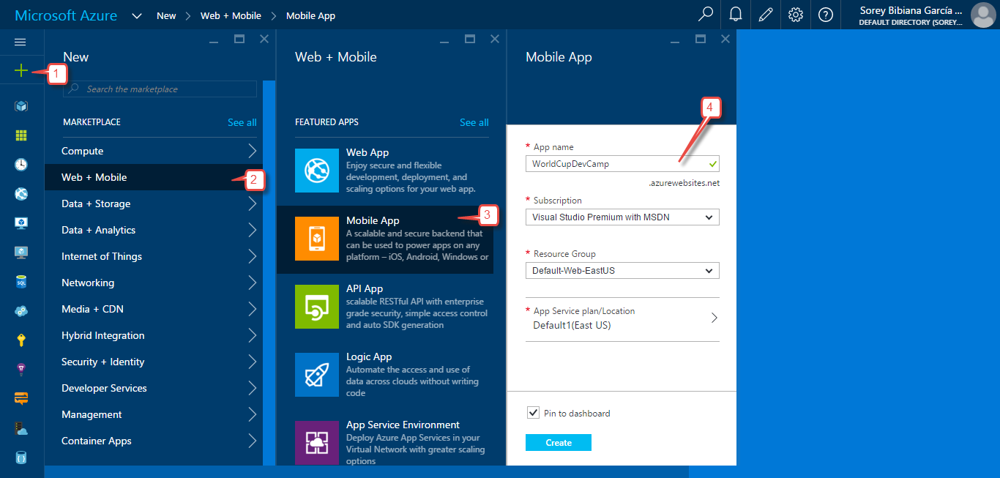
    
1. Cuando la aplicación sea creada se cargará el panel de administración en la zona de settings. Busca la opción Easy tables y selecciónala. En este punto se te indicará que debe realizarse una configuración para habilitar las Easy tables, da click en el mensaje que te lo indica.
	
	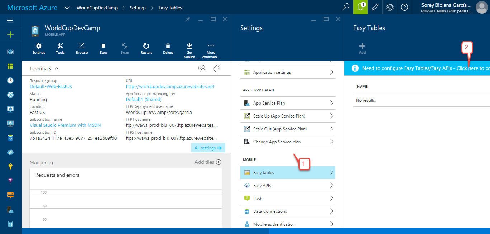
    
1. A continuación se te indicarán los pasos a seguir para configurar las Easy tables: Conectarnos a una base de datos e inicializar la app.
	
	
    
1. Sigue todos los pasos para configurar una nueva base de datos, tal como se muestra en la imagen. Recuerda que debes elegir otros nombres para tu app. Presiona los botones OK del último paso al primero, las ventanas se iran cerrando una a una.
	
	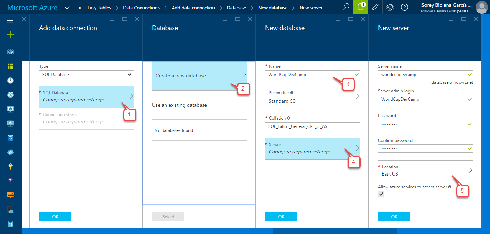
    
1. Espera que la creación de la base de datos y la conexión finalice con éxito.
	
	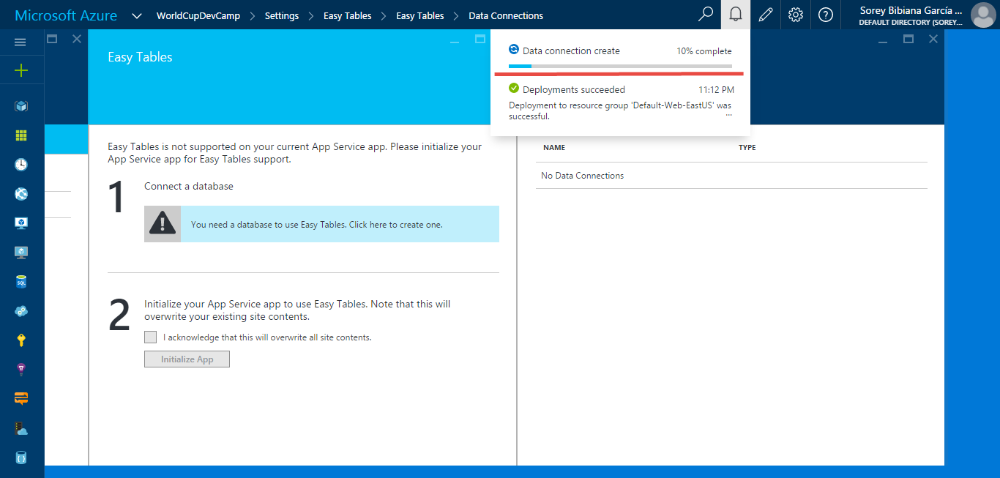
    
    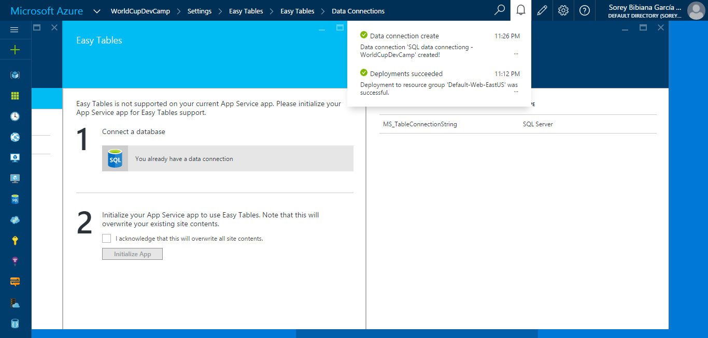
    
1. Acepta los términos, presiona el botón inicializar y espera que se confirme la finalización del proceso.
	
	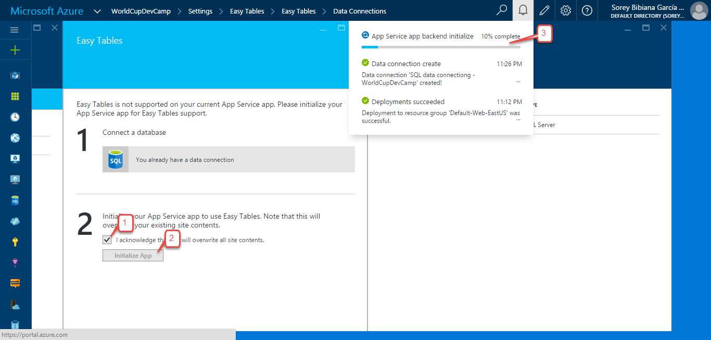
    
1. Después de que el proceso finalice, quedarás ubicado en la pantalla de creación de tablas. Crea una siguiendo los pasos de la imagen. Después de presionar el botón OK espera la confirmación. Tu tabla debe aparecer en la lista.
	
	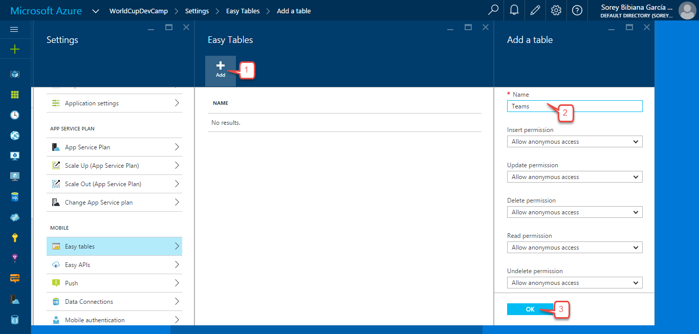
    
1. Para adicionar columnas selecciona tu tabla y administra el esquema. Usa el botón adicional columna para añadir las que consideres.
	
	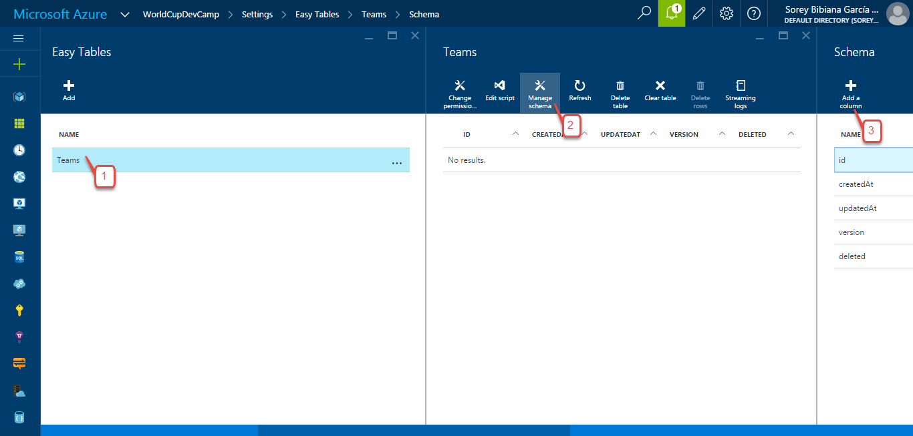
    
    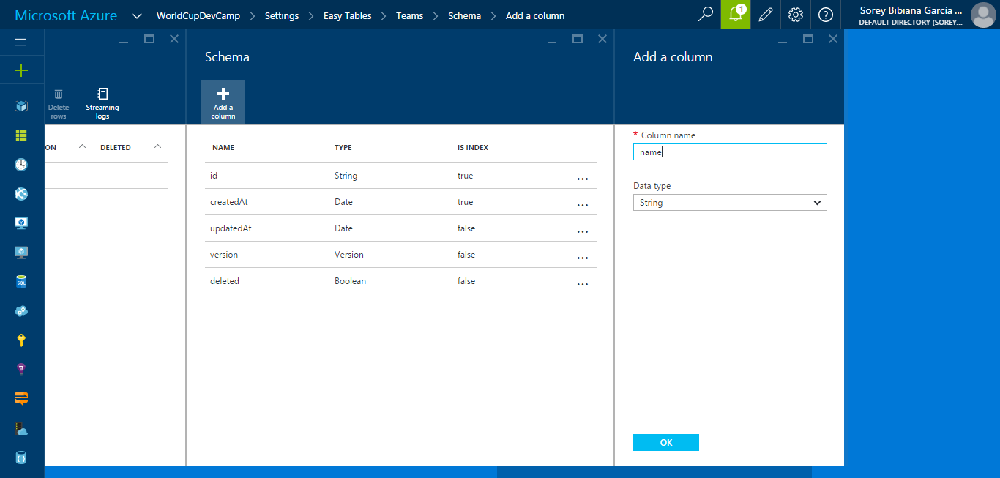
    
    
###Parte 2: Probando las Easy Tables

1. Después de crear tu tabla podrás incluso modificar el código Node.js con que fue construido. Si, las Easy Tables son Node.js.
	
	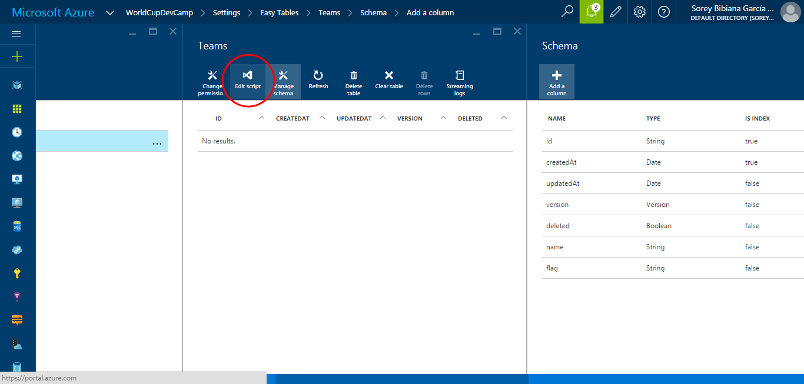
    
1. El editor en línea "Mónaco" te permitira cambiar el código. No tendras que hacer ningún proceso de publicación, el cambio es inmediato.
	
	

    A continuación está el código usado en el ejemplo
    ```
    var table = module.exports = require('azure-mobile-apps').table();

    table.insert(function (context) {
        if (context.item.name.indexOf("Colombia") > -1) {
            context.item.name += " ¡Mi tierrita!";
        }
        
        return context.execute();
    });
    ```    

1. En un probador web como Fiddler, podemos componer un llamado HTTP para probar que nuestra API Rest está funcionando. Debes recordar escribir ZUMO-API-VERSION: 2.0.0 como header del request http.	
	
    
    
1. Después de ejecutar vemos como el item creado tiene la modificación que insertamos en nuestro script

    
    
1. En Azure podemos ver como nuestro dato fue creado, o bien haciendo una petición get por Fiddler

    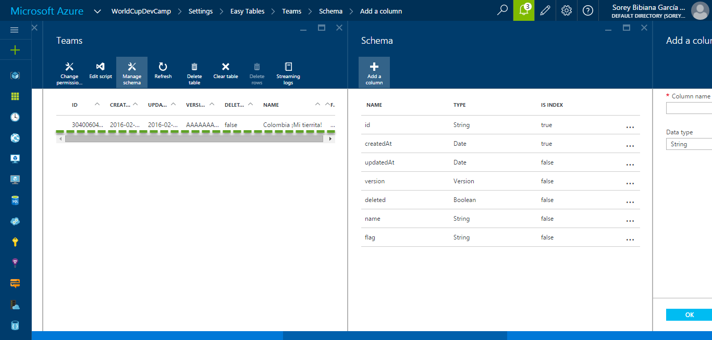
    
###Parte 3: Entendiendo el diseño adaptativo

1. Iniciaremos creando nuestra App Universal. 
	
	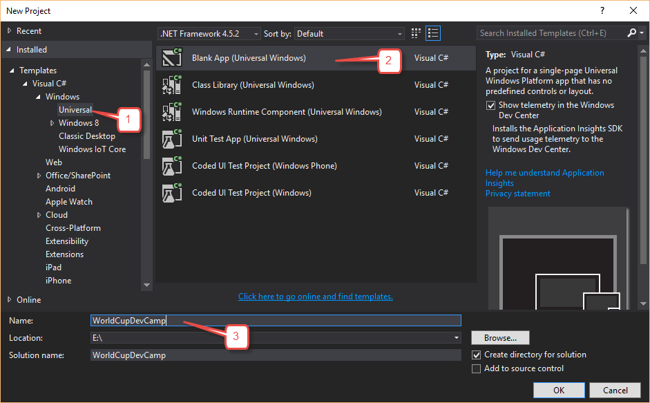
    
1. Para crear nuestro diseño usaremos Blend. Inicia Blend desde el proyecto como lo muestra la imagen

    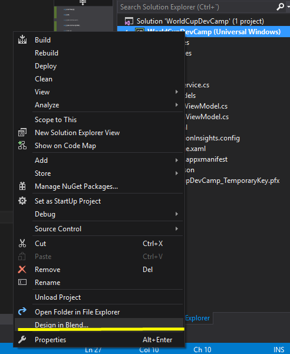
    
1. En Blend vamos a crear como contenido de nuestra página un SplitView. En la documentación oficial puedes encontrar [íconos predeterminados](https://msdn.microsoft.com/en-us/library/windows/apps/jj841126.aspx) basados en la fuente Segoe. El código de nuestra primera vista debería quedar como se muestra a continuación.

    ```
    <SplitView x:Name="MySplitView" 
                DisplayMode="CompactOverlay"
                IsPaneOpen="False" 
                CompactPaneLength="50" 
                OpenPaneLength="200">
        <SplitView.Pane>
            <StackPanel Background="#FF1D7C01">
                <Button x:Name="HamburgerButton" FontFamily="Segoe MDL2 Assets" Content="&#xE700;"
                Width="50" Height="50" Background="Transparent" Foreground="White" />
                <StackPanel Orientation="Horizontal">
                    <Button x:Name="MenuButton1" FontFamily="Segoe MDL2 Assets" Content="&#xE710;"
                Width="50" Height="50" Background="Transparent" Foreground="White"/>
                    <TextBlock Text="Añadir equipo" FontSize="18" VerticalAlignment="Center" Foreground="White" />
                </StackPanel>
                <StackPanel Orientation="Horizontal">
                    <Button x:Name="MenuButton2" FontFamily="Segoe MDL2 Assets" Content="&#xE716;"
                    Width="50" Height="50" Background="Transparent" Foreground="White"/>
                    <TextBlock Text="Ver equipos" FontSize="18" VerticalAlignment="Center" Foreground="White" />
                </StackPanel>
                <StackPanel Orientation="Horizontal">
                    <Button x:Name="MenuButton3" FontFamily="Segoe MDL2 Assets" Content="&#xE730;"
                    Width="50" Height="50" Background="Transparent" Foreground="White"/>
                    <TextBlock Text="Grupos" FontSize="18" VerticalAlignment="Center" Foreground="White" />
                </StackPanel>
            </StackPanel>
        </SplitView.Pane>
        <SplitView.Content>
            <Grid Background="White">
                <TextBlock Text="SplitView Basic" FontSize="54" Foreground="Black"
                        HorizontalAlignment="Center" VerticalAlignment="Center"/>
            </Grid>
        </SplitView.Content>
    </SplitView>
    ```

1. En Visual Studio el preview nos permite ver el panel del Menu Extendido y Colapsado. 
    
    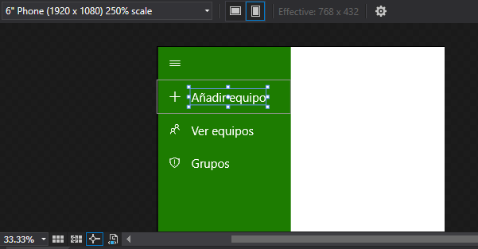
    
1. En ejecución lo veremos solo colapsado. 

    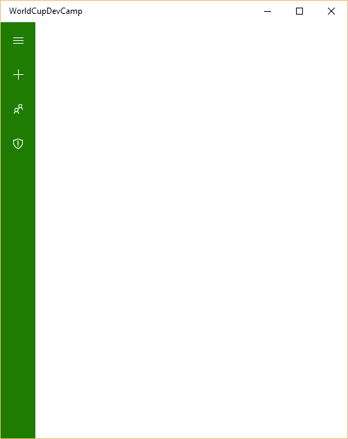

1. Creemos el evento en el menú hamburguesa para abrir y cerrar el menú. 

    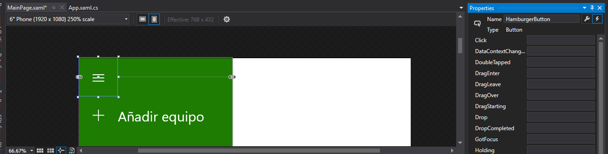
    

1. La forma más básica debería verse de la siguiente forma en código: 
    
    ```
    private void HamburgerButton_Click(object sender, RoutedEventArgs e)
    {
        MySplitView.IsPaneOpen = !MySplitView.IsPaneOpen;
    }
    ```
    
 
1. Para trabajar con diseño adaptativo debemos crear un Visual State Manager en el primer contenedor que exista en la pagina. Puedes hacerlo con Blend asi:

 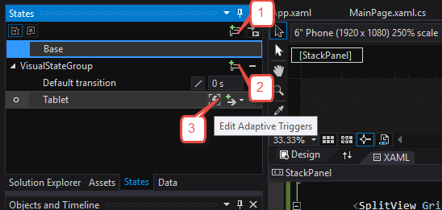

1. O bien puedes escribir el siguiente código

    ```    
        <VisualStateManager.VisualStateGroups>
            <VisualStateGroup x:Name="VisualStateGroup">
                <VisualState x:Name="Tablet">
                    <VisualState.StateTriggers>
                        <AdaptiveTrigger MinWindowWidth="500"/>
                    </VisualState.StateTriggers>
                    <VisualState.Setters>
                        <Setter Target="MySplitView.(SplitView.DisplayMode)" Value="Inline"/>
                        <Setter Target="MySplitView.(SplitView.IsPaneOpen)" Value="True"/>
                    </VisualState.Setters>
                </VisualState>
            </VisualStateGroup>
        </VisualStateManager.VisualStateGroups>
        
    ```
        
    La condición descrita en este código indica que el menú debe estar colapsado por defecto, pero cuando la pantalla tenga minimo 500 píxeles efectivos, debe estar en línea y abierto.       
        
1. Vamos a darle un mejor diseño a nuestra página. Extrayendo el botón de menú fuera del panel lateral. Además en el contenido del SplitView reemplazaremos el contenido exitente por un frame que nos permitirá navegar entre páginas. El código debe lucir así:
	
    ```
    <Grid>
        <VisualStateManager.VisualStateGroups>
            <VisualStateGroup x:Name="VisualStateGroup">
                <VisualState x:Name="Tablet">
                    <VisualState.StateTriggers>
                        <AdaptiveTrigger MinWindowWidth="500"/>
                    </VisualState.StateTriggers>
                    <VisualState.Setters>
                        <Setter Target="MySplitView.(SplitView.DisplayMode)" Value="Inline"/>
                        <Setter Target="MySplitView.(SplitView.IsPaneOpen)" Value="True"/>
                    </VisualState.Setters>
                </VisualState>
            </VisualStateGroup>
        </VisualStateManager.VisualStateGroups>
        <Grid.RowDefinitions>
            <RowDefinition Height="Auto"></RowDefinition>
            <RowDefinition></RowDefinition>
        </Grid.RowDefinitions>
        <StackPanel Orientation="Horizontal" Background="Black">
            <Button x:Name="HamburgerButton" FontFamily="Segoe MDL2 Assets" Content="&#xE700;"
                    Width="50" Height="50" Background="Transparent" Foreground="White" Click="HamburgerButton_Click"/>
        </StackPanel>

        <SplitView Grid.Row="1" x:Name="MySplitView" 
                DisplayMode="CompactOverlay"
                IsPaneOpen="False" 
                CompactPaneLength="50" 
                OpenPaneLength="200">
            
            <SplitView.Pane>
                <StackPanel Background="{StaticResource MenuBackgroundColor}">
                    <StackPanel Orientation="Horizontal">
                        <Button x:Name="MenuButton1" FontFamily="Segoe MDL2 Assets" Content="&#xE710;"
                    Width="50" Height="50" Background="Transparent" Foreground="White"/>
                        <TextBlock Text="Añadir equipo" FontSize="18" VerticalAlignment="Center" Foreground="White" />
                    </StackPanel>
                    <StackPanel Orientation="Horizontal">
                        <Button x:Name="MenuButton2" FontFamily="Segoe MDL2 Assets" Content="&#xE716;"
                        Width="50" Height="50" Background="Transparent" Foreground="White"/>
                        <TextBlock Text="Ver equipos" FontSize="18" VerticalAlignment="Center" Foreground="White" />
                    </StackPanel>
                    <StackPanel Orientation="Horizontal">
                        <Button x:Name="MenuButton3" FontFamily="Segoe MDL2 Assets" Content="&#xE730;"
                        Width="50" Height="50" Background="Transparent" Foreground="White"/>
                        <TextBlock Text="Grupos" FontSize="18" VerticalAlignment="Center" Foreground="White" />
                    </StackPanel>
                </StackPanel>
            </SplitView.Pane>
            <SplitView.Content>
                <Frame x:Name="NavigationContainer">
                
                </Frame>
            </SplitView.Content>
        </SplitView>
    </Grid>
    
    ```
    
1. El preliminar en Windows Mobile se ve así:

    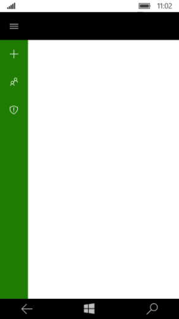 
    
###Parte 4: Ensamblando la base para MVVM y el patrón de navegación

1. Para trabajar con MVVM instalaremos un paquete a través de Nuget
	
    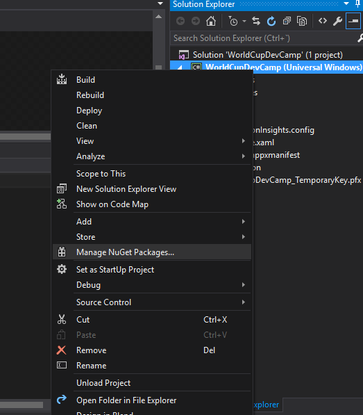
  
1. El paquete es MVVMLight solo las librerías. Ten cuidado de seleccionar el paquete que está vigente, ya que hay uno aún publicado pero deprecado.  
    
    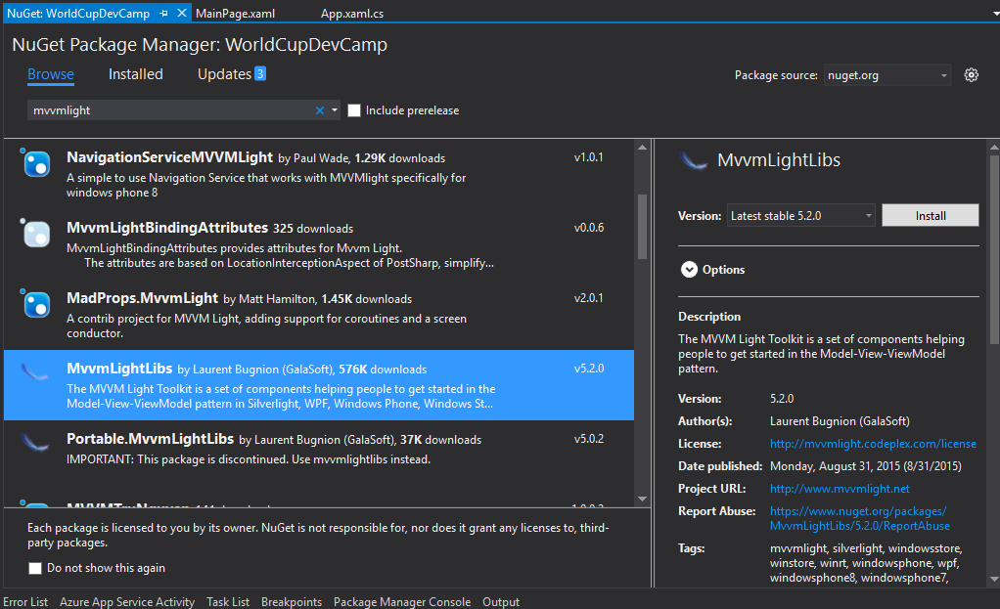
    
1. Creamos la estructura de clases de nuestra app
   
    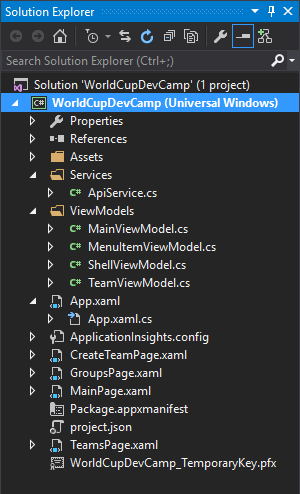
    
1. Toma el código de las view models, el code behind de MainPage y el nuevo XAML de MainPage de los siguientes enlaces:
    
    - [MainViewModel](https://github.com/Ninja-Labs/azure/blob/UWPLabNavegacionCompleta/7.%20Apps%20Service%20and%20Universal%20Windows%20Platform/Lab%201/WorldCupDevCamp/WorldCupDevCamp/ViewModels/MainViewModel.cs)
    - [MenuItemViewModel](https://github.com/Ninja-Labs/azure/blob/master/7.%20Apps%20Service%20and%20Universal%20Windows%20Platform/Lab%201/WorldCupDevCamp/WorldCupDevCamp/ViewModels/MenuItemViewModel.cs)
    - [ShellViewModel](https://github.com/Ninja-Labs/azure/blob/master/7.%20Apps%20Service%20and%20Universal%20Windows%20Platform/Lab%201/WorldCupDevCamp/WorldCupDevCamp/ViewModels/ShellViewModel.cs)
    - [TeamViewModel](https://github.com/Ninja-Labs/azure/blob/UWPLabNavegacionCompleta/7.%20Apps%20Service%20and%20Universal%20Windows%20Platform/Lab%201/WorldCupDevCamp/WorldCupDevCamp/ViewModels/TeamViewModel.cs)    
    - [MainPage.xaml](https://github.com/Ninja-Labs/azure/blob/UWPLabNavegacionCompleta/7.%20Apps%20Service%20and%20Universal%20Windows%20Platform/Lab%201/WorldCupDevCamp/WorldCupDevCamp/MainPage.xaml)
    - [MainPage.xaml.cs](https://github.com/Ninja-Labs/azure/blob/UWPLabNavegacionCompleta/7.%20Apps%20Service%20and%20Universal%20Windows%20Platform/Lab%201/WorldCupDevCamp/WorldCupDevCamp/MainPage.xaml.cs)
    

**ATENCIÓN:** Recuerda conservar tus namespaces tanto en C# como en XAML solo copia los contenidos de las clases y el XAML
    
**INFORMACIÓN:** Para escoger los iconos correctos en la enumeración a través de codigo C# mira la [descripción de la enumeración Symbol](https://msdn.microsoft.com/EN-US/library/windows/apps/windows.ui.xaml.controls.symbol.aspx) en la documentación oficial

###Parte 5: Consumiendo nuestra API

1. Realizaremos el consumo del API a través de HttpClient por lo cual debemos instalar el paquete a través de nuget
	
    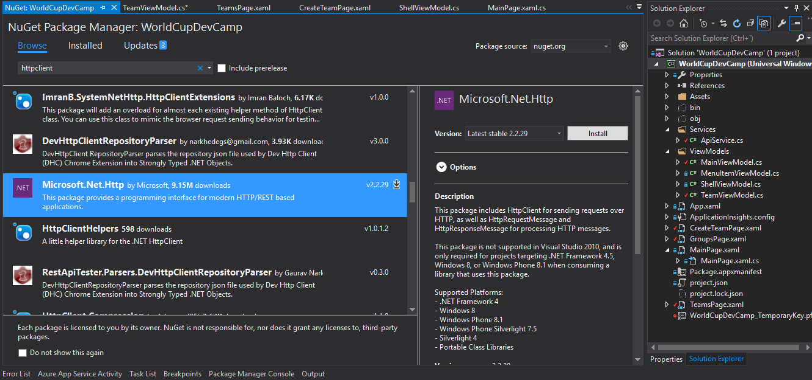

1. Agrega además el Json.NET
	
    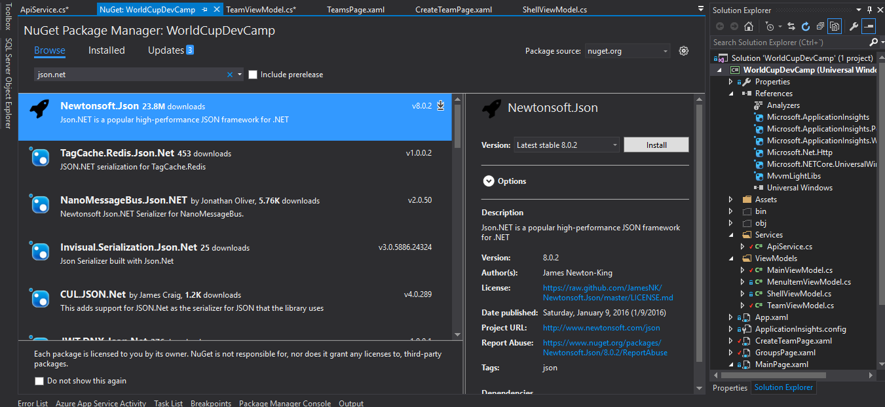
    
1. Creamos el método consultar en ApiService con el siguiente código

    ```
    internal async Task<List<TeamViewModel>> GetTeamsAsync()
    {
        var serviceUrl = "http://worldcupdevcamp.azurewebsites.net/tables/teams";
        using (var client = new HttpClient())
        {
            client.DefaultRequestHeaders.Add("ZUMO-API-VERSION", "2.0.0");
            var response = await client.GetAsync(new Uri(serviceUrl));
            string result = await response.Content.ReadAsStringAsync();
            return JsonConvert.DeserializeObject<List<TeamViewModel>>(result);
        }
    }
    ```
            
1. Creamos el método insertar en ApiService con el siguiente código

    ```
    internal async Task SaveTeamAsync(TeamViewModel team)
    {
        var serviceUrl = "http://worldcupdevcamp.azurewebsites.net/tables/teams";

        team.Id = Guid.NewGuid().ToString();

        using (var client = new HttpClient())
        {
            var bodyRequest = JsonConvert.SerializeObject(team);
            client.DefaultRequestHeaders.Add("ZUMO-API-VERSION", "2.0.0");
            var response = await client.PostAsync(serviceUrl, new StringContent(bodyRequest, System.Text.Encoding.UTF8, "application/json"));
            string result = await response.Content.ReadAsStringAsync();
        }
    }
    ```
1. Debemos adecuar la view model TeamViewModel que en este ejercicio estamos usando como Modelo para que pueda serilizar correctamente. Por lo que debemos aplicar los siguientes cambios.
    
    ```
    public class TeamViewModel : ViewModelBase
    {
        ApiService apiService;

        public TeamViewModel()
        {
            apiService = new ApiService();
        }
        [JsonProperty("id")]
        public string Id { get; set; }
        [JsonProperty("name")]
        public string Name { get; set; }
        [JsonProperty("flag")]
        public string Flag { get; set; }

        [JsonIgnore]
        public string Group { get; set; }
        [JsonIgnore]
        public ICommand SaveCommand
        { 
            get
            {
                return new RelayCommand(Save);
            }
        }
    ```
    
1. Implementamos el método Save con el siguiente código:

    ```
    private async void Save()
    {
        await apiService.SaveTeamAsync(this);
        App.Main.LoadData();
        App.RootFrame.Navigate(typeof(TeamsPage));
    }
    ```

1. Además terminamos de implementar el método LoadData en el MainViewModel así:

    ```
    public class MainViewModel : ViewModelBase
    {
        ApiService apiService;

        public MainViewModel()
        {
            apiService = new ApiService();
            Teams = new ObservableCollection<TeamViewModel>();
            NewTeam = new TeamViewModel();

            //Teams.Add(new TeamViewModel() { Name = "Colombia", Flag= "http://rs575.pbsrc.com/albums/ss196/laurasgonzalez/ColombiaFlag.jpg~c200" });
            LoadData();
        }
        public TeamViewModel NewTeam { get; set; }

        public ObservableCollection<TeamViewModel> Teams { get; set; }

        public async void LoadData()
        {
            this.Teams.Clear();
            var teams = await apiService.GetTeamsAsync();

            foreach (var item in teams)
            {
                this.Teams.Add(item);
            }
        }
    }
    ```
1. Toma el código páginas de los siguientes enlaces:
    
    - [CreateTeamPage.xaml](https://github.com/Ninja-Labs/azure/blob/master/7.%20Apps%20Service%20and%20Universal%20Windows%20Platform/Lab%201/WorldCupDevCamp/WorldCupDevCamp/CreateTeamPage.xaml)
    - [GroupsPage.xaml](https://github.com/Ninja-Labs/azure/blob/master/7.%20Apps%20Service%20and%20Universal%20Windows%20Platform/Lab%201/WorldCupDevCamp/WorldCupDevCamp/GroupsPage.xaml)
    - [TeamsPage.xaml](https://github.com/Ninja-Labs/azure/blob/UWPLabNavmasteregacionCompleta/7.%20Apps%20Service%20and%20Universal%20Windows%20Platform/Lab%201/WorldCupDevCamp/WorldCupDevCamp/TeamsPage.xaml)
    
1. Toma el código final de la MainViewModel
    
    - [MainViewModel](https://github.com/Ninja-Labs/azure/blob/master/7.%20Apps%20Service%20and%20Universal%20Windows%20Platform/Lab%201/WorldCupDevCamp/WorldCupDevCamp/ViewModels/MainViewModel.cs)
    
1. Implementa el convertidor para las listas agrupadas con el nombre ItemsToKeyedListConverter en una carpeta con el nombre Converters
    
    - [ItemsToKeyedListConverter](https://github.com/Ninja-Labs/azure/blob/master/7.%20Apps%20Service%20and%20Universal%20Windows%20Platform/Lab%201/WorldCupDevCamp/WorldCupDevCamp/Converters/ItemsToKeyedListConverter.cs)
    
1. Actualiza los recursos de App.xaml
    
    - [App.xaml](https://github.com/Ninja-Labs/azure/blob/master/7.%20Apps%20Service%20and%20Universal%20Windows%20Platform/Lab%201/WorldCupDevCamp/WorldCupDevCamp/App.xaml)