#WebApps MVC 5 + Angular JS + Application Insight 
<span class="alert alert-info">
A continuación, se describen los pasos correspondientes
para realizar un aplicativo Asp.Net Mvc 5 consumiendo 
el API creada con anterioridad, además aplicaremos AngularJs, el popular framework MVC Front-end.
Y por último desplegaremos sobre azure nuestro proyecto, e implementaremos Application Insight, para conocer
la trazabilidad de peticiones, accesos y click's :)

Emocionante ¿No?

</span>
##Comencemos:

Query para creación de tablas
```

create table Jugador(
	Id int Primary key identity(1,1),
	Nombre nvarchar(200) null,
	Apodo nvarchar(200) null,
	Nacionalidad nvarchar(200) null,
	Estatura decimal null,
	Peso int null,
	Posicion nvarchar(200) null,
	IdEquipo int null
)

create table Equipo(
	Id int Primary key identity(1,1),
	Nombre nvarchar(200) null,
	Apodo nvarchar(200) null,
	Presidente nvarchar(200) null,
	Entrenador nvarchar(200) null,
	Estadio nvarchar(200) null,

)
```
Linea de código para remover el formato por defecto xml del api

```

  var appXmlType = config.Formatters
                .XmlFormatter.SupportedMediaTypes.FirstOrDefault(t => t.MediaType == "application/xml");
            config.Formatters.XmlFormatter.SupportedMediaTypes.Remove(appXmlType);
```

###Paso 1: Creación de proyecto Asp.Net Mvc 

1. Abrimos nuestro visual studio y procedemos a dar click en "Nuevo proyecto".
1. Abierta nuestra ventana de creación de nuevo proyecto buscamos la plantilla de C# --> Web.
1. Seleccionamos Aplicación web Asp.Net.
1. Indicamos el nombre de nuestro proyecto.
1. Luego damos click en el menu desplegado ubicado en la parte derecha de nuestro correo vinculado, si no 
aparece nuestro correo dira "Agregar cuenta"	

	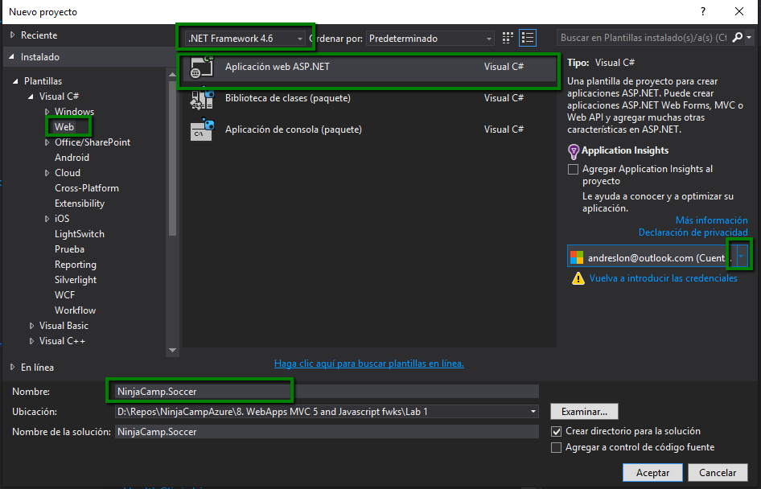

1. Se abrira nuestra ventana para loguearnos a azure o reintroducir las credenciales, introducimos nuestros datos 
y damos click en Iniciar sesión

    
    
1. Ya vinculada nuestra cuenta de azure, nos disponemos a vincular automaticamente el sistema de telemetria de microsoft "Application Insight"
1. Seleccionamos la opción "Agregar Application Insight al proyecto"
1. Damos click en "Definir la configuración"

    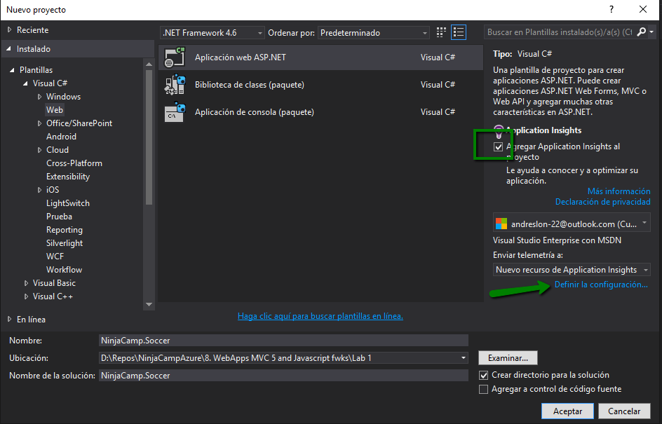

1. Abierta ya nuestra ventada de configuracion para Insight, seleccionamos nuestro grupo de recurso, si no tenemos entonces lo creamos.
1. En nombre del recurso Application Insight lo dejamos en (Nombre del proyecto)
1. Damos click en Aceptar    

    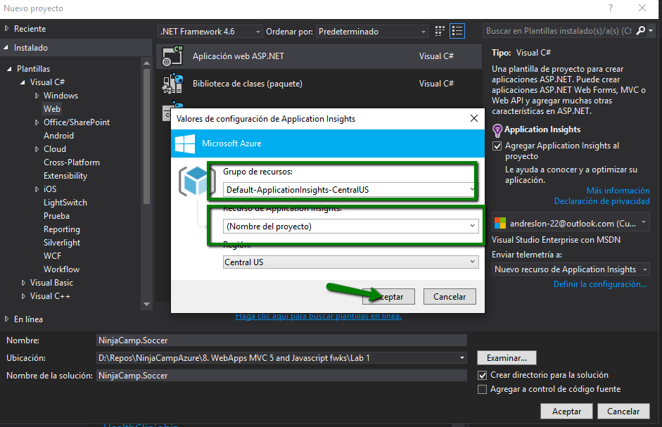
   
1. Ya configurada nuestra cuenta de azure y application insight , damos click en aceptar.
1. Al crear nuestro proyecto web se abrirá la ventana correspondiente para seleccionar nuestra plantilla.
1. Seleccionamos la plantilla MVC.
1. Seleccionamos el check ubicado en la arte inferior "Host en la nube", para que se nos cree nuestra WebApp en Azure.
1. Para evitar crear todo el esquema de ejemplo de nuestro proyecto MVC que implementa Autenticación, procedemos a quitarla, damos click en "Cambiar autenticación".

    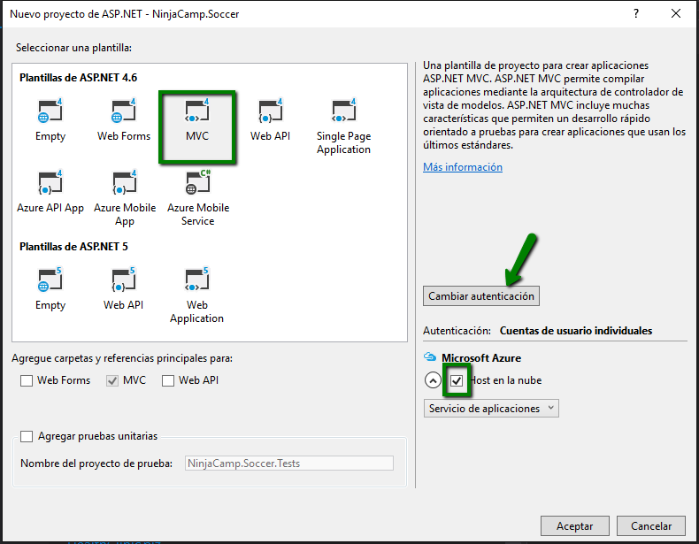
	
1. Seleccionamos la opción de "Sin autenticación" y presionamos "Aceptar".
	- Ya de regreso en la ventana de la plantilla, volvemos a presionar "Aceptar"

	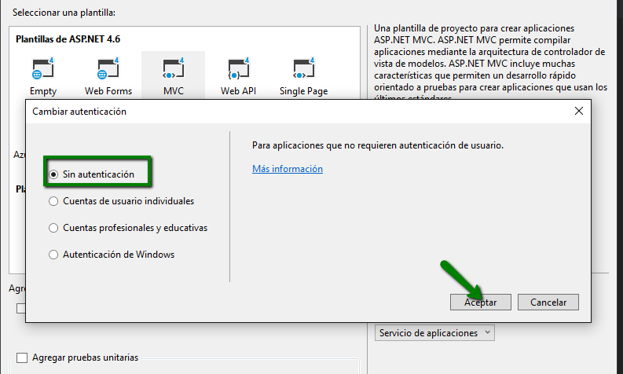

    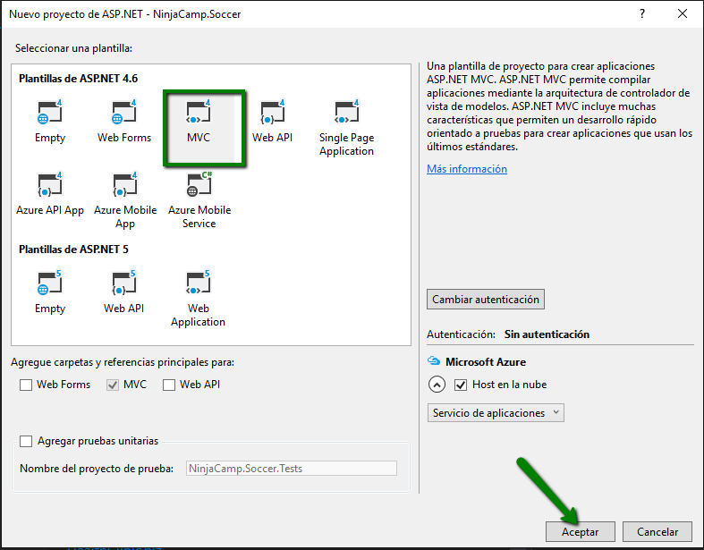
    
1. Debido a que seleccionamos la casilla Host en la nube, se nos abrira una ventana de configuración para crear nuestro webapp en azure.
1. Automaticamente se creara un nombre de la aplicación web, puedes cambiarla.
1. selecciona tu subscripción y el grupo de recursos-
1. Por ultimo si no tienes creado un plan de servicio da click en nuevo.

    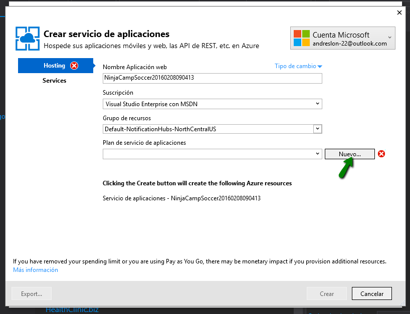

1. Para crear un plan de servicio solo agrega un nombre y la ubicación del plan, al final presiona aceptar.
    
    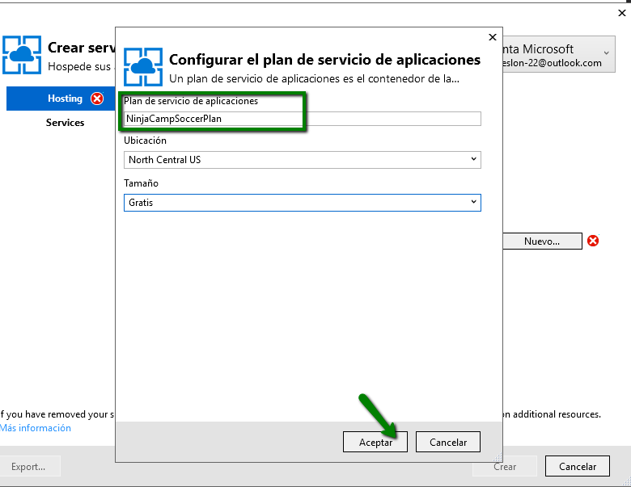

1. Ya todo listo y configurado para iniciar la codificación
    
    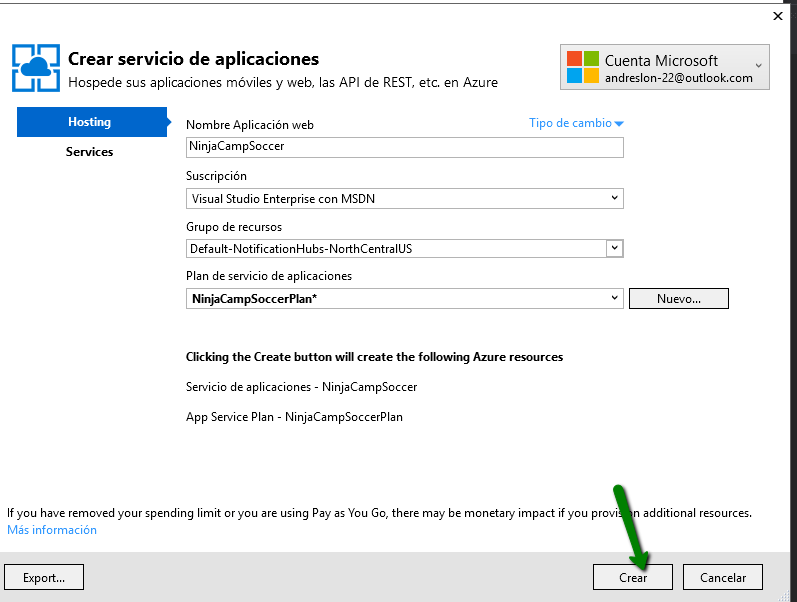

###Paso 2: Creación de modelos

1. Ya creada la base de nuestra aplicación, ahora nos situaremos en la carpeta Models,
damos click derecho Agregar--> Clase
1. Agregaremos nuestros modelos Equipo y Jugador.
(haz lo mismo que la imagen con la clase Jugador)
    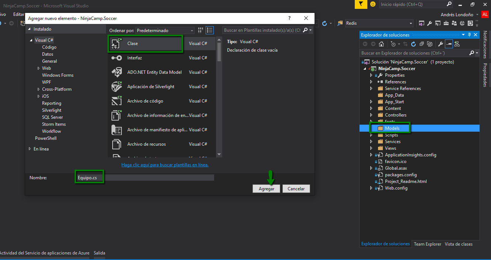
1. Adicionamos las propiedades requeridas para los modelos, similares a las construidas con anterioridad en el Lab de WebApi
1. Importamos la libreria
```
using Newtonsoft.Json;
```
1. y por ultimo sobre cada propiedad establecemos el atributo json que se utilizara para serializar y deserializar la respuesta del API.
    
    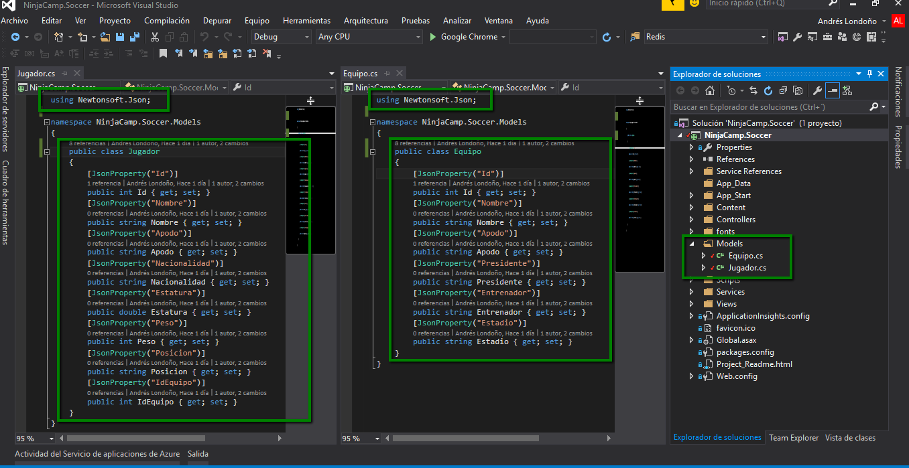
    
Acá el codigo:
    
```
using Newtonsoft.Json;

namespace NinjaCamp.Soccer.Models
{
    public class Jugador
    {
        [JsonProperty("Id")]
        public int Id { get; set; }
        [JsonProperty("Nombre")]
        public string Nombre { get; set; }
        [JsonProperty("Apodo")]
        public string Apodo { get; set; }
        [JsonProperty("Nacionalidad")]
        public string Nacionalidad { get; set; }
        [JsonProperty("Estatura")]
        public double Estatura { get; set; }
        [JsonProperty("Peso")]
        public int Peso { get; set; }
        [JsonProperty("Posicion")]
        public string Posicion { get; set; }
        [JsonProperty("IdEquipo")]
        public int IdEquipo { get; set; }
    }
}
```

```
using Newtonsoft.Json;

namespace NinjaCamp.Soccer.Models
{
    public class Equipo
    {
        [JsonProperty("Id")]
        public int Id { get; set; }
        [JsonProperty("Nombre")]
        public string Nombre { get; set; }
        [JsonProperty("Apodo")]
        public string Apodo { get; set; }
        [JsonProperty("Presidente")]
        public string Presidente { get; set; }
        [JsonProperty("Entrenador")]
        public string Entrenador { get; set; }
        [JsonProperty("Estadio")]
        public string Estadio { get; set; }
    }
}
```
###Paso 3: Consumo de API

1. Empezamos entonces a vincularnos con el LAB realizado con anterioridad, lo primero que haremos sera 
crear una carpeta en el proyecto Click derecho en el proyecto --> Agregar--> Nueva Carpeta . Nombralá "Services" 
1. Ahora nos situaremos en la carpeta Services,
damos click derecho Agregar--> Clase
1. Agregaremos nuestras clases EquipoService y JugadorService.
    
    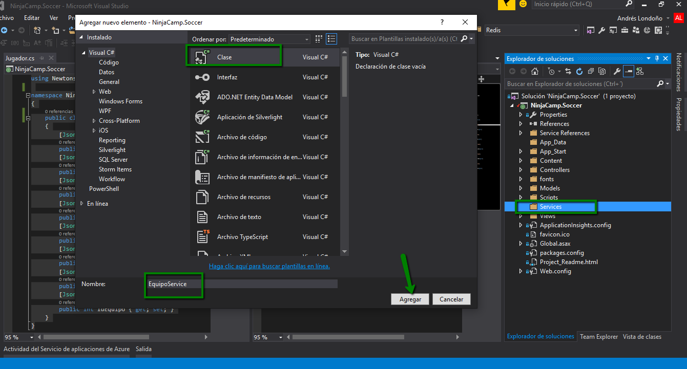

1. Antes de continuar, busca la url obtenida del api publicada en Azure, ya que sera la ruta de consumo de los datos. 

1. Importamos en ambas clases las librerias necesarias a utilizar
```
using Newtonsoft.Json;
using NinjaCamp.Soccer.Models;
using System.Collections.Generic;
using System.Net.Http;
using System.Text;
using System.Threading.Tasks;
using System.Linq;
```

1. Nos situamos en la clase EquipoService.cs establecemos la variable con la ruta del API 
y los metodos respectivos.

    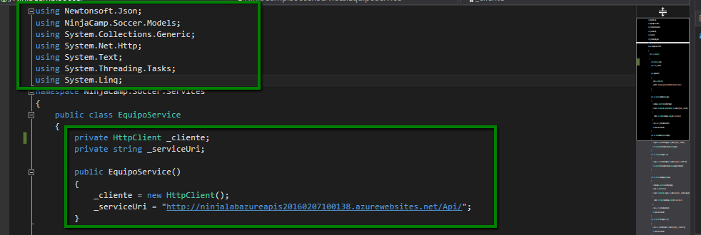
    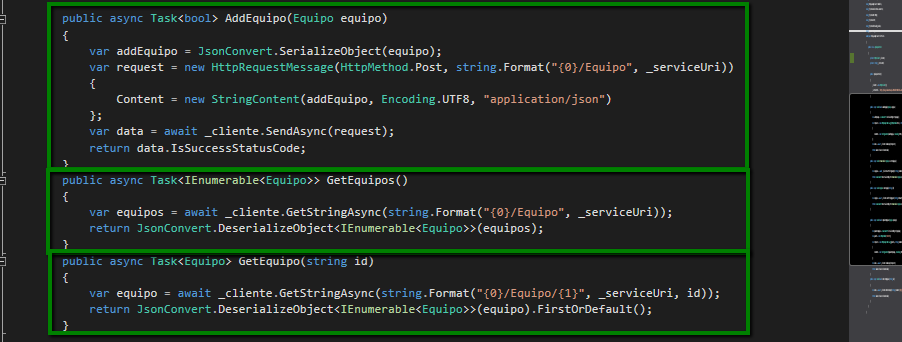
    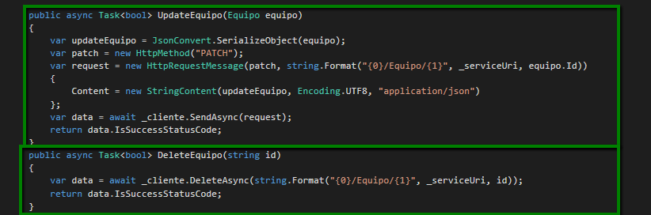

Acá el codigo:

```
using Newtonsoft.Json;
using NinjaCamp.Soccer.Models;
using System.Collections.Generic;
using System.Net.Http;
using System.Text;
using System.Threading.Tasks;
using System.Linq;
namespace NinjaCamp.Soccer.Services
{
    public class EquipoService
    {
        private HttpClient _cliente; 
        private string _serviceUri;

        public EquipoService()
        {
            _cliente = new HttpClient();
            _serviceUri = "http://ninjalabazureapis20160207100138.azurewebsites.net/Api/";
        }

        public async Task<bool> AddEquipo(Equipo equipo)
        {
            var addEquipo = JsonConvert.SerializeObject(equipo);
            var request = new HttpRequestMessage(HttpMethod.Post, string.Format("{0}/Equipo", _serviceUri))
            {
                Content = new StringContent(addEquipo, Encoding.UTF8, "application/json")
            };
            var data = await _cliente.SendAsync(request);
            return data.IsSuccessStatusCode;
        }
        public async Task<IEnumerable<Equipo>> GetEquipos()
        {
            var equipos = await _cliente.GetStringAsync(string.Format("{0}/Equipo", _serviceUri));
            return JsonConvert.DeserializeObject<IEnumerable<Equipo>>(equipos);
        }
        public async Task<Equipo> GetEquipo(string id)
        {
            var equipo = await _cliente.GetStringAsync(string.Format("{0}/Equipo/{1}", _serviceUri, id));
            return JsonConvert.DeserializeObject<IEnumerable<Equipo>>(equipo).FirstOrDefault();
        }

        public async Task<bool> UpdateEquipo(Equipo equipo)
        {
            var updateEquipo = JsonConvert.SerializeObject(equipo);
            var patch = new HttpMethod("PATCH");
            var request = new HttpRequestMessage(patch, string.Format("{0}/Equipo/{1}", _serviceUri, equipo.Id))
            {
                Content = new StringContent(updateEquipo, Encoding.UTF8, "application/json")
            };
            var data = await _cliente.SendAsync(request);
            return data.IsSuccessStatusCode;
        }
        public async Task<bool> DeleteEquipo(string id)
        {
            var data = await _cliente.DeleteAsync(string.Format("{0}/Equipo/{1}", _serviceUri, id));
            return data.IsSuccessStatusCode;
        }
    }
}
```

1. Realizamos los mismos metodos y variables en la clase JugadorServices.cs

    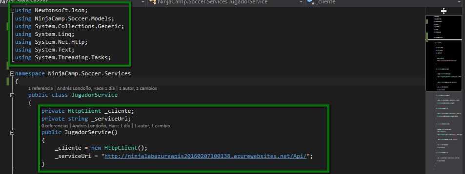
    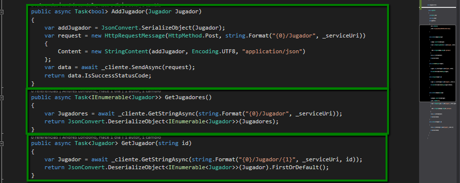
    

Acá el codigo

```
using Newtonsoft.Json;
using NinjaCamp.Soccer.Models;
using System.Collections.Generic;
using System.Linq;
using System.Net.Http;
using System.Text;
using System.Threading.Tasks;

namespace NinjaCamp.Soccer.Services
{ 
    public class JugadorService
    {
        private HttpClient _cliente;
        private string _serviceUri;
        public JugadorService()
        {
            _cliente = new HttpClient();
            _serviceUri = "http://ninjalabazureapis20160207100138.azurewebsites.net/Api/";
        }

        public async Task<bool> AddJugador(Jugador Jugador)
        {
            var addJugador = JsonConvert.SerializeObject(Jugador);
            var request = new HttpRequestMessage(HttpMethod.Post, string.Format("{0}/Jugador", _serviceUri))
            {
                Content = new StringContent(addJugador, Encoding.UTF8, "application/json")
            };
            var data = await _cliente.SendAsync(request);
            return data.IsSuccessStatusCode;
        }
        public async Task<IEnumerable<Jugador>> GetJugadores()
        {
            var Jugadores = await _cliente.GetStringAsync(string.Format("{0}/Jugador", _serviceUri));
            return JsonConvert.DeserializeObject<IEnumerable<Jugador>>(Jugadores);
        }
        public async Task<Jugador> GetJugador(string id)
        {
            var Jugador = await _cliente.GetStringAsync(string.Format("{0}/Jugador/{1}", _serviceUri, id));
            return JsonConvert.DeserializeObject<IEnumerable<Jugador>>(Jugador).FirstOrDefault();
        }

        public async Task<bool> UpdateJugador(Jugador Jugador)
        {
            var updateJugador = JsonConvert.SerializeObject(Jugador);
            var patch = new HttpMethod("PATCH");
            var request = new HttpRequestMessage(patch, string.Format("{0}/Jugador/{1}", _serviceUri, Jugador.Id))
            {
                Content = new StringContent(updateJugador, Encoding.UTF8, "application/json")
            };
            var data = await _cliente.SendAsync(request);
            return data.IsSuccessStatusCode;
        }
        public async Task<bool> DeleteJugador(string id)
        {
            var data = await _cliente.DeleteAsync(string.Format("{0}/Jugador/{1}", _serviceUri, id));
            return data.IsSuccessStatusCode;
        }
    }
}
```

###Paso 4: Creación de controladores

1. Ya creados nuestros modelos, procedemos a crear nuestros controladores, damos click derecho en la carpeta Controllers-->Agregar-->Clase
1. Se abrirá una ventana para agregar el controlador respectivo, 
seleccionaremos "Controlador de MVC 5 en blanco" y damos click en "Agregar"
1. Agregaremos nuestras Controladores EquipoController y JugadorController.
	
    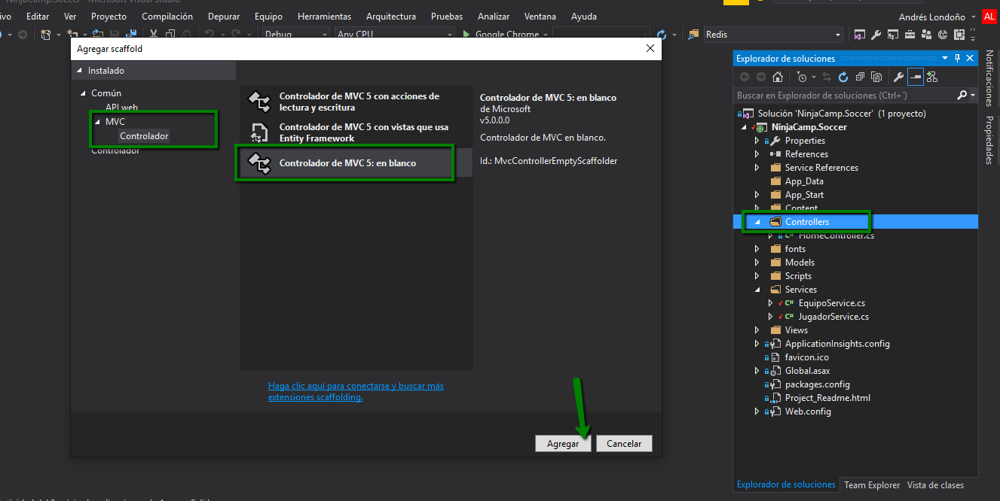
    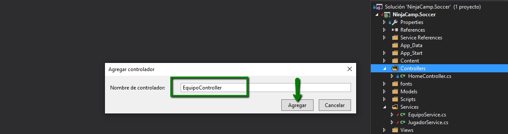
    
1. Creado nuestros controladores, abrimos EquipoController e importamos las librerias a utilizar.

```
using NinjaCamp.Soccer.Models;
using NinjaCamp.Soccer.Services;
using System.Threading.Tasks;
using System.Web.Mvc;
```

1. Si observas se creo automaticamente un metodo Index, su obetivo es retornar la vista respectiva al enrutamiento de MVC, mas tarde crearemos la vista.
1. Debajo de este metodo index agregamos otro metodo de enrutamiento para una vista que agregaremos llamada "CreateEdit", igualmente los metodos respectivos para invocar
los servicios creados previamente.
(Estos metodos seran consumidos desde AngularJS)

    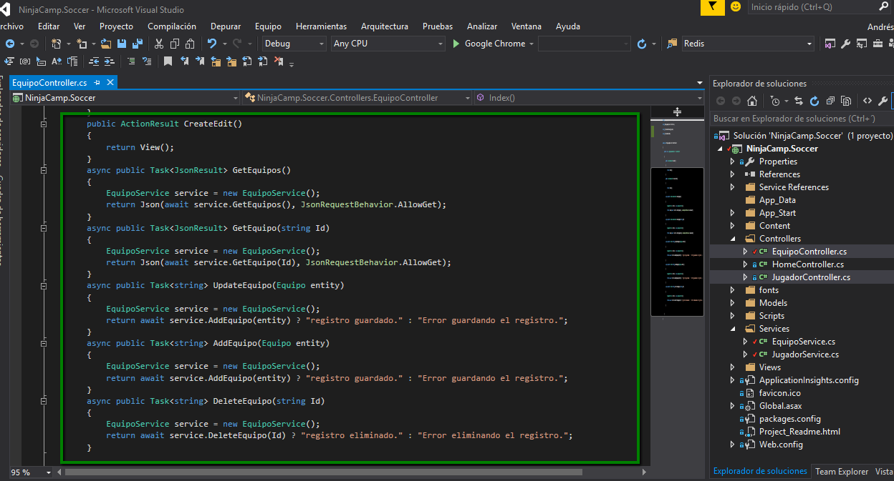
    
Acá el codigo:

```
using NinjaCamp.Soccer.Models;
using NinjaCamp.Soccer.Services;
using System.Threading.Tasks;
using System.Web.Mvc;

namespace NinjaCamp.Soccer.Controllers
{
    public class EquipoController : Controller
    {
        public ActionResult Index()
        {
            return View();
        }
        public ActionResult CreateEdit()
        {
            return View();
        }
        async public Task<JsonResult> GetEquipos()
        {
            EquipoService service = new EquipoService();
            return Json(await service.GetEquipos(), JsonRequestBehavior.AllowGet);
        }
        async public Task<JsonResult> GetEquipo(string Id)
        {
            EquipoService service = new EquipoService();
            return Json(await service.GetEquipo(Id), JsonRequestBehavior.AllowGet);
        }
        async public Task<string> UpdateEquipo(Equipo entity)
        {
            EquipoService service = new EquipoService();
            return await service.AddEquipo(entity) ? "registro guardado." : "Error guardando el registro.";
        }
        async public Task<string> AddEquipo(Equipo entity)
        {
            EquipoService service = new EquipoService();
            return await service.AddEquipo(entity) ? "registro guardado." : "Error guardando el registro.";
        }
        async public Task<string> DeleteEquipo(string Id)
        {
            EquipoService service = new EquipoService();
            return await service.DeleteEquipo(Id) ? "registro eliminado." : "Error eliminando el registro.";
        }

    }
}

```

1. Realizamos exactamente lo mismo en el controlador EquipoController

    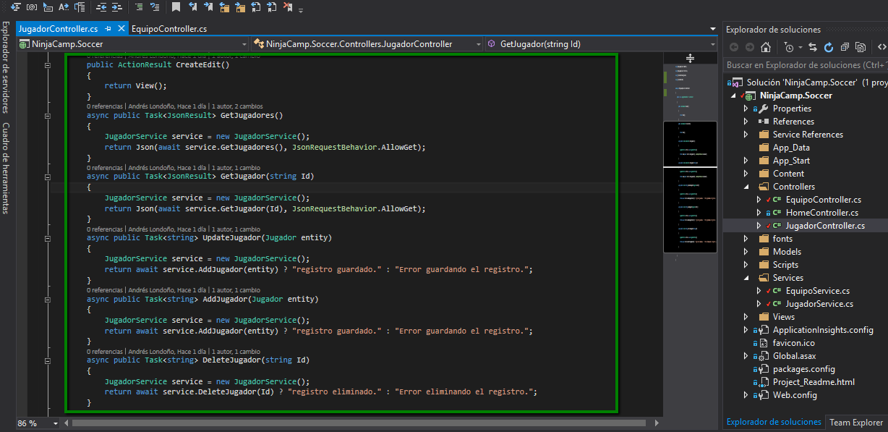
    
Acá el codigo:

```
using NinjaCamp.Soccer.Models;
using NinjaCamp.Soccer.Services;
using System.Threading.Tasks;
using System.Web.Mvc;

namespace NinjaCamp.Soccer.Controllers
{ 
    public class JugadorController : Controller
    {
        public ActionResult Index()
        {
            return View();
        }
        public ActionResult CreateEdit()
        {
            return View();
        }
        async public Task<JsonResult> GetJugadores()
        {
            JugadorService service = new JugadorService();
            return Json(await service.GetJugadores(), JsonRequestBehavior.AllowGet);
        }
        async public Task<JsonResult> GetJugador(string Id)
        {
            JugadorService service = new JugadorService();
            return Json(await service.GetJugador(Id), JsonRequestBehavior.AllowGet);
        }
        async public Task<string> UpdateJugador(Jugador entity)
        {
            JugadorService service = new JugadorService();
            return await service.AddJugador(entity) ? "registro guardado." : "Error guardando el registro.";
        }
        async public Task<string> AddJugador(Jugador entity)
        {
            JugadorService service = new JugadorService();
            return await service.AddJugador(entity) ? "registro guardado." : "Error guardando el registro.";
        }
        async public Task<string> DeleteJugador(string Id)
        {
            JugadorService service = new JugadorService();
            return await service.DeleteJugador(Id) ? "registro eliminado." : "Error eliminando el registro.";
        }

    }
}

```

##Paso 5: Instalación y uso de AngularJs

1. Procedemos a instalar la libreria de Angular para utilizar el esquema MVC del lado del cliente, lo realizaremos de forma facil
, presionamos click derecho sobre References y seleccionamos "Administrar paquetes Nuget..."
1. En el cuadro de búsqueda ingresamos "Angular"
1. Seleccionamos "Angular.Core".
1. Presionamos "Instalar" y posterior aceptamos la licencia de esta librería.
1. Realizamos el mismo procedimiento con el aquete "Angular.Route"
  
    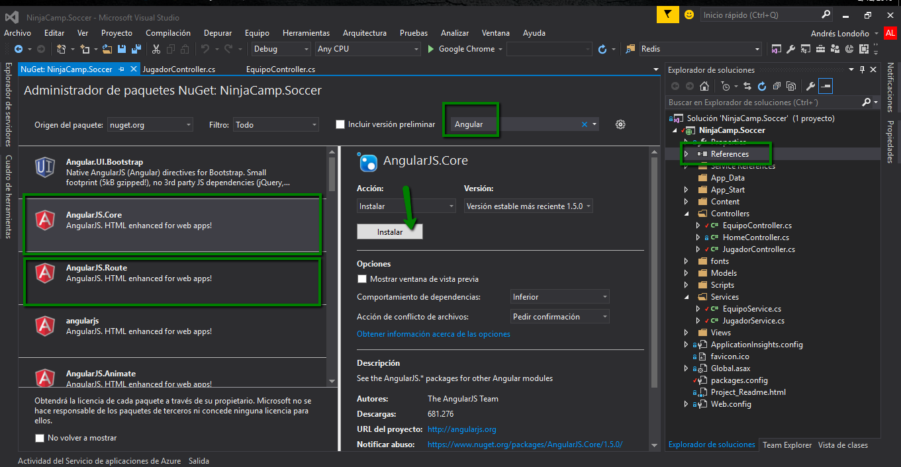  

1. Ya instalado Angular, procedemos a configurar para su uso.
1. Creamos una carpeta llamada "AngularJs" y dentro de esta dos carpetas Equipo y Jugador, 
necesarias para separar nuestro codigo del lado del cliente.
Además creo los archivos necesarios para crear la estructura que observaras en la imagen.
1. Crea un archivo .js llamado App.js en nuesra carpeta AngularJS, necesario para asignar nuestro modulo.
    
    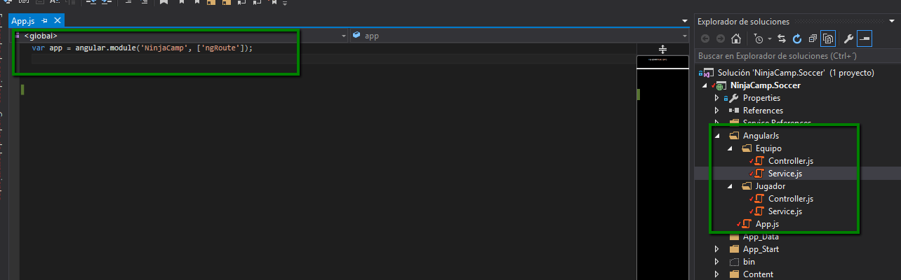

Acá va el codigo

``` 
var app = angular.module('NinjaCamp', ['ngRoute']);
```  
  
1. Abrimos el archivo _Layout.cshtml ubicado en Views --> Shared
1. En la etiqueta html agregamos la directiva necesaria para usar angular y el modulo que tiene nuestra app para dicho uso.
1. Importamos las librerias instaladas y el app.js.
1. Agregamos al menu, 2 items para navegar hacia nuestras vistas.
    
    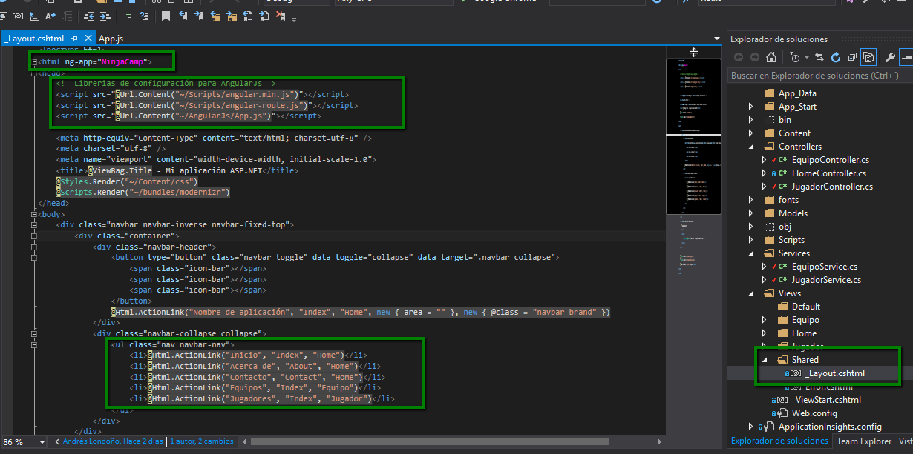

###Paso 6: Creación de controladores y servicios Angular

1. Devolviendonos a los archivos creados en la carpeta AngularJs, abrimos el archivo AngularJs-->Equipo-->Controller.js
1. Allí agregaremos el codigo correspondiente para diferentes acciones de las vistas, como son 
Obtener Equipos al cargar la pagina, Guardar registro, Eliminar, Limpiar, etc.
El controlador creado será vinculado a la vista que crearemos luego de Equipo.

    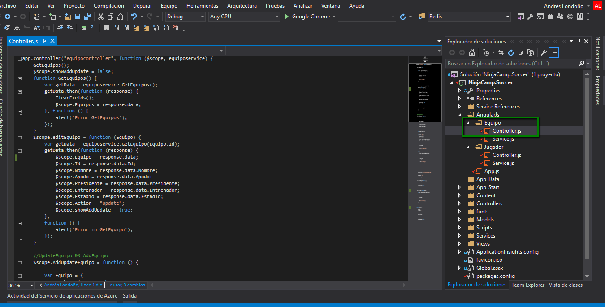


Acá va el codigo AngularJs-->Equipo-->Controller.js
```
app.controller("equipocontroller", function ($scope, equiposervice) {
    GetEquipos();
    $scope.showAddUpdate = false;
    function GetEquipos() {
        var getData = equiposervice.GetEquipos();
        getData.then(function (response) {
            ClearFields();
            $scope.Equipos = response.data;
        }, function () {
            alert('Error GetEquipos');
        });
    } 
    $scope.editEquipo = function (Equipo) {
        var getData = equiposervice.GetEquipo(Equipo.Id);
        getData.then(function (response) {
            $scope.Equipo = response.data;
            $scope.Id = response.data.Id;
            $scope.Nombre = response.data.Nombre;
            $scope.Apodo = response.data.Apodo;
            $scope.Presidente = response.data.Presidente;
            $scope.Entrenador = response.data.Entrenador;
            $scope.Estadio = response.data.Estadio;
            $scope.Action = "Update";
            $scope.showAddUpdate = true;
        },
        function () {
            alert('Error in GetEquipo');
        });
    }

    //UpdateEquipo && AddEquipo
    $scope.AddUpdateEquipo = function () {

        var Equipo = {
            Nombre: $scope.Nombre,
            Apodo: $scope.Apodo,
            Presidente: $scope.Presidente,
            Entrenador: $scope.Entrenador,
            Estadio: $scope.Estadio
        };
        var getAction = $scope.Action;

        if (getAction == "Update") {
            Equipo.Id = $scope.Id;

            var getData = equiposervice.UpdateEquipo(Equipo);
            getData.then(function (msg) {
                GetEquipos();
                alert(msg.data);
            }, function () {
                alert('Error in UpdateEquipo');
            });
        } else {
            var getData = equiposervice.AddEquipo(Equipo);
            getData.then(function (msg) {
                GetEquipos();
                alert(msg.data);
            }, function () {
                alert('Error in AddEquipo');
            });
        }
    }

    $scope.AddEquipoDiv = function () {
        $scope.templateUrl = 'PartialViews/Equipo/AddUpdate.html';
        ClearFields();
        $scope.Action = "Add";
        $scope.showAddUpdate = true;
    }
    $scope.CancelAddEquipoDiv = function () {
        ClearFields();
        $scope.Action = "Add";
        $scope.showAddUpdate = false;
    }

    $scope.deleteEquipo = function (Equipo) {
        getData.then(function (msg) {
            GetEquipos();
            alert(msg.data);
        }, function () {
            alert('Error in DeleteEquipo');
        });
    }

   function ClearFields() {
        $scope.Id = "";
        $scope.Nombre = "";
        $scope.Apodo = "";
        $scope.Presidente = "";
        $scope.Entrenador = "";
        $scope.Estadio = "";
        $scope.showAddUpdate = false;
    }
});
```

1. Abrimos el archivo AngularJs-->Equipo-->Service.js
1. Allí agregaremos los metodos que se comunicaran con el controlador MVC y realizara las peticiones necesarias.

    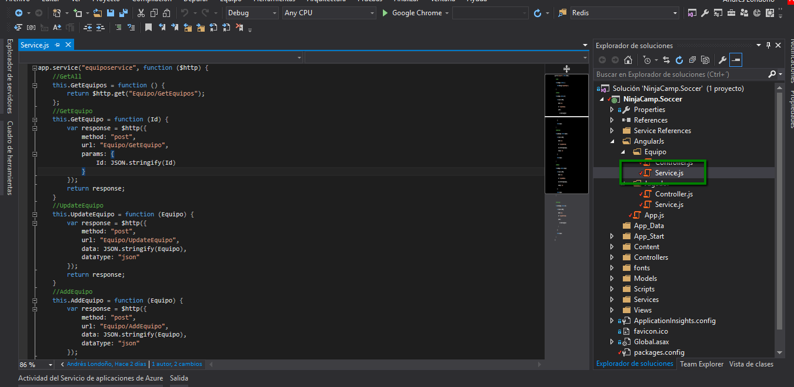

Acá va el codigo AngularJs-->Equipo-->Service.js
```
app.service("equiposervice", function ($http) {
    //GetAll
    this.GetEquipos = function () {
        return $http.get("Equipo/GetEquipos");
    };
    //GetEquipo
    this.GetEquipo = function (Id) {
        var response = $http({
            method: "post",
            url: "Equipo/GetEquipo",
            params: { 
                Id: JSON.stringify(Id)
            }
        });
        return response;
    }
    //UpdateEquipo
    this.UpdateEquipo = function (Equipo) {
        var response = $http({
            method: "post",
            url: "Equipo/UpdateEquipo",
            data: JSON.stringify(Equipo),
            dataType: "json"
        });
        return response;
    }
    //AddEquipo
    this.AddEquipo = function (Equipo) {
        var response = $http({
            method: "post",
            url: "Equipo/AddEquipo",
            data: JSON.stringify(Equipo),
            dataType: "json"
        });
        return response;
    }

    //DeleteEquipo
    this.DeleteEquipo = function (Id) {
        var response = $http({
            method: "post",
            url: "Equipo/DeleteEquipo",
            params: {
                Id: JSON.stringify(Id)
            }
        });
        return response;
    }
});
```

1. Realizamos lo mismo para la carpeta Jugador.

    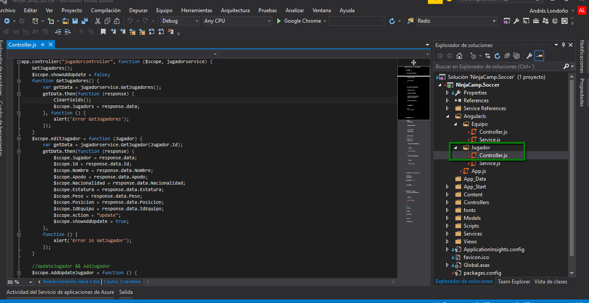

Acá va el codigo AngularJs-->Jugador-->Controller.js
```
app.controller("jugadorcontroller", function ($scope, jugadorservice) {
    GetJugadores();
    $scope.showAddUpdate = false;
    function GetJugadores() {
        var getData = jugadorservice.GetJugadores();
        getData.then(function (response) {
            ClearFields();
            $scope.Jugadors = response.data;
        }, function () {
            alert('Error GetJugadores');
        });
    } 
    $scope.editJugador = function (Jugador) {
        var getData = jugadorservice.GetJugador(Jugador.Id);
        getData.then(function (response) {
            $scope.Jugador = response.data;
            $scope.Id = response.data.Id;
            $scope.Nombre = response.data.Nombre;
            $scope.Apodo = response.data.Apodo;
            $scope.Nacionalidad = response.data.Nacionalidad;
            $scope.Estatura = response.data.Estatura;
            $scope.Peso = response.data.Peso;
            $scope.Posicion = response.data.Posicion;
            $scope.IdEquipo = response.data.IdEquipo;
            $scope.Action = "Update";
            $scope.showAddUpdate = true;
        },
        function () {
            alert('Error in GetJugador');
        });
    }

    //UpdateJugador && AddJugador
    $scope.AddUpdateJugador = function () {

        var Jugador = {
            Nombre: $scope.Nombre,
            Apodo: $scope.Apodo,
            Nacionalidad: $scope.Nacionalidad,
            Estatura: $scope.Estatura,
            Peso: $scope.Peso,
            Posicion: $scope.Posicion,
            IdEquipo: $scope.IdEquipo,
        };

        var getAction = $scope.Action;

        if (getAction == "Update") {
            Jugador.Id = $scope.Id;

            var getData = jugadorservice.UpdateJugador(Jugador);
            getData.then(function (msg) {
                GetJugadores();
                alert(msg.data);
            }, function () {
                alert('Error in UpdateJugador');
            });
        } else {
            var getData = jugadorservice.AddJugador(Jugador);
            getData.then(function (msg) {
                GetJugadores();
                alert(msg.data);
            }, function () {
                alert('Error in AddJugador');
            });
        }
    }

    $scope.AddJugadorDiv = function () {
        ClearFields();
        $scope.Action = "Add";
        $scope.showAddUpdate = true;
    }
    $scope.CancelAddJugadorDiv = function () {
        ClearFields();
        $scope.Action = "Add";
        $scope.showAddUpdate = false;
    }

    //DeleteJugador
    $scope.deleteJugador = function (Jugador) {
        var getData = jugadorservice.DeleteJugador(Jugador.Id);
        getData.then(function (msg) {
            GetJugadores();
            alert(msg.data);
        }, function () {
            alert('Error in DeleteJugador');
        });
    }

    //ClearFields
    function ClearFields() {
        $scope.Id = "";
        $scope.Nombre = "";
        $scope.Apodo = "";
        $scope.Nacionalidad = "";
        $scope.Estatura ="";
        $scope.Peso ="";
        $scope.Posicion = "";
        $scope.IdEquipo = "";
        $scope.showAddUpdate = false;
    }
});

```
1. Lo mismo en Service.js de la carpeta Jugador 

    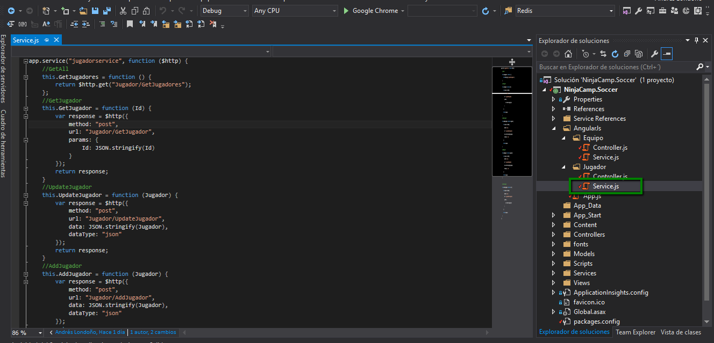


Acá va el codigo AngularJs-->Jugador-->Service.js

```
app.service("jugadorservice", function ($http) {
    //GetAll
    this.GetJugadores = function () {
        return $http.get("Jugador/GetJugadores");
    };
    //GetJugador
    this.GetJugador = function (Id) {
        var response = $http({
            method: "post",
            url: "Jugador/GetJugador",
            params: {
                Id: JSON.stringify(Id)
            } 
        });
        return response;
    }
    //UpdateJugador
    this.UpdateJugador = function (Jugador) {
        var response = $http({
            method: "post",
            url: "Jugador/UpdateJugador",
            data: JSON.stringify(Jugador),
            dataType: "json"
        });
        return response;
    }
    //AddJugador
    this.AddJugador = function (Jugador) {
        var response = $http({
            method: "post",
            url: "Jugador/AddJugador",
            data: JSON.stringify(Jugador),
            dataType: "json"
        });
        return response;
    }

    //DeleteJugador
    this.DeleteJugador = function (Id) {
        var response = $http({
            method: "post",
            url: "Jugador/DeleteJugador",
            params: {
                Id: JSON.stringify(Id)
            }
        });
        return response;
    }
});

```

    
###Paso 7: Creación de vistas MVC + Angular

1. Si observas, verás que en la carpeta Views estan creadas dos carpetas Equipo y Jugador, 
estas carpetas fueron creadas cuando creamos los controladores respectivos.
1. Allí vamos a crear las vistas respectivas, Da click en la carpeta Agregar--> Vista...

    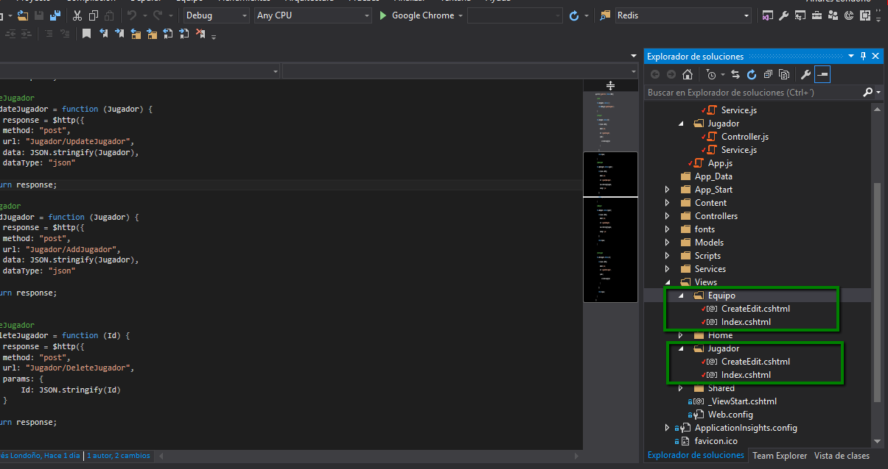

1. Agregamos el código necesario para que la vista se comunique con el controlador
creado con AngularJs de Equipo
    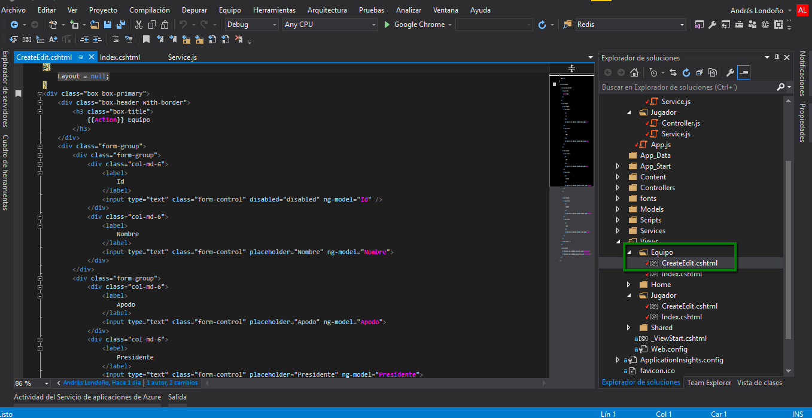
    
NOTA: Omitir la creación de CreateEdit.cshtml
    
1. Hora de agregar el codigo respectivo para la vista de Equipo 
    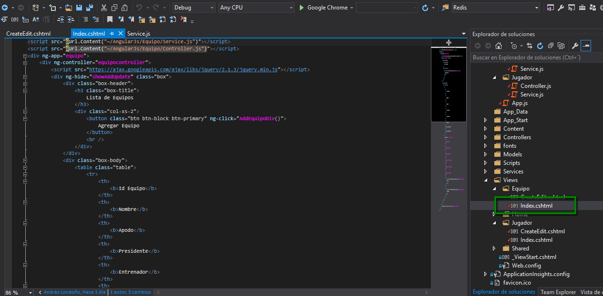

Acá va el codigo Views-->Equipo-->Index.cshtml

```
<script src="@Url.Content("~/AngularJs/Equipo/Service.js")"></script>
<script src="@Url.Content("~/AngularJs/Equipo/Controller.js")"></script>
<div ng-app="equipo">
    <div ng-controller="equipocontroller">
        <script src="https://ajax.googleapis.com/ajax/libs/jquery/2.1.3/jquery.min.js"></script>
        <div ng-hide="showAddUpdate" class="box">
            <div class="box-header">
                <h3 class="box-title">
                    Lista de Equipos
                </h3>
                <div class="col-xs-2">
                    <button class="btn btn-block btn-primary" ng-click="AddEquipoDiv()">
                        Agregar Equipo
                    </button>
                    <br />
                </div>
            </div>
            <div class="box-body">
                <table class="table">
                    <tr>
                        <th>
                            <b>Id Equipo</b>
                        </th>
                        <th>
                            <b>Nombre</b>
                        </th>
                        <th>
                            <b>Apodo</b>
                        </th>
                        <th>
                            <b>Presidente</b>
                        </th>
                        <th>
                            <b>Entrenador</b>
                        </th>
                        <th>
                            <b>Estadio</b>
                        </th>
                        <th style="width: 100px">
                        </th>
                        <th style="width: 100px">
                        </th>
                    </tr>
                    <tr ng-repeat="Equipo in Equipos">
                        <td>
                            {{Equipo.Id}}
                        </td>
                        <td>
                            {{Equipo.Nombre}}
                        </td>
                        <td>
                            {{Equipo.Apodo}}
                        </td>
                        <td>
                            {{Equipo.Presidente}}
                        </td>
                        <td>
                            {{Equipo.Entrenador}}
                        </td>
                        <td>
                            {{Equipo.Estadio}}
                        </td>
                        <td>
                            <button class="btn btn-block btn-primary" ng-click="editEquipo(Equipo)">
                                Editar
                            </button>
                        </td>
                        <td>
                            <button class="btn btn-block btn-danger" ng-click="deleteEquipo(Equipo)">
                                Eliminar
                            </button>
                        </td>
                    </tr>
                </table>
            </div>
        </div>
        <div ng-show="showAddUpdate">

            <div class="box box-primary">
                <div class="box-header with-border">
                    <h3 class="box-title">
                        {{Action}} Equipo
                    </h3>
                </div>
                <div class="form-group">
                    <div class="form-group">
                        <div class="col-md-6">
                            <label>
                                Id
                            </label>
                            <input type="text" class="form-control" disabled="disabled" ng-model="Id" />
                        </div>
                        <div class="col-md-6">
                            <label>
                                Nombre
                            </label>
                            <input type="text" class="form-control" placeholder="Nombre" ng-model="Nombre">
                        </div>
                    </div>
                    <div class="form-group">
                        <div class="col-md-6">
                            <label>
                                Apodo
                            </label>
                            <input type="text" class="form-control" placeholder="Apodo" ng-model="Apodo">
                        </div>
                        <div class="col-md-6">
                            <label>
                                Presidente
                            </label>
                            <input type="text" class="form-control" placeholder="Presidente" ng-model="Presidente">
                        </div>
                    </div>

                    <div class="form-group">
                        <div class="col-md-6">
                            <label>
                                Entrenador
                            </label>
                            <input type="text" class="form-control" placeholder="Entrenador" ng-model="Entrenador">
                        </div>
                        <div class="col-md-6">
                            <label>
                                Estadio
                            </label>
                            <input type="text" class="form-control" placeholder="Estadio" ng-model="Estadio">
                        </div>
                    </div>
                    <div class="clearfix"></div>
                </div>
                <div class="box-footer">
                    <input type="button" class="btn btn-primary" value="Guardar" ng-click="AddUpdateEquipo()" />
                    <input type="button" class="btn btn-primary" value="Cancelar" ng-click="CancelAddEquipoDiv()" />
                </div>
            </div>

        </div>
    </div>
</div>


```


1. Agregamos el código necesario para que la vista se comunique con el controlador
creado con AngularJs de Jugador

    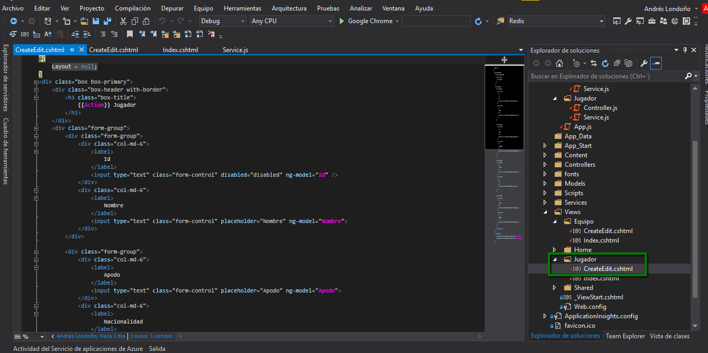

NOTA: Omitir la creación de CreateEdit.cshtml
    
1. Hora de agregar el codigo respectivo para la vista de Jugador 

    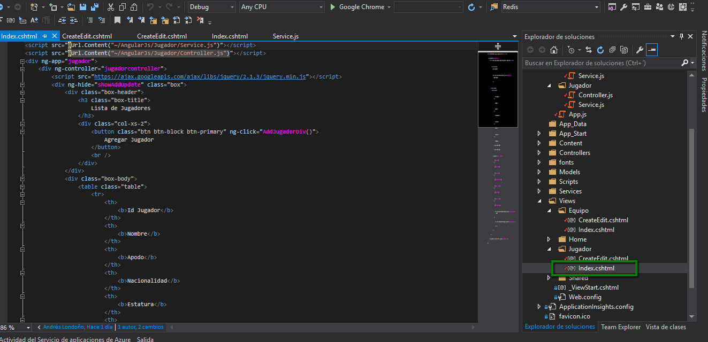

Acá va el codigo Views-->Jugador-->Index.cshtml

```
<script src="@Url.Content("~/AngularJs/Jugador/Service.js")"></script>
<script src="@Url.Content("~/AngularJs/Jugador/Controller.js")"></script>
<div ng-app="jugador">
    <div ng-controller="jugadorcontroller">
        <script src="https://ajax.googleapis.com/ajax/libs/jquery/2.1.3/jquery.min.js"></script>
        <div ng-hide="showAddUpdate" class="box">
            <div class="box-header">
                <h3 class="box-title">
                    Lista de Jugadores
                </h3>
                <div class="col-xs-2">
                    <button class="btn btn-block btn-primary" ng-click="AddJugadorDiv()">
                        Agregar Jugador
                    </button>
                    <br />
                </div>
            </div>
            <div class="box-body">
                <table class="table">
                    <tr>
                        <th>
                            <b>Id Jugador</b>
                        </th>
                        <th>
                            <b>Nombre</b>
                        </th>
                        <th>
                            <b>Apodo</b>
                        </th>
                        <th>
                            <b>Nacionalidad</b>
                        </th>
                        <th>
                            <b>Estatura</b>
                        </th>
                        <th>
                            <b>Peso</b>
                        </th>
                        <th>
                            <b>Posicion</b>
                        </th>
                        <th>
                            <b>IdEquipo</b>
                        </th>
                        <th style="width: 100px">
                        </th>
                        <th style="width: 100px">
                        </th>
                    </tr>
                    <tr ng-repeat="Jugador in Jugadores">
                        <td>
                            {{Jugador.Id}}
                        </td>
                        <td>
                            {{Jugador.Nombre}}
                        </td>
                        <td>
                            {{Jugador.Apodo}}
                        </td>
                        <td>
                            {{Jugador.Nacionalidad}}
                        </td>
                        <td>
                            {{Jugador.Estatura}}
                        </td>
                        <td>
                            {{Jugador.Peso}}
                        </td>
                        <td>
                            {{Jugador.Posicion}}
                        </td>
                        <td>
                            {{Jugador.IdEquipo}}
                        </td>
                        <td>
                            <button class="btn btn-block btn-primary" ng-click="editJugador(Jugador)">
                                Editar
                            </button>
                        </td>
                        <td>
                            <button class="btn btn-block btn-danger" ng-click="deleteJugador(Jugador)">
                                Eliminar
                            </button>
                        </td>
                    </tr>
                </table>
            </div>
        </div>
        <div ng-show="showAddUpdate">
            <div class="box box-primary">
                <div class="box-header with-border">
                    <h3 class="box-title">
                        {{Action}} Jugador
                    </h3>
                </div>
                <div class="form-group">
                    <div class="form-group">
                        <div class="col-md-6">
                            <label>
                                Id
                            </label>
                            <input type="text" class="form-control" disabled="disabled" ng-model="Id" />
                        </div>
                        <div class="col-md-6">
                            <label>
                                Nombre
                            </label>
                            <input type="text" class="form-control" placeholder="Nombre" ng-model="Nombre">
                        </div>
                    </div>

                    <div class="form-group">
                        <div class="col-md-6">
                            <label>
                                Apodo
                            </label>
                            <input type="text" class="form-control" placeholder="Apodo" ng-model="Apodo">
                        </div>
                        <div class="col-md-6">
                            <label>
                                Nacionalidad
                            </label>
                            <input type="text" class="form-control" placeholder="Nacionalidad" ng-model="Nacionalidad">
                        </div>
                    </div>

                    <div class="form-group">
                        <div class="col-md-6">
                            <label>
                                Estatura
                            </label>
                            <input type="text" class="form-control" placeholder="Estatura" ng-model="Estatura">
                        </div>
                        <div class="col-md-6">
                            <label>
                                Peso
                            </label>
                            <input type="text" class="form-control" placeholder="Peso" ng-model="Peso">
                        </div>
                    </div>

                    <div class="form-group">
                        <div class="col-md-6">
                            <label>
                                Posicion
                            </label>
                            <input type="text" class="form-control" placeholder="Posicion" ng-model="Posicion">
                        </div>
                        <div class="col-md-6">
                            <label>
                                IdEquipo
                            </label>
                            <input type="text" class="form-control" placeholder="IdEquipo" ng-model="IdEquipo">
                        </div>
                    </div>
                    <div class="clearfix"></div>
                </div>
                <div class="box-footer">
                    <input type="button" class="btn btn-primary" value="Guardar" ng-click="AddUpdateJugador()" />
                    <input type="button" class="btn btn-primary" value="Cancelar" ng-click="CancelAddJugadorDiv()" />
                </div>
            </div>

        </div>
    </div>
</div>


```
    
###Paso 8: Publicación y registro de telemetria     

1. Es ahora de que pruebes tu aplicación corriendo localmente y también publiquemos el aplicativo en azure.
1. Haz click derecho sobre el proyecto y selecciona Publicar.
1. Se visualizará una pantalla de publicación que contiene todos los datos de vinculación ya realizados anteriormente.
1. Solo tendremos que dar click en Publicar y esperar...
  
    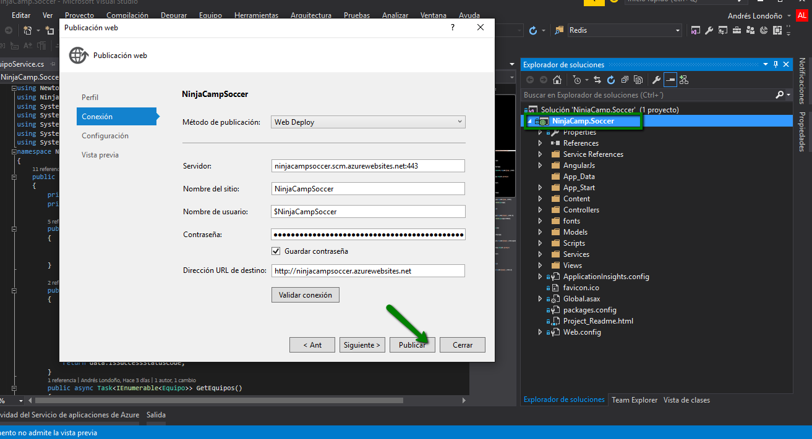
    
1. Ahora vamos al portal de azure y nos dirijimos a
Todos los recursos--> NinjaCamp.Soccer(nombre asignado al servicio de insight)
1. Si puedes observar inicialmente se observan datos de nuestro aplicativo con respecto a las solicitudes reealizadas, errores de solicitud, etc.
    
    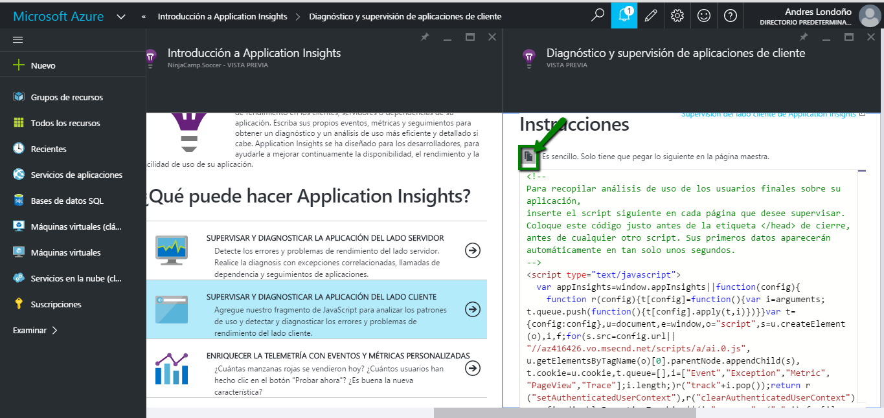
    
1. Ahora aplicaremos código para realizar el seguimiento requerido en el lado del cliente.
    
    