#WebApps con C-Sharp
###MVC5 - KnockOut - Bootstrap
###Conectándonos con DocumentDB

Este tutorial te permitirá conocer y manejar los conceptos y principios de desarrollo de Asp.Net MVC, al mismo tiempo te ayudará a comprender el manejo de ajax utilizando knockout, así como los conceptos de diseño utilizando Bootstrap.

AL final tendremos una aplicación modular que te permita cargar los datos de manera dinámica utilizando una base de datos NoSql Azure DocumentDB.

Para esto es necesario contar con:
- Visual Studio 2015 cualquiera de sus versiones, puedes descargar la versión gratuita [Visual Studio Community aquí](https://www.visualstudio.com/downloads/download-visual-studio-vs).
- Una cuenta de Azure (Azure Pass)
- Haber hecho el ejercicio para la creación de una [Base de datos en DocumentDB aquí](https://github.com/Ninja-Labs/azure/blob/master/6.%20WebApps%20MVC%20Core%20and%20Entity%20Framework/Lab%202/lab.md) o en este [otro link](https://channel9.msdn.com/Series/Ninja-Tips/31-NinjaTips-Desarrollo-DocumentDB-1-Vistazo-general)

##Tareas
- [Tarea 1 - MVC 5 WebApps.](#tarea-1)
- [Tarea 2 - Crear una aplicación web ASP.Net MVC.](#tarea-2)
- [Tarea 3 - Instalando las Librerías requeridas para nuestro ejemplo.](#tarea-3)
- [Tarea 4 - Construyendo Nuestro Model (Modelo).](#tarea-4)
- [Tarea 5 - Nuestro Controller (Controlador).] (#tarea-5)
- [Tarea 6 - Nuestra View (Vista).] (#tarea-6)
- [Tarea 7 - Creando los Archivos de enrutado (condicional).] (#tarea-7)
- [Tarea 8 - Knockoutjs conectándonos con el controller.] (#tarea-8)
- [Tarea 9 - Mostrando datos en nuestra vista.] (#tarea-9)
- [Tarea 10 - Desde Cero un nuevo diseño Bootstrap para nuestra UI (Repaso general).] (#tarea-10)
- [Vínculos - Vínculos de interés.] (#vínculos)

###Tarea 1
####MVC 5 WebApps
Modelo Vista Controlador es un paradigma de programación que distribuye la carga del código con base en los 3 componentes que la integran, un resumen podría ser el de la siguiente grafica:

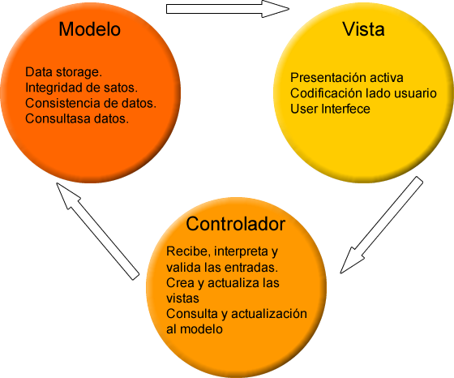

Otra manera de verlo sería agregando un componente Usuario al paradigma de MVC.


Se puede encontrar más información y profundizar en el tema en diferentes sitios en internet así como en publicaciones, al final dejaremos un listado de vínculos que podrían ser de interés para ésto.

###Tarea 2
####Crear una aplicación web ASP.Net MVC
Para nuestro laboratorio utilizaremos Visual Studio 2015 (VS) y utilizando el framework 4.6

1- Abrimos Visual Studio y seleccionamos la opción Crear Nuevo Proyecto y seleccionamos la opcion Web para ver las plantillas correspondientes, seleccionamos ASP.NET Web Applicacion (aplicaciones web de Asp.Net).


2- En la ventana que se abre seleccionamos la opción Empty (vacia) y dejamos sin seleccional la casilla Host in the cloud (Host en la nube). También seleccionaremos los folders y librerías que necesitamos para iniciar, en este caso MVC y Web API (como se ve en la grafica de abajo) que requeriremos para nuestro trabajo y hacemos clic en OK.

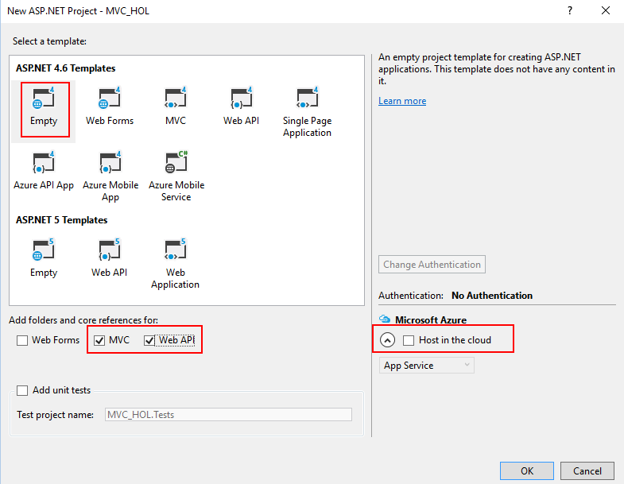

3- Se abrirá nuestro ambiente de desarrollo en el que veremos las carpetas y archivos que cargó la plantilla por defecto, debería verse así:


###Tarea 3
####Instalando las Librerías requeridas para nuestro ejemplo
1- Para nuestro proyecto requerimos instalar o actualizar las libresrías que necesitaremos y son

- DocumentDB
- NewtonSoft
- jQuery
- Knockoutjs
- Bootstrap

2- Aunque hay diferentes formas de cargar las librerías que requerimos, en este proyecto vacio vamos a cargarlas utilizando NuGet Packages (Paquetes NuGet), para esto hacemos clic derecho sobre <strong>References</strong> y hacemos clic sobre la opción Manage Nuget Packages.


3- Para las ultimas versiones de VS se abrirá la ventana que permitirá seleccionar si lo que queremos es buscar (Browse), ver los paquetes instalados (Installed), o que paquetes pueden ser actualizados (Updates). Seleccionaremos la opción Browse.


4- En la caja de texto de búsqueda escribiremos DocumentDB para buscar la librería correspondiente, escribiremos Microsoft.Azure.DocumentDB y al resultado seleccionaremos la opción Microsoft.Azure.DocumentDB y dejaremos la ultima versión estable que aparezca en el listado de la derecha.


5- Hacemos clic en Install (Instalar) y los aceptamos (clic en OK y Aceptar) en las ventanas emergentes que aparezcan.

Al revisar en las referencias podemos ver que ha quedado instalada la referencia de Azure Document Client.


6- Ahora realizaremos el mismo procedimiento para instalar los paquetes correspondientes de Newtonsoft, esto nos permitirá trabajar con formatos json dentro de nuestro sistema, requerido para comunicarnos con DocumentDB. 

Es necesario aclarar que Newtonsoft ya esta instalado dentro de la aplicación, sin embargo el procedimiento nos permitirá descargar la última versión estable del paquete. Hacemos clic sobre la opción update (Actualizar).

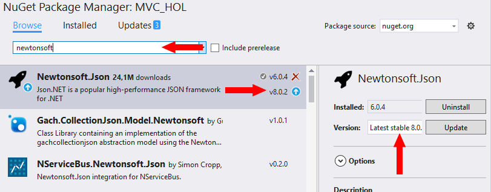

Si aparecen ventanas emergentes hacemos clic en OK o aceptar.

7- Ahora instalaremos jQuery realizando el mismo procedimiento que hemos realizado hasta ahora escribiendo jQuery en el cuadro de texto de búsqueda del NuGet package.

Hacemos clic sobre Install (instalar), si aparecen ventanas emergentes hacemos clic en OK o aceptar.

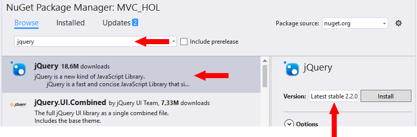

8- Debe aparecer una nueva carpeta Scripts con los archivos javascript corresponsdientes a jquery dentro de la nueva carpeta.


9- El siguiente paso es instalar knockoutjs, para esto realizaremos el procesimiento de buscarlo en el NuGet packages e instalamos de la misma forma que hemos instalado los paquetes anteriores.

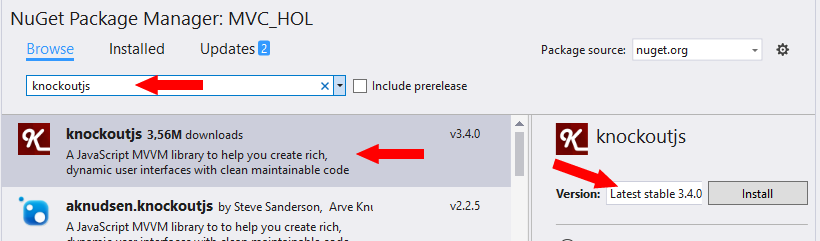

10- Aparecen los archivos correspondientes dentro de la carpeta Scripts de nuestro proyecto.

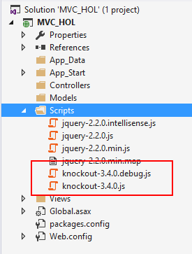

11- Ahora finalizaremos instalando el paquete de Bootstrap que utilizaremos en las tareas finales de nuestro laboratorio, el procedimiento es el mismo que con los elementos anteriores dentro del manejador de paquetes NuGet.


12- Acá el resultado es especial ya que tendremos una carpeta Content que tendrá los estilos asociados con Bootstrap, una carpeta Fonts que trae unas fuentes especiales que nos permitiran implementar grifos o imágenes como si fueran fuentes de tezto y también tenemos los archivos javascript asociados a Bootstrap para poder implementar funcionalidades de diseño.


Con el procedimiento anterior, ya estamos preparados para construir nuestra aplicación.

###Tarea 4
####Construyendo Nuestro Model (Modelo)

Nos basaremos en el ejercicio realizado con [DocumentDB anterior](https://github.com/Ninja-Labs/azure/blob/master/6.%20WebApps%20MVC%20Core%20and%20Entity%20Framework/Lab%202/lab.md) del cual tomaremos el código y lo integrarémos a nuestra aplicación.

1- Lo que haremos es crear la clase <strong>Movie</strong> dentro de nuestra carpeta Models, haciendo clic derecho sobre la carpeta y seleccionando la opción Add->New Item... (Agregar->Nuevo elemento)

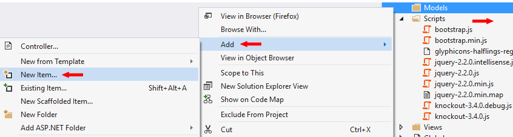

2- A esta clase deberá quedar de la siguiente manera:
```
using System;
using Newtonsoft.Json;

namespace MVC_HOL.Models
{
    public class Movie
    {
        [JsonProperty(PropertyName = "id")]
        public string Id { get; set; }

        [JsonProperty(PropertyName = "name")]
        public string Name { get; set; }

        [JsonProperty(PropertyName = "description")]
        public string Description { get; set; }

        [JsonProperty(PropertyName = "year")]
        public int Year { get; set; }

        [JsonProperty(PropertyName = "genre")]
        public string Genre { get; set; }
    }
}
```

3- El valor ```[JsonProperty(PropertyName = "id")]``` viene de Newtonsoft.Json y es el valor que le daremos al nombre de ese campo dentro del formato Json que se construirá de nuestro modelo. 

4- Ahora crearemos la clase <strong>MovieRepository</strong> dentro de nuestra carpeta Models, haciendo clic derecho sobre la carpeta y seleccionando la opción Add->New Item... (Agregar->Nuevo elemento)


5- Trabajaremos con 'C#', por esa razón en la ventana emergente seleccionaremos esta opción en lenguaje, así como seleccionaremos Code (Código) y la plantilla Class (Clase), recordemos darle el nombre <strong>Movie</strong> y hacemos clic en Add (Agregar)


6- Lo que haremos es crear la clase <strong>MovieRepository</strong> dentro de nuestra carpeta Models, haciendo clic derecho sobre la carpeta y seleccionando la opción Add->New Item... (Agregar->Nuevo elemento)


7- Trabajaremos con 'C#', por esa razón en la ventana emergente seleccionaremos esta opción en lenguaje, así como seleccionaremos Code (Código) y la plantilla Class (Clase), recordemos darle el nombre <strong>MovieRepository</strong> y hacemos clic en Add (Agregar)


8- Al final nuestra carpeta Models deberá quedar con estos dos archivos:

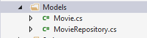

9- A nuestra clase MovieRepository le agregamos la referencia <strong>using System.Collections.Generic</strong>, <strong>using System.Linq</strong>, <strong>using System.Threading.Tasks</strong> para trabajar un método asíncrono, <strong>using Microsoft.Azure.Documents</strong>, <strong>using Microsoft.Azure.Documents.Client</strong>, <strong>using Microsoft.Azure.Documents.Linq</strong> estás últimas para poder llamar a las clases correspondientes de conexión a DocumentDB.

10- Luego le agregaremos las variables de conexión, así como el llamado al cliente correspondiente, el código debe quedar de la siguiente manera:
```
using System;
using System.Collections.Generic;
using System.Linq;
using System.Threading.Tasks;
using Microsoft.Azure.Documents;
using Microsoft.Azure.Documents.Client;
using Microsoft.Azure.Documents.Linq;

namespace MVC_HOL.Models
{
    public class MovieRepository
    {
        private const string EndpointUrl = "https://suendpoint.documents.azure.com:443/";//la direccion del endpoint de su conexión
        private const string AuthorizationKey = "Su_AuthorizationKey==";
        private const string CollectionId = "movies";
        private const string DatabaseId = "azurecampdb";

        private static DocumentClient client;

        private static DocumentClient Client
        {
            get
            {
                if (client == null)
                    client = new DocumentClient(new Uri(EndpointUrl), AuthorizationKey);

                return client;
            }
        }
		
		//código para database
		...
		
		
		//codigo para collection
		...
    }
}
```

11- En este punto empezaremos a construir la conexión con el acceso a datos agregando el código que nos permitirá conectarnos con el repositorio de datos:
```
	private static Database database;
    private static Database Database
    {
        get
        {
            if (database == null)
                database = GetOrCreateDatabase(DatabaseId);

            return database;
        }
    }
```
12- Ahora nos conectámos con la colección dentro de la base de datos:
```
	private static DocumentCollection collection;
    private static DocumentCollection Collection
    {
        get
        {
            if (collection == null)
            {
                collection = GetOrCreateCollection(Database.SelfLink, CollectionId);
            }

            return collection;
        }
    }

```
13- Agregamos los métodos que comprueban si existe la base de datos, si no existe la crea, así mimso el método que crea o verifica si existe la colección.
```
	public static Database GetOrCreateDatabase(string databaseId)
    {
        var db = Client.CreateDatabaseQuery()
                        .Where(d => d.Id == databaseId)
                        .AsEnumerable()
                        .FirstOrDefault();

        if (db == null)
            db = client.CreateDatabaseAsync(new Database { Id = databaseId }).Result;

        return db;
    }

	public static DocumentCollection GetOrCreateCollection(string databaseLink, string collectionId)
    {
        var col = Client.CreateDocumentCollectionQuery(databaseLink)
                          .Where(c => c.Id == collectionId)
                          .AsEnumerable()
                          .FirstOrDefault();

        if (col == null)
        {
            col = client.CreateDocumentCollectionAsync(databaseLink,
                new DocumentCollection { Id = collectionId },
                new RequestOptions { OfferType = "S1" }).Result;
        }

        return col;
    }
```
14- Ahora agregaremos el método que trae todos los datos asociados con nuestra clase Movie 
```
	public static IEnumerable<Movie> GetAllMovies()
    {
        var movies = Client.CreateDocumentQuery<Movie>(Collection.SelfLink).AsEnumerable();
        return movies;
    }
```
15- Continuamos con el método que nos trae un único dato de la base de datos utilizando el Id del objeto que llamamos:
```
	public static Movie GetMovieById(string id)
    {
        var movie = Client.CreateDocumentQuery<Movie>(Collection.SelfLink)
            .Where(d => d.Id == id)
            .AsEnumerable()
            .FirstOrDefault();

        return movie;
    }
```
16- Por último le agregamos el método que permitirá agregar un nuevo registro a la base de datos:
```
	public static async Task<Movie> CreateMovie(Movie entity)
    {
        Document doc = await Client.CreateDocumentAsync(Collection.SelfLink, entity);
        Movie movie = (Movie)(dynamic)doc;

        return movie;
    }
```
Éste último método es de tipo asíncrono por eso es necesario plantear que es una tarea y al mismo tiempo agregarle las palabras reservadas async y await, así como la referencia using System.Threading.Tasks.

######El código completo de la clase MovieRepository.cs quedaría de la siguiente manera:
```
using System;
using System.Collections.Generic;
using System.Linq;
using System.Threading.Tasks;
using Microsoft.Azure.Documents;
using Microsoft.Azure.Documents.Client;
using Microsoft.Azure.Documents.Linq;

namespace MVC_HOL.Models
{
    public class MovieRepository
    {
        private const string EndpointUrl = "https://suendpoint.documents.azure.com:443/";//la direccion del endpoint de su conexión
        private const string AuthorizationKey = "Su_AuthorizationKey==";
        private const string CollectionId = "movies";
        private const string DatabaseId = "azurecampdb";

        private static DocumentClient client;

        private static DocumentClient Client
        {
            get
            {
                if (client == null)
                    client = new DocumentClient(new Uri(EndpointUrl), AuthorizationKey);

                return client;
            }
        }

        private static Database database;
        private static Database Database
        {
            get
            {
                if (database == null)
                    database = GetOrCreateDatabase(DatabaseId);

                return database;
            }
        }

        public static Database GetOrCreateDatabase(string databaseId)
        {
            var db = Client.CreateDatabaseQuery()
                            .Where(d => d.Id == databaseId)
                            .AsEnumerable()
                            .FirstOrDefault();

            if (db == null)
                db = client.CreateDatabaseAsync(new Database { Id = databaseId }).Result;

            return db;
        }

        private static DocumentCollection collection;
        private static DocumentCollection Collection
        {
            get
            {
                if (collection == null)
                {
                    collection = GetOrCreateCollection(Database.SelfLink, CollectionId);
                }

                return collection;
            }
        }

        public static DocumentCollection GetOrCreateCollection(string databaseLink, string collectionId)
        {
            var col = Client.CreateDocumentCollectionQuery(databaseLink)
                              .Where(c => c.Id == collectionId)
                              .AsEnumerable()
                              .FirstOrDefault();

            if (col == null)
            {
                col = client.CreateDocumentCollectionAsync(databaseLink,
                    new DocumentCollection { Id = collectionId },
                    new RequestOptions { OfferType = "S1" }).Result;
            }

            return col;
        }

        public static IEnumerable<Movie> GetAllMovies()
        {
            var movies = Client.CreateDocumentQuery<Movie>(Collection.SelfLink).AsEnumerable();
            return movies;
        }

        public static Movie GetMovieById(string id)
        {
            var movie = Client.CreateDocumentQuery<Movie>(Collection.SelfLink)
                .Where(d => d.Id == id)
                .AsEnumerable()
                .FirstOrDefault();

            return movie;
        }

        public static async Task<Movie> CreateMovie(Movie entity)
        {
            Document doc = await Client.CreateDocumentAsync(Collection.SelfLink, entity);
            Movie movie = (Movie)(dynamic)doc;

            return movie;
        }
    }
}
```

######Recordemos que es necesario reemplazar la información de las variables EndpointUrl y AuthorizationKey por los valores que obtenemos de nuestra cuenta de Azure DocumentDB

###Tarea 5
####Nuestro Controller (Controlador)

#####Tarea 5.1 Web API Controller

1- Vamos a crear nuestra clase Controladora haciendo clic derecho sobre la carpeta Controllers->Add->Controller (Agregar Controller)


2- En este punto podemos crear un controlador, ya sea para manejo del codigo o un tipo de servicio Web API, para este ejercicio seleccionaremos la opción de Web API Controller Empty (Vacio):


3- Lo llamaremos MoviesController


4- Nuestra carpeta Controllers se verá con la clase que acabamos de crear.

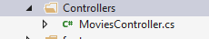

Con esto ya tenemos la base para empezar a construir un esquema que se conecte con la base de datos y con Knockoutjs podemos trabajar la interface de usuario.

5- Ahora agregaremos el código necesario a nuestro controlador iniciando con el siguiente código de base:
```
using System;
using System.Collections.Generic;
using System.Linq;
using System.Net;
using System.Net.Http;
using System.Web.Http;

namespace MVC_HOL.Controllers
{
    public class MoviesController : ApiController
    {
    }
}
```
En donde <strong>MoviesController : ApiController</strong> nos indica que esta clase hereda de la clase ApiController.

- Agreamos el método que nos traerá una colección de datos de tipo IEnumerable de todas las películas guardadas (si las hay).
```
	public IEnumerable<Movie> GetAllMovies()
    {
        var movies = MovieRepository.GetAllMovies();
        return movies;
    }
```
- ahora agregamos el método que nos trae un único objeto de tipo Movie utilizando el Id.
```
	public Movie GetMoviesById(string id)
    {
        return MovieRepository.GetMovieById(id);
    }
```
- Y luego el método que nos permitirá agregar un nuevo registro en nuestra base de datos:
```
	public async Task<IHttpActionResult> PostMovie(Movie movie)
        {
            if (!ModelState.IsValid)
            {
                return BadRequest(ModelState);
            }

            await MovieRepository.CreateMovie(movie);

            return CreatedAtRoute("DefaultApi", new { id = movie.Id }, movie);

        }
```
Éste último método es de tipo asíncrono por eso es necesario plantear que es una tarea y al mismo tiempo agregarle las palabras reservadas async y await, así como la referencia using System.Threading.Tasks.

######El código completo quedaría de la siguiente manera:
```
using System;
using System.Collections.Generic;
using System.Threading.Tasks;
using System.Web.Http;
using MVC_HOL.Models;

namespace MVC_HOL.Controllers
{
    public class MoviesController : ApiController
    {
        public IEnumerable<Movie> GetAllMovies()
        {
            var movies = MovieRepository.GetAllMovies();
            return movies;
        }

        public Movie GetMoviesById(string id)
        {
            return MovieRepository.GetMovieById(id);
        }

        public async Task<IHttpActionResult> PostMovie(Movie movie)
        {
            if (!ModelState.IsValid)
            {
                return BadRequest(ModelState);
            }

            await MovieRepository.CreateMovie(movie);

            return CreatedAtRoute("DefaultApi", new { id = movie.Id }, movie);

        }
    }
}
```

#####Tarea 5.2 HomeController
1- Vamos a crear un controlador para asociarlo con una vista haciendo clic derecho sobre la carpeta Controllers->Add->Controller (Agregar Controller)


2- Para crear este controlador seleccionaremos la primera opción que es crear un controlador vacio (Controller Empty):


3- Lo llamaremos HomeController.

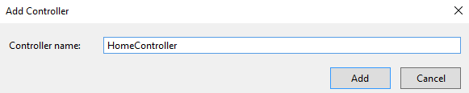

4- Nuestra carpeta Controllers ahora se verá de esta manera:

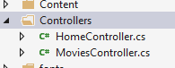

5- El resultado es una clase cuyo código debera verse de la siguiente manera:

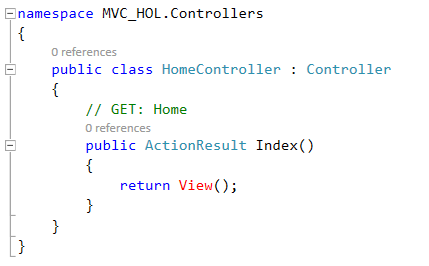

6- Si observamos nuestra carpeta Views en el explorador de la solución podemos ver que se ha agregado la carpeta Home que estará asociada con el controlador HomeController.

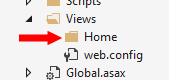

######Esta será la base para continuar con la siguiente tarea.

###Tarea 6
####Nuestra View (Vista)

1- Teniendo abierta la clase HomeController (Tarea 5.2), hacemos clic derecho sobre el método Index y seleccionamos la opción Add View (Agregar Vista)

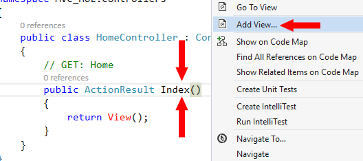

2- En la ventana que se abre debemos dejar el nombre Index, así como seleccionada la opción Empty (without model) ya que no vamos a traer los datos de ningún modelo específico sino que esto lo haremos más adelante a través de javascript.


3- Al hacer clic sobre Add (Agregar) ocurren varias cosas con nuestro proyecto, entre otras:

- Se genera un archivo de tipo Razor en la carpeta Home dentro de Views llamado Index.cshtml
- Se genera un archivo de tipo Razor en la carpeta Shared dentro de Views llamado _Layour.cshtml que será la página maestra base del proyecto.
- Si no hubieramos implementado jQuery ni Bootstrap, se hubieran agregado automáticamente estos paquetes.
- Dentro de Content se agregó una nueva hoja de estilos llamada Site.css
- Dentro de la carpeta Scripts se agregó la libreria de javascript Modernizr.


4- Presionamos la tecla F5 para que se abra el proyecto en el explorador web, lo que nos mostrará la página Index con diseño predefinido, este diseño viene del archivo _Layout.cshtml

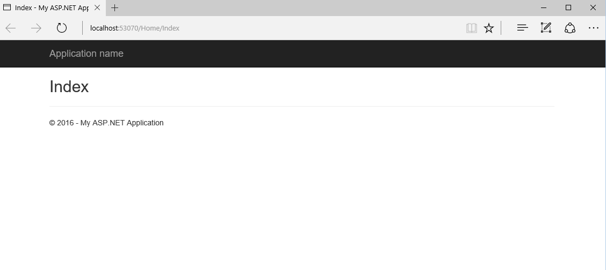

5- Toma por defecto la página Index de Home por que esta predefinida dentro del clase de configuración RouteConfig.cs que esta dentro de la carpeta App_Start, al igual que la ruta del ApiController esta en la clase WebApiConfig.cs dentro de la misma carpeta.


######Si existen estas clases, podemos realizar lo siguiente:

6- Si hemos cerrado el navegador volvamos a abrirlo presionando la tecla F5, en la barra de direcciones agregemos API/Movies lo que nos mostrará la información que trae de la base de datos por defecto es la lista de todos los registros en formato Json, si no hay registros debe mostrar una página con un par de corchetes cuadrados.
En el caso de este ejemplo que ya hay registros preguardados en la base de datos muestra lo siguiente:


7- Cerremos el navegador y si es necesario detengamos la ejecución de la aplicación haciendo clic en el boton detener de Visual Studio.

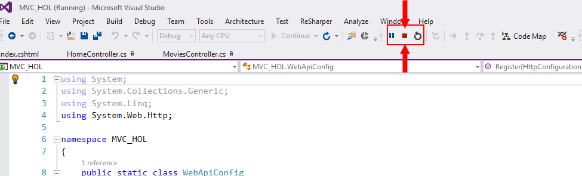

######Si no existen estas clases, es necesario crearlas

###Tarea 7
####Creando los Archivos de enrutado (condicional)

Como se mencionó en la tarea anterior, si no existen las clases RouteConfig.cs y/o WebApiConfig.cs dentro de la carpeta App_Start, es necesario crearlos, si existen estas clases podemos pasar a la tarea 8 si lo desean.

1- Lo primero que haremos en esta tarea es crear la clase RouteConfig.cs dentro de la carpeta App_Start de la misma manera en que se crearon las clases dentro de la carpeta Models, haciendo clic derecho sobre  la carpeta App_Start, seleccionando la opción Add->New Item y escogiendo la opción Code de la ventana que se abre y la plantilla Class.

1.1- 

1.2- 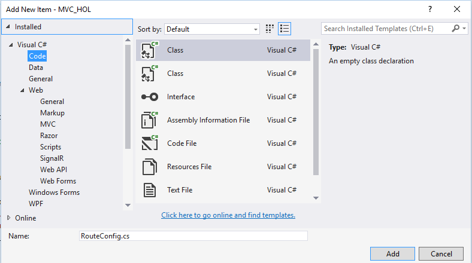

2- La clase RouteConfig debe quedar de la siguiente manera, en donde contendrá el mapeado de las rutas que trabajará internamente "{controller}/{action}/{id} (parámetro opcional)" y por defecto tendrá la siguiente ruta controller = "Home", action = "Index", id = UrlParameter.Optional, por esa razón toma al Index del Home por defecto.
```
using System;
using System.Collections.Generic;
using System.Linq;
using System.Web;
using System.Web.Mvc;
using System.Web.Routing;

namespace MVC_HOL
{
    public class RouteConfig
    {
        public static void RegisterRoutes(RouteCollection routes)
        {
            routes.IgnoreRoute("{resource}.axd/{*pathInfo}");

            routes.MapRoute(
                name: "Default",
                url: "{controller}/{action}/{id}",
                defaults: new { controller = "Home", action = "Index", id = UrlParameter.Optional }
            );
        }
    }
}
```

3- Lo siguiente es crear la clase WebApiConfig.cs dentro de la carpeta App_Start de la misma manera en que se crearon las clases dentro de la carpeta Models, haciendo clic derecho sobre  la carpeta App_Start, seleccionando la opción Add->New Item y escogiendo la opción Code de la ventana que se abre y la plantilla Class.

3.1- 

3.2- 

4- La clase WebApiConfig debe quedar de la siguiente manera, en donde contendrá el mapeado de las rutas que trabajará internamente "api/{controller}/{id} (parámetro opcional)" y en este caso no hay valor por defecto.
```
using System;
using System.Collections.Generic;
using System.Linq;
using System.Web.Http;

namespace MVC_HOL
{
    public static class WebApiConfig
    {
        public static void Register(HttpConfiguration config)
        {
            // Web API configuration and services

            // Web API routes
            config.MapHttpAttributeRoutes();

            config.Routes.MapHttpRoute(
                name: "DefaultApi",
                routeTemplate: "api/{controller}/{id}",
                defaults: new { id = RouteParameter.Optional }
            );
        }
    }
}
```

5- Para que queden activas es necesario abrir la clase Global.asax y realizar la configuración cuando la aplicación inicia: método Application_Start.

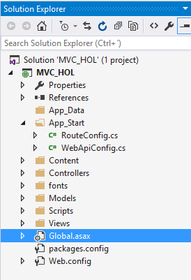

6- Deberá agregarse dos lineas de código:
```
	GlobalConfiguration.Configure(WebApiConfig.Register);
    RouteConfig.RegisterRoutes(RouteTable.Routes);
```
######El código completo de Global.asax debería verse similar a:
```
using System;
using System.Web;
using System.Web.Mvc;
using System.Web.Routing;
using System.Web.Http;

namespace MVC_HOL
{
    public class Global : HttpApplication
    {
        void Application_Start(object sender, EventArgs e)
        {
            // Code that runs on application startup
            AreaRegistration.RegisterAllAreas();
            GlobalConfiguration.Configure(WebApiConfig.Register);
            RouteConfig.RegisterRoutes(RouteTable.Routes);            
        }
    }
}
```
7- Compilamos la solución haciendo clic en la pestaña Build y luego en Build Solution:
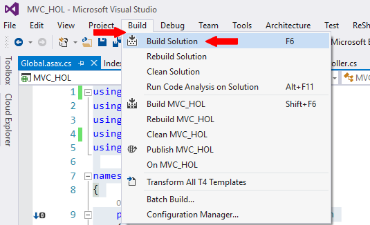

8- Ejecutamos utilizando la tecla F5 y realizamos los ultimos dos pasos de la Tarea 6.

###Tarea 8
####Knockoutjs conectándonos con el Apicontroller

El ideal es trabajar al mismo tiempo esta parte y la vista (Tarea 9), sinembargo por orden vamos a trabajar todo el código javascript primero y después veremos el resultado en las siguientes tareas.

1- Vamos a crear nuestro archivo javascript con el que conectaremos al ApiController utilizando knockoutjs, para esto hacemos clic derecho del mouse sobre la carpeta Scripts y seleccionamos Add->New Folder (Agregar nuevo folder) y le daremos el nombre de <strong>movie</strong> (o el nombre que sea significativo dentro del proyecto).

1.1- 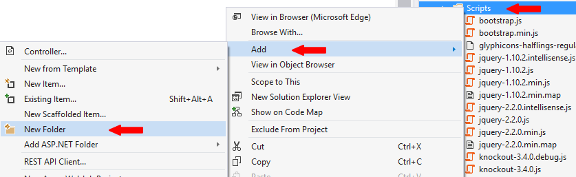

1.2- 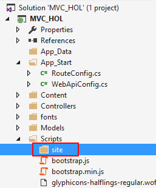

2- En esta carpeta movie haremos clic derecho del ratón y seleccionamos Add->New Item y en la ventana que se abre seleccionaremos la opción Web y la plantilla JavaScript File (Archivo JavaScript), lo llamaremos movies.js.

2.1- 

2.2- 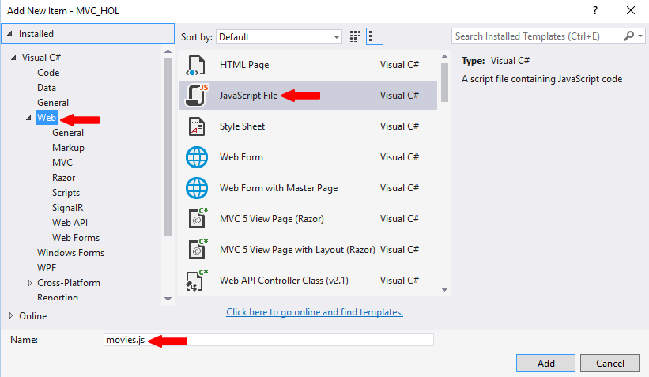

3- Con esto ya tendremos nuestro javascript para trabajar con los datos.


4- Abrimos nuestro archivo movies.js (si no esta abierto) e iniciamos la construcción de nuestro código y empezamos. 

 knockout es un esquema que trabaja con un patón del tipo Modelo Vista y Vista del Modelo o Model View ViewModel (MVVM).

5- Lo primero que construimos en nuestro javascript será la función en donde implementaremos el código, para este ejercicio la llamaremos ViewModel, al final haremos el llamado utilizando el objeto <strong>ko</strong> que maneja knockoutjs para hacer el llamado de nuestro ViewModel. El código resultante iniciaria de la siguiente forma:
```
var ViewModel = function () {
    
};

ko.applyBindings(new ViewModel());
```

6- Dentro de nuestra función ViewModel agregamos un llamado a la información con la que trabajaremos var selft=this y crearemos dos variables una para el listado de las películas, otra para imprimir un error si lo hay y la última para traer la información de una película que seleccionemos (detalle de la película):

```
	var self = this;
    self.movies = ko.observableArray();
    self.error = ko.observable();
	self.detail = ko.observable();
```

ko.observableArray tiene la estructura dentro de la librería del knockout para traer una lista de datos.
ko.observable trae información (un texto, un número, etc),.

7- Ahora vamos a crear un objeto que lo utilizaremos en el momento en que tengamos que crear una película.
```
	self.newMovie = {
        id: ko.observable(),
        name: ko.observable(),
        description: ko.observable(),
        year: ko.observable(),
        genre: ko.observable()
    }
```

8- Continuamos agregando una variable que contendrá la ruta de la Api con la que nos comunicaremos:
```
	var moviesUri = "/api/movies/";
```
Recordemos que ésta Api la creamos en tareas anteriores (Revisar Tarea 6 y Tarea 7)

9- Agregamos la función de jQuery que nos permite información que integra código de lado cliente y servidor (Asynchronous JavaScript and XML - AJAX).
```
	function ajaxHelper(uri, method, data) {
        self.error(""); // Clear error message
        return $.ajax({
            type: method,
            url: uri,
            dataType: "json",
            contentType: "application/json",
            data: data ? JSON.stringify(data) : null
        }).fail(function (jqXHR, textStatus, errorThrown) {
            self.error(errorThrown);
        });
    }

```

10- En este punto ya tenemos la base para hacer el llamado correspondiente a nuestro código, por eso ahora se agregará la función <strong>getAllMovies</strong> que traé el listado de las películas, la que se conecta con el ApiController 'ajaxHelper(moviesUri, "GET")' y carga la información en la variable movies 'self.movies(data)'
```
	function getAllMovies() {
        ajaxHelper(moviesUri, "GET").done(function (data) {
            self.movies(data);
        });
    }	
```
Se esta comunicando a través del GET del ApiController en su método GetAllMovies, en donde trae el listado de las películas, convirtiéndolo en un formato legible para el javascript.

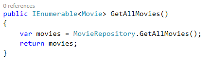

11- Ahora incluiremos la funcion getMovieDetail que nos traé un registro específico pasándole la dirección del ApiController y el Id del registro requerido 'ajaxHelper(moviesUri + item.id, "GET")' y los datos quedaran asociados a la variable details 'self.detail(data)'.
```
self.getMovieDetail = function (item) {
        ajaxHelper(moviesUri + item.id, "GET").done(function (data) {
            self.detail(data);
        });
    }
```
Se esta comunicando a través del GET del ApiController en su método GetMoviesById, en donde trae el un unico objeto de tipo Movie.


12- Para complementar, construimos la funcion addMovie la que nos permite guardar registros asociándola al objeto que creamos anteriormente llamado newMovie, en donde le pasamos los valores del objeto creando el objeto movie.
pasamos el parámetro de dirección y el objeto movie utilizando un método de tipo POST 'ajaxHelper(moviesUri, "POST", movie)' para pasar la información al ApiController 'self.movies.push(item)'.
```
	self.addMovie = function (formElement) {
        var movie = {
            id: self.newMovie.id(),
            name: self.newMovie.name(),
            genre: self.newMovie.genre(),
            description: self.newMovie.description(),
            year: self.newMovie.year()
        };

        ajaxHelper(moviesUri, "POST", movie).done(function (item) {
            self.movies.push(item);
        });
    };
```
A través del POST se comunica con el método PostMovie dentro del ApiController.

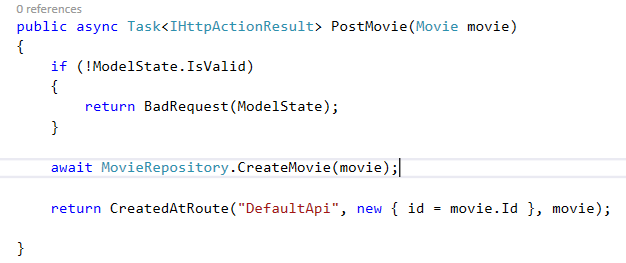

13- Cerrando la fucnion ViewModel le decimos que ejecute por defecto el método que trae todo el listado de las películas 'getAllMovies'
```
getAllMovies();

```
######El código completo se debería ver así:

```
var ViewModel = function () {
    var self = this;
    self.movies = ko.observableArray();
    self.error = ko.observable();
    self.detail = ko.observable();

    //Objeto de tipo Movie
    self.newMovie = {
        id: ko.observable(),
        name: ko.observable(),
        description: ko.observable(),
        year: ko.observable(),
        genre: ko.observable()
    }

    var moviesUri = "/api/movies/";

    //jQuery Ajax
    function ajaxHelper(uri, method, data) {
        self.error(""); // Clear error message
        return $.ajax({
            type: method,
            url: uri,
            dataType: "json",
            contentType: "application/json",
            data: data ? JSON.stringify(data) : null
        }).fail(function (jqXHR, textStatus, errorThrown) {
            self.error(errorThrown);
        });
    }

    //Trae todos los registros
    function getAllMovies() {
        ajaxHelper(moviesUri, "GET").done(function (data) {
            self.movies(data);
        });
    }

    //Traé un único registro
    self.getMovieDetail = function (item) {
        ajaxHelper(moviesUri + item.id, "GET").done(function (data) {
            self.detail(data);
        });
    }

    //Agrega un nuevo registro
    self.addMovie = function (formElement) {
        var movie = {
            id: self.newMovie.id(),
            name: self.newMovie.name(),
            genre: self.newMovie.genre(),
            description: self.newMovie.description(),
            year: self.newMovie.year()
        };

        ajaxHelper(moviesUri, "POST", movie).done(function (item) {
            self.movies.push(item);
        });
    };

    //Carga los datos al iniciar.
    getAllMovies();
};

ko.applyBindings(new ViewModel());
```

######Ahora vamos a integrar todo lo anterior a nuestra vista Index dentro del Home.

###Tarea 9
####Mostrando datos en nuestra vista

1- Abrimos nuestro archivo Index.cshtml que se encuentra dentro de Views->Home

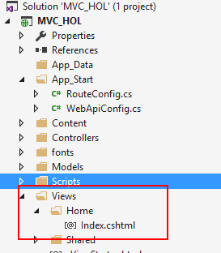

Empezamos a construir el diseño de nuestra vista aprovechando que ya tenemos por defecto incorporado el bootstrap, sinembargo es necesario agregar que es un diseño base y se trabajará utilizando etiquetas Div, se recomienda trabajar siempre con alguien que maneje diseño para tener una vista complementaria del proyecto.
A manera de ejercicio, esté código se presentará como imágen para que se deba agregar manualmente.

2-

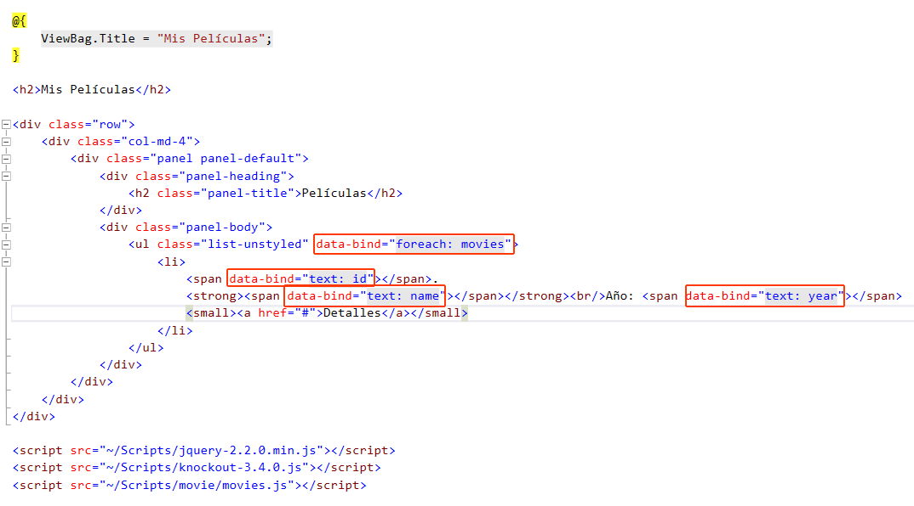

- Agregamos una etiqueta div que tendra una clase css 'row' (viene de los estilos del bootstrap) indicándole que va a integrar todo lo que este contenido como una fila.
- Dentro agregamos una etiqueta div a la cual le diremos que utilizará 4 columnas del esquema de 12 columnas que maneja Bootstrap con la clase 'col-md-4'.
- Dentro agregaremos una etiqueta div que utilizará una clase panel en donde mostrará la estructura de panel que viene por defecto (default). asignándo los colores y los estilos correspondientes.
- Dentro de esta última, agregaremos 2 etiquetas div, la primera tendrá una clase panel-heading (encabezado del panel), la segunda la clase panel-body (cuerpo del panel)
- Dentro del div del encabezado del panel agregaremos una etiqueta h2 con la clase panel-title y agregaremos el texto correspondiente al titulo del panel.
- Dentro de la etiqueta div del cuerpo del panel agregaremos una lista de tipo ul con la clase list-unstyled lo que le quitará los puntos asociados a la lista.
- Dentro de la lista 'ul' se puede observar el elemento data-bind="foreach:movies" esto quiere decir que esta haciendo una lectura asociada con el knockoutjs trayendo la lista 'movies' (observableArray) y leyendo sus registros a través de un ciclo foreach.
- Las etiquetas de lista 'li' muestran los detalles de cada dato que se lea, en donde agregamos etiquetas 'span' para mostrar el texto correspondiente al 'id', 'name' y 'year' dentro de la propiedad 'data-bind' mostrándolo como texto 'data-bind="text: id"'. Este llamado lo hace utilizando la fuinción getAllMovies que se ejecuta en nuestro 'movies.js'.
- se agrega una etiqueta anchor 'a' que tiene como texto detalles a la que más adelante le daremos funcionalidad.
- Al finalizar agregaremos las referencias a los archivos javascript que necesitaremos para que todo se ejecute, en orden debe ir jQuery, seguido de knockout y por último el archivo de script que creamos en la tarea 8. estos llamados siempre deberan quedar al final del código tanto por estándares como para la correcta funcionalidad del código.

###### Al ejecutarlo con la tecla F5, si tenemos información dentro de la base de datos debería poderse ver el listado.
3-
 
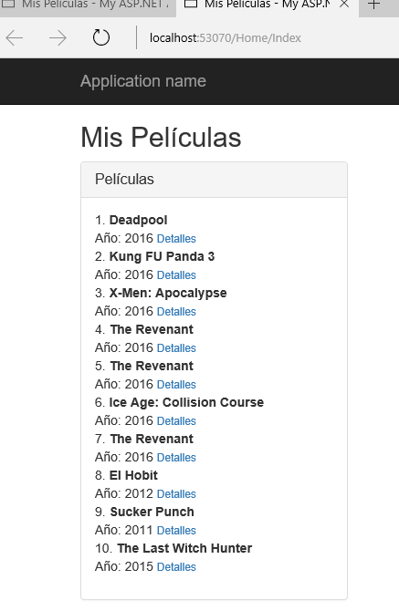

Detenemos la ejecución y continuamos agregando un panel que contendrá el formulario que permitirá agregar nuevos registros a nuestra base de datos.

4-


- Agregamos un panel con etiquetas div similar al procedimiento anterior.
- Metemos este nuevo panel dentro de la etiqueta row que será el contenedor principal.
- Dentro de la etiqueta div del cuerpo del panel (clase panel-body) agregamos la etiqueta 'form' que contendrá nuestro formulario para guardar la información, le asignamos la clase 'form-horizontal' y le agregamos la propiedad data-bind asociada con la función addMovie cuando se envía el formulario 'data-bind="submit: addMovie"' 
- Dentro de esta agregamos una etiqueta div con la clase 'form-group' y que estará asociando los elementos al objeto 'newMovie' de nuestro javascript 'data-bind="with: newMovie'.
- Agregamos ahora los controles 'label' e 'input', a éstos últimos le asociamos el valor al que deberán estar asociados en la construcción de nuesto objeto newMovie. 'data-bind="value:id"', 'data-bind="value:name"', 'data-bind="value:description"', 'data-bind="value:genre"' y 'data-bind="value:year"'
- Finalmente se agrega el botón de tipo 'submit' que enviará la información al javascript para que éste ejecute el procedimiento correspondiente 'button type="submit" class="btn btn-default'.

###### Al ejecutarlo con la tecla F5, si tenemos información dentro de la base de datos debería poderse ver el listado.

5-


Agregamos datos al formulario, y estos deben aparecer en nuestro listado.


6- Detenemos la ejecución y continuamos agregando un panel que contendrá el formulario que permitirá ver el detalle de la película seleccionada.

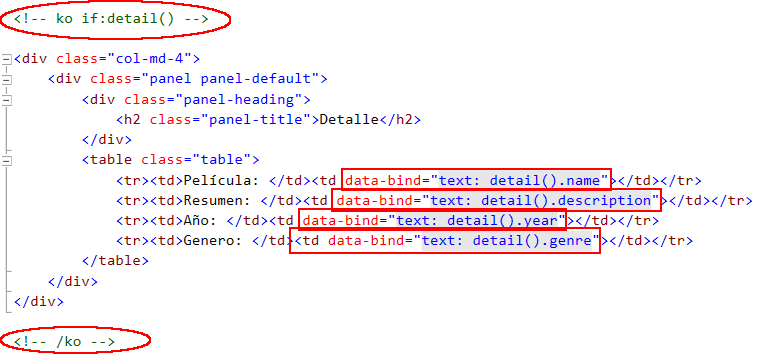

- Primero modificamos el boton detalle que habíamos agregado en el listado de la película que deberá quedar de la siguiente manera:``` <small><a href="#" data-bind="click: $parent.getMovieDetail">Detalles</a></small>``` en donde ejecutará la fincion 'getMovieDetail' al hacer clic en el hipervínculo 'data-bind="click: $parent.getMovieDetail"'.
- Se agregará una orden de knockoutjs ```<!-- ko if:detail() --><!-- /ko -->``` para que nos muestre el panel de detalles solo si hay información, esto evitará que nos arroje un error al ejecutar el llamado de detalles sin datos.
- Dentro agregaremos el código para crear el panel correspondiente al detalle de la película que hemos seleccionado.
- Metemos este nuevo codigo dentro de la etiqueta row que será el contenedor principal.
- Agregamos una tabla que nos permitirá mostrar la información de manera organizada y que utiliza la clase 'table' del bootstrap. los data-bind que contienen la información se pueden asociar directamente en las etiquetas de celda 'td', estos data-bind estaran asociados con la ejecución del detalle 'detail()' trayendo los valores correspondientes del objeto que llamamos 'text: detail().name', 'text: detail().description', 'text: detail().year', 'text: detail().genre'.

###### Al ejecutarlo con la tecla F5, inicialmente no se verá nada, pero al hacer clic sobre el vínculo detalle de cualquier película aparecerá el panel.


######El código completo es el siguiente, se agregó un mensaje de error para que si se presenta alguno podamos ver la información del error asociada.


######Ya tenemos nuestro proyecto funcionando, ahora podemos ver que ajustes podemos hacerle a nuestro diseño para que sea más agradable.

###Tarea 10
####Desde Cero un nuevo diseño Bootstrap para nuestra UI (Repaso general)

Como punto final vamos a crear un espacio completamente independiente, una página HTML que traerá la información y que tendrá un diseño diferente al anterior, con una ventana Modal que mostrará los detalles de las películas.

1- Crearemos una nueva vista, para esto abriremos nuestro HomeController y le agregaremos el siguiente código:
```
	public ActionResult MiVista()
    {
        return View();
    }
``` 

2- Repitiendo el proceso de la tarea 6 agregaremos una nueva vista asociada al método mi vista que acabamos de crear: clic derecho del mouse sobre el método MiVista y clic sobre la opción Add View (Agregar Vista), dejamos lo seleccionado por defecto, asegurándonos que el Template sea Empty (without model) o vacio sin modelo.
3- Al quedar creada nuestra nueva vista se verá reflejada en la carpeta Home:


4- Agregamos nuestro código para listar la información.

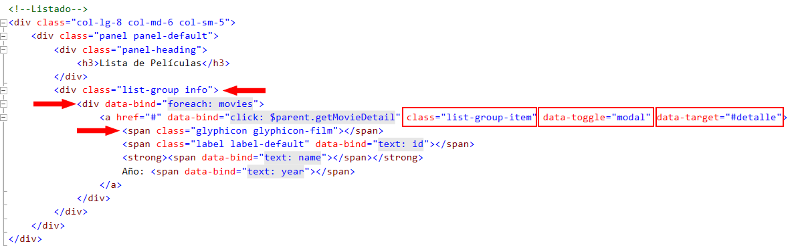

Acá debemos tener en cuenta los siguientes aspectos:

- No estamos utilizando listas de tipo 'ul' sino un div contenedor que utiliza la clase de bootstrap 'list-group info'.
- La etiqueta anchor 'a' va a contener toda la información, tiene la clase 'list-group-item' y tiene dos atributos especiales 'data-toggle="modal"' y 'data target="#detalle"' que nos indican que va a abrir una etiqueta modal cuyo control contenedor tiene el 'id="detalle"'.
- Agregamos un glifo que va a mostrarnos una imagen al lado izquierdo de cada elemento '<span class="glyphicon glyphicon-film"></span>'.

5- Ahora agregamos nuestro panel que contendrá el formulario para guardar nuevos datos.


- Este no tiene mayores variaciones en comparación con el ejercicio de la tarea 9 a escepcion de la clase en el div contenedor 'class="col-lg-4 col-md-4 col-sm-4"' esto es para que pueda distribuirse en los diferentes anchos de pantalla utilizando responsive design.
- Dentro de este agregamos el mensaje de error que deberá aparecer en el caso que exista algun error.

6- Agregamos nuestras etiquetas para obtener una ventana modal para mostrar el detalle:


- Este div contenedor deberá tener las siguientes propiedades: 'id=detalle' para que pueda ser llamado desde el clic sobre el elemento de la lista y la clase 'modal fade embed-responsive-item' lo que le dará un comportamiento modal con un fade que oscurecerá el resto de la página.
- Lo otro a tener encuenta es que el header del modal tendrá un botón que mostrará una 'x' y que esta asociado con el cerrar el modal. ```<button class="close" aria-hidden="True" data-dismiss="modal">&times;</button> ```
- El modal header también mostrará el título de la película con un titulo de tipo 'h3' ```<h3 class="modal-title" data-bind="text: detail().name"></h3>```
- En el 'footer' del modal agregamos un boton que permitirá cerrar la ventana, al igual que el elemento que colocamos en la parte superior derecha de la ventana modal.

7- Para finalizar, agregamos los llamados a los javascript necesarios para que se ejecuten las acciones.

```
<script src="~/Scripts/jquery-2.2.0.min.js"></script>
<script src="~/Scripts/knockout-3.4.0.js"></script>
<script src="~/Scripts/movie/movies.js"></script>
```

8- Lo que hemos construido deberá verse similar a:


9- Al hacer clic sobre alguno de los elementos de la lista aparecerá nuestra ventana modal con los detalles de la misma.


######La siguiente imagen muestra el código completo:


###Vínculos
####Vínculos de interés

Para compementar aquí les dejo vario vínculos que pueden ayudarles a profundizar en los temas aquí tratados:

- [Sitio de knockoutjs](http://knockoutjs.com/)
- [Tutoriales practicos de knockoutjs](http://learn.knockoutjs.com/)
- [Angularjs otra librería similar a knockout](http://learn.knockoutjs.com/)
- [Sitio de Bootstrap](http://getbootstrap.com/)
- [Iniciando con bootstrap](http://getbootstrap.com/getting-started/)
- [ASP.Net MVC](http://www.asp.net/mvc)
- [Microsoft Virtual Academy Cursos de MVC](https://mva.microsoft.com/search/SearchResults.aspx?q=MVC#!q=MVC&lang=1033)
- [Document DB GuitHub Previo](https://github.com/Ninja-Labs/azure/blob/master/6.%20WebApps%20MVC%20Core%20and%20Entity%20Framework/Lab%202/lab.md)
- [Curso de DocumentDB](https://channel9.msdn.com/Series/Ninja-Tips/31-NinjaTips-Desarrollo-DocumentDB-1-Vistazo-general)

###### Muchos éxitos y sigan disfrutando el código!!!

######HOL by @Manquip


