##Tarea 1 Creación de una App universal

1. Desde Visual Studio creamos un nuevo proyecto de app universal justo como se ve en el screenshot
    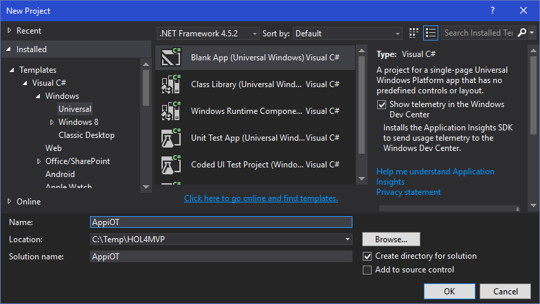 
1. Una vez creado procedemos a compilarlo, para obtener los paquetes necesarios.
1. Ejecutamos la solución en blanco y la cerramos
1. En el explorados de soluciones damos click derecho sobre el archivo `Package.appxmanifest` y seleccionamos `ViewCode`
    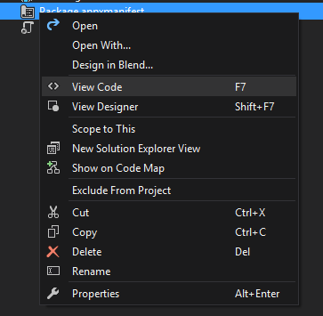 
1. Una vez abierto nos desplazamos hasta la parte final del archivo y nos aseguramos que la etiqueta `<Capabilities>` quede como se ve a continuación

    ```xml
    <Capabilities>
        <Capability Name="internetClient" />
        <DeviceCapability Name="microphone" />
        <DeviceCapability Name="webcam" />
    </Capabilities>
    ```
    
1. Esto autorizará la app para hacer uso del micrófono y la cámara
1. Desde el explorado de soluciones abrimos el archivo `MainPage.xaml` 
1. Nos aseguramos de pasar al modo de edición de código `XAML` dando doble click sobre la pestaña que aparece en la aprte inferior.  
    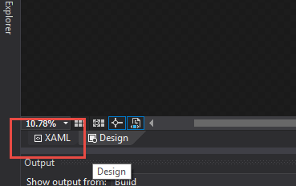 
1. Reemplazamos el objeto `<Grid>` por el código que viene a continuación 

    ```xml
    <Grid Background="{ThemeResource ApplicationPageBackgroundThemeBrush}" 
          HorizontalAlignment="Stretch" 
          VerticalAlignment="Stretch">
        <Grid.ColumnDefinitions>
            <ColumnDefinition Width="5*" />
            <ColumnDefinition Width="1*"/>
        </Grid.ColumnDefinitions>
    </Grid>   
    ```
    
1. Justo abajo de los tag `Grid.ColumnDefinitions` crearemos un objeto de tipo `CaptureElement` que será el que mostrará el preview de la cámara y justo encima de el colocaremos un objeto `Canvas` sobre el cual podremos dibujar encima del preview de la cámara.

    ```xml
        <CaptureElement Width="800" Height="448" x:Name="PhotoPreview" Grid.Column="0"/>
        
        <Canvas x:Name="canvas" Grid.Column="0"  
                Width="800" Height="448">
        </Canvas> 
    ```
    
1. Debemos notar que cada uno de los objetos tiene un nombre asignado, unas dimensiones y de manera muy importante debemos notar que a cada uno se le indica en que columna del `Grid` definido en el paso anterior deben qudar los objetos. Ámbos están en la misma Columna.
1. Justp debajo del `<Canvas>` debemos crear un objeto `<Button>` en la segunda Columna y con un manejador de eventos para cuando se le haga Click.

    ```xml
        <Button x:Name="Picture" 
                Grid.Column="1" Height="200" 
                Width="200" 
                HorizontalAlignment="Stretch"
                Click="Picture_Click">
            Photo!
        </Button>
     ```
     
1. Ebrimos el archivo `MainPage.xaml.cs` que es el code behind de la UI creada anteriormente, nos desplazamos hasta el final del archivo y justo antes de los dos últimos brackets `}` pegamos este código.
    
    ```csharp
        private async void Picture_Click(object sender, RoutedEventArgs e)
        {

        } 
    ```  
    
##Tarea 2 Preparando para trabajar con la webcam y proyecto Oxford

1. En las referencias del proyecto damos click derecho y seleccionaos `Manage Nuget Packages`
1. En el recuadro que se abre vamos a `Browse` y buscamos `Emotion`, en el listado que aparece ubicamos `Microsoft.ProjectOxford.Emotion` y procedemos a instalarlo.
    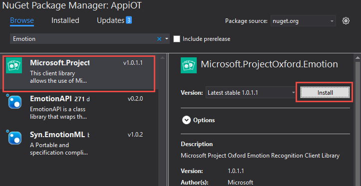 
1. Alobservar las referencias en el explorador de soluciones podremos observar las nuevas referencias adicionadas. Emotion es una API de reconocimiento facial que permite determinar las expresiones de las personas.
1. En el proyecto adicionamos una nueva clase y la llamaremos `EmotionCapturer.cs`    
    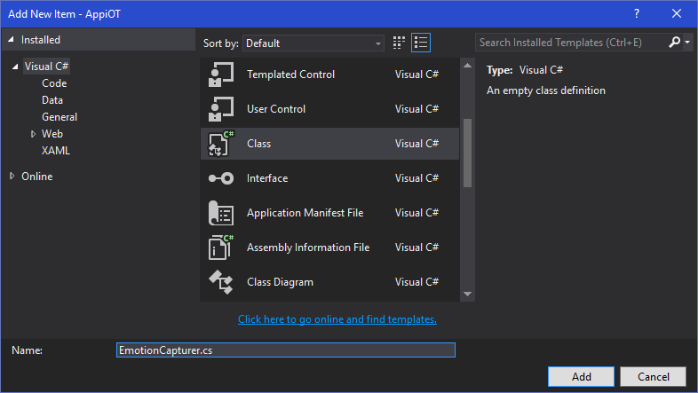
1. En dicha clase nos aseguramos de tener todos estos `using`

    ```csharp
    using Microsoft.ProjectOxford.Emotion;
    using Microsoft.ProjectOxford.Emotion.Contract;
    using System;
    using System.Diagnostics;
    using System.IO;
    using System.Linq;
    using System.Threading.Tasks;
    using Windows.Media.Capture;
    using Windows.Media.MediaProperties;
    using Windows.Storage.Streams;  
    ```
    
1. Justo al inicio de la clase adicionamos estos campos, propiedades y métodos

    ```csharp
        ImageEncodingProperties _imgFormat = ImageEncodingProperties.CreateJpeg();
        MediaCapture _takePhotoManager;
        public MediaCapture PhotoManager { get { return _takePhotoManager; } }
        EmotionServiceClient emotionServiceClient = new EmotionServiceClient("YOUR_API_KEY");

        public async Task<Emotion[]> RecognizeAsync(Stream picture) => await emotionServiceClient.RecognizeAsync(picture);
        public async Task StartPreviewAsync() => await _takePhotoManager.StartPreviewAsync();  
    ```    
    
1. Creamos un método que nos permita inicializar todo lo que se necesario.

    ```csharp
        public async Task InitializeAsync()
        {
            await InitializeCameraAsync();
            await InitializeEmotionAPIAsync();
        }
    ```
    
1. Desde luego ninguno de estos métodos existe aún así procedemos a crearlos, los componentes de la webcam y de la API `Emotion` suelen tomarse un tiempo para inicializar y usualmente son postergados a su primer uso, así que una manera de optimizar la experiencia de usuario es tomando una foto falsa al inicio y mandarla a la API. Aún no sabemos como tomar fotos pero dejaremos este código escrito simulando la obtención de la foto y luego si ejecutando un llamado real a la API.

    ```csharp
        private async Task InitializeEmotionAPIAsync()
        {
            using (var picture = await CapturePictureAsync())
            {
                await emotionServiceClient.RecognizeAsync(picture);
            }
        }
    ``` 
    
1. De acuerdo a como utilizamos las API de emotion necesitamos un fotografía cargada en memoria, así que utilzamos el objeto `_takePhotoManager` para capturar la foto con el formato indicado y una vez la tenemos la ponemos en un formato compatible con la API.

    ```csharp
        public async Task<Stream> CapturePictureAsync()
        {
            var stream = new InMemoryRandomAccessStream();
            await _takePhotoManager.CapturePhotoToStreamAsync(_imgFormat, stream);
            var outstream = stream.AsStream();
            outstream.Position = 0;

            return outstream;
        } 
    ```         
           
1. Ya tenemos el código para inicializar la API `Emotion` pero nos hace falta inicializar la cámara para poderla usar, es decir el método `InitializeCameraAsync`. Inicializamos `_takePhotoManager` 

    ```csharp
        private async Task InitializeCameraAsync()
        {
            _takePhotoManager = new MediaCapture();

            var settings = new MediaCaptureInitializationSettings
            { StreamingCaptureMode = StreamingCaptureMode.Video };

            await _takePhotoManager.InitializeAsync();
        }
    ```
    
1. Una vez inicializado debemos establecer una resolución adecuada, como no conocemos las cpacidades de tu webcam debemos preguntar porque resoluciones soporta, para ello enseguida de `_takePhotoManager.InitializeAsync()` obtendremos las resoluciones posibles para fotos y las listaremos en la consola de depuración.

    ```csharp
        private async Task InitializeCameraAsync()
        {
            _takePhotoManager = new MediaCapture();

            var settings = new MediaCaptureInitializationSettings
            { StreamingCaptureMode = StreamingCaptureMode.Video };

            await _takePhotoManager.InitializeAsync();

            var res = _takePhotoManager.VideoDeviceController.GetAvailableMediaStreamProperties(MediaStreamType.Photo);

            foreach (VideoEncodingProperties resolution in res)
            {
                Debug.WriteLine($"W: {resolution.Width} H: {resolution.Height} FRate: {resolution.FrameRate.Numerator / (double)resolution.FrameRate.Denominator}");
            }
        }
     ```   
     
1. Para hacer funcionar la API necesitamos un key, así que par encontrar el key debemos ir a https://www.projectoxford.ai/ e iniciamos sesión.
1. Una vez iniciada la sesión vamos a `My subscriptions`
    
    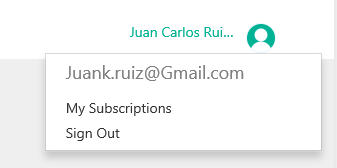
1. En el listado seleccionamos "Emotion API - Free" y donde dice "Primary Key" le damos click en `Show`, allí obtendremos el API KEY.
1. En el inicio de la clase `EmotionCapturer.cs` ubicamos esta línea y ponemos allí el API KEY.

    ```csharp
    EmotionServiceClient emotionServiceClient = new EmotionServiceClient("YOUR_API_KEY");
    ```
    
1. Abrimos `MainPage.xaml` en modo de edcición de XAML, en el tag inicial `<Page>` adicionamos `Loaded="Page_Loaded"`
 quedando así
 
    ```xml
    <Page
    x:Class="AppiOT.MainPage"
    xmlns="http://schemas.microsoft.com/winfx/2006/xaml/presentation"
    xmlns:x="http://schemas.microsoft.com/winfx/2006/xaml"
    xmlns:local="using:AppiOT"
    xmlns:d="http://schemas.microsoft.com/expression/blend/2008"
    xmlns:mc="http://schemas.openxmlformats.org/markup-compatibility/2006"
    mc:Ignorable="d" Loaded="Page_Loaded">
    ```
 
1. Abrimos `MainPage.xaml.cs` y justo al inicio de la clase declaramos el siguiente campo del tipo `EmotionCapturer`

    ```csharp
    EmotionCapturer _emotionCapturer = new EmotionCapturer();
    ```
    
1. Debajo de donde habiamos creado el método `Picture_Click` crearemos ahora el siguiente método. En el cual inicializamos el objeto  `EmotionCapturer` y lo vinculamos con la interfaz gráfica con el objeto `PhotoPreview` creado en el XAML. Finalmente inicializamos la vista previa llamando `_emotionCapturer.StartPreviewAsync()`

    ```csharp
        private async void Page_Loaded(object sender, RoutedEventArgs e)
        {
            await _emotionCapturer.InitializeAsync();
            PhotoPreview.Source = _emotionCapturer.PhotoManager;
            await _emotionCapturer.StartPreviewAsync();
        }
    ```
    
1. Hora de hacer mágia! ejecutemos la aplicación y esta ya muestra la webcam ;)
1. Suspendamosla y en Visual Studio vamos a la vemntana `output`, sino la vez pudes ir al costado superior derecho y buscarla

    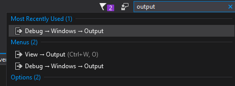
1. En esta ventana has scroll hacia arriba hasta encontrar el listado de resoluciones permitidas por la webcam.
    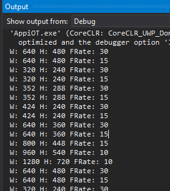
1. Toma nota de alguna de las que tiene `W:800` y `FRate:30`, toma nota tambien del `H:`
1. Regresamos a `EmotionCapturer` justo despúes de donde quedamos, abajo del `foreach`
1. Allí buscaremos una resolución adecuada a nuestras necesidades utilizando una consulta de `linq`, en mi caso los datos seleccionados fueron : W: 800, H:448, FRate:30

    ```csharp
            var resolutionProperty = (from VideoEncodingProperties resolution in res
                                      where resolution.Width == 800
                                      && resolution.Height == 448
                                      && resolution.FrameRate.Numerator / (double)resolution.FrameRate.Denominator == 30
                                      select resolution).FirstOrDefault(); 
    ```
1. Una vez hallada la propiedad de resolución se la asignamos a la webcam

    ```csharp
            if (resolutionProperty != null)
                await _takePhotoManager.VideoDeviceController.SetMediaStreamPropertiesAsync(MediaStreamType.VideoPreview, resolutionProperty);
            else
                throw new Exception("INVALID RESOLUTION");    
    ```
     
1. El código completo de este método se muestra a continuación

    ```csharp
        private async Task InitializeCameraAsync()
        {
            _takePhotoManager = new MediaCapture();

            var settings = new MediaCaptureInitializationSettings
            { StreamingCaptureMode = StreamingCaptureMode.Video };

            await _takePhotoManager.InitializeAsync();

            var res = _takePhotoManager.VideoDeviceController.GetAvailableMediaStreamProperties(MediaStreamType.Photo);

            foreach (VideoEncodingProperties resolution in res)
            {
                Debug.WriteLine($"W: {resolution.Width} H: {resolution.Height} FRate: {resolution.FrameRate.Numerator / (double)resolution.FrameRate.Denominator}");
            }

            var resolutionProperty = (from VideoEncodingProperties resolution in res
                                      where resolution.Width == 800
                                      && resolution.Height == 448
                                      && resolution.FrameRate.Numerator / (double)resolution.FrameRate.Denominator == 30
                                      select resolution).FirstOrDefault();

            if (resolutionProperty != null)
                await _takePhotoManager.VideoDeviceController.SetMediaStreamPropertiesAsync(MediaStreamType.VideoPreview, resolutionProperty);
            else
                throw new Exception("INVALID RESOLUTION");
        }
    ```
    
1. Vamos a `MainPage.xaml`, y nos aseguramos que estos objetos tengan las medidas que correspondientes al tamaño de la camara que hemos seleccionado, quedando en mi caso así

    ```xml
        <CaptureElement Width="800" Height="448" x:Name="PhotoPreview" Grid.Column="0"/>
        
        <Canvas x:Name="canvas" Grid.Column="0"  
                Width="800" Height="448">
        </Canvas>    
    ```
    
1. Ejecutamos la aplicación y veremos como se ha adaptado el preview    
1. Con esto ya tenemos ajustada la funcionalidad de `EmotionCapturer.cs`
   
##Tarea 3 Poniendo la Webcam y Emotion en marcha

1. Vamos s dibujar un rostro sobre las caras detectadas por la webcam
1. En `MainPage.xaml.cs` agregamos todos estos `using`

    ```csharp
    using Microsoft.ProjectOxford.Emotion.Contract;
    using System;
    using System.Linq;
    using System.Threading.Tasks;
    using Windows.UI;
    using Windows.UI.Xaml;
    using Windows.UI.Xaml.Controls;
    using Windows.UI.Xaml.Media;
    using Windows.System.Threading;
    using System.Text;
    ```
    
1. Emotion nos devuelve por cada foto un grupo de rectangulos, pero estos rectangulos no los podemos dibujar en un App así nada más; así que debemos convertirlos a rectangulos 'dibujables' Y para ponerle algo de picante le pondremos algunos colores de manera aleatoria. Todo esto con este  código que adicionaremos a `MainPage.xaml.cs`

    ```csharp
        static readonly Color[] colores = new Color[] { Colors.Green, Colors.Red, Colors.Blue,
                                                        Colors.White, Colors.Pink, Colors.Salmon,
                                                        Colors.Violet, Colors.LimeGreen, Colors.Lime };
        Random rnd = new Random(Environment.TickCount);
        static readonly int max = colores.Count();
        Color GetRandomColor() => colores[rnd.Next(max - 1)];

        public UIElement ConvertToRectangle(Microsoft.ProjectOxford.Common.Rectangle emotionRectangle)
        {
            var margin = new Thickness() { Left = emotionRectangle.Left, Top = emotionRectangle.Top };
            return new Windows.UI.Xaml.Shapes.Rectangle()
            {
                Margin = margin,
                Height = emotionRectangle.Height,
                Width = emotionRectangle.Width,
                Stroke = new SolidColorBrush(GetRandomColor()),
                StrokeThickness = 3
            };
        }    
    ```
    
1. Creamos el método `CaptureAndShowUIAsync` donde llamaremos `_emotionCapturer` para tomar una foto y luego enviarla a reconocimiento de emociones. Adicinalmente utilizaremos `canvas` para dibujar los rectangulos que nos da emotion encima de cada fotografía.

    ```csharp
        private async Task CaptureAndShowUIAsync()
        {
            canvas.Children.Clear();
            Emotion[] emotionResult = null;
            using (var picture = await _emotionCapturer.CapturePictureAsync())
            {
                emotionResult = await _emotionCapturer.RecognizeAsync(picture);
            }

            foreach (var emotion in emotionResult)
            {
                canvas.Children.Add(ConvertToRectangle(emotion.FaceRectangle));
            }
        }
    ```
    
1. Buscamos el método `Picture_Click` y lo reemplazamos por lo siguiente

    ```csharp
    private async void Picture_Click(object o, RoutedEventArgs e) => await CaptureAndShowUIAsync();
    ```
    
1. Taraaaaaaaaaaaaaaan! Hora de probarlo, ejecutemos la App, pongámonos en frente de la cámara y demos click en el botón! un rectangulo se debe dibujar por cada rostro detectado.
1. Ahora volvámoslo una tarea más automática. Pero antes debemos aclarar que la API de `Emotion` tiene ciertos límites en l versión gratuita por lo que la máxima cantidad de transacciones por minuto es : 20. Por ello no podremos tener los cuadros actualizados tan rápido como quisieramos, pero es algo que podemo solucionar metiendonos la mano al bolsillo.
1. Apenas iniciando la clase `MainPage` agregaremos el siguiente campo

    ```csharp
        DispatcherTimer PeriodicTimer;
    ```
    
1. En el evento `PageLoaded` justo después de `_emotionCapturer.StartPreviewAsync()` inicializaremos el Timer y le pediremos que 20 veces por minuto tome una foto y dibuje los cuadros

    ```csharp
            PeriodicTimer = new DispatcherTimer
            {
                //dispararse 20 veces por minuto
                Interval = TimeSpan.FromMinutes(1 / 20d)
            };

            PeriodicTimer.Tick += async (o, ev) =>
                            {
                                try
                                {
                                    await CaptureAndShowUIAsync();
                                }
                                catch { }
                            };
    ```
    
1. Ahora inicializaremos el Timer, pero es posible que la cámara aún no este lista /hardware world/ por lo que pondremos una pequeña espera previa

    ```csharp
            await Task.Delay(2000);
            PeriodicTimer.Start();
    ```    

1. `Page_Loaded` completo queda así

    ```csharp
        private async void Page_Loaded(object sender, RoutedEventArgs e)
        {

            await _emotionCapturer.InitializeAsync();
            PhotoPreview.Source = _emotionCapturer.PhotoManager;
            await _emotionCapturer.StartPreviewAsync();

            PeriodicTimer = new DispatcherTimer
            {
                //dispararse 20 veces por minuto
                Interval = TimeSpan.FromMinutes(1 / 20d)
            };

            PeriodicTimer.Tick += async (o, ev) =>
                            {
                                try
                                {
                                    await CaptureAndShowUIAsync();
                                }
                                catch { }
                            };

            await Task.Delay(2000);
            PeriodicTimer.Start();
        }
    ```
    
1. Ponemos a ejecutar la App y podemos observar como 20 veces por minuto hace reconocimiento facial continuo.

##Tarea 4 Azure y el Internet de las cosas

1. Vamos al portal de **Azure** https://portal.azure.com e iniciamos sesión
1. Creamos un serviciode tipo iOT Hub
    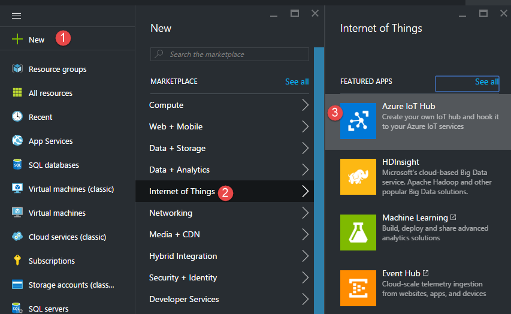
1. Le ponemos el nombre que deseemos, escogemos una zona cercana y lo configuramos en el tier gratuito     
    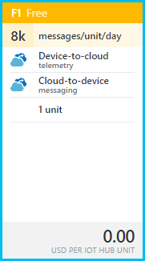
1. Una vez creado vamos a `All settings` > Shared Access Policies > y damos click en `iothubowner`

1. Allí tomamos notas de los Primary Key y connection String. 
    
    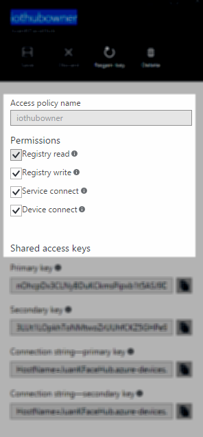
1. Sino tienes una cuenta de almacenamiento de Azure, es el momento de crear una 

    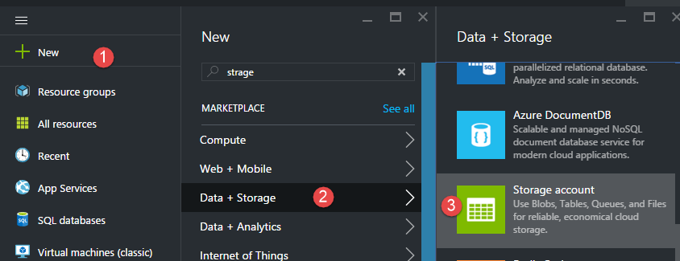
1. De igual manera toma nota de los access keys y connection strings
1. Ahora crearemos un Stream Analytics Job     

    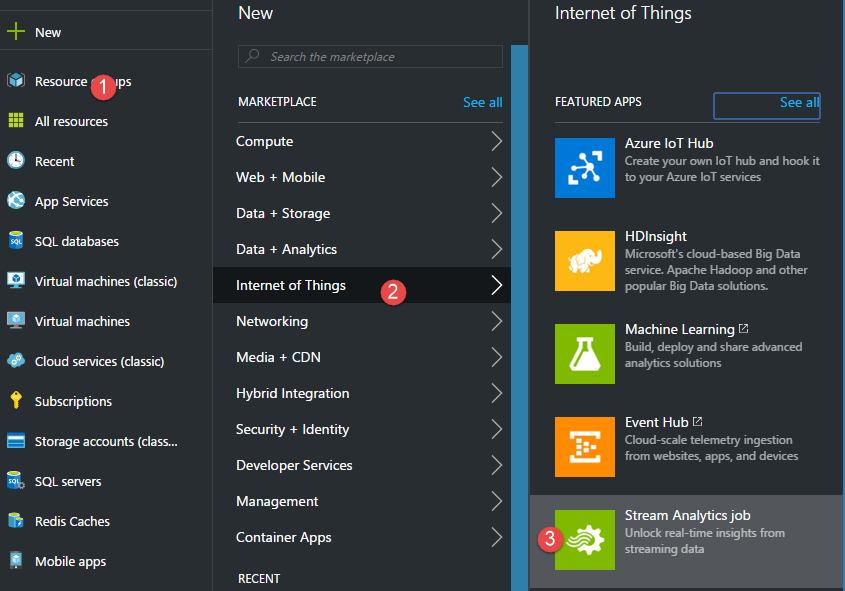
1. Una vez creado damos click en `Inputs` 
 
    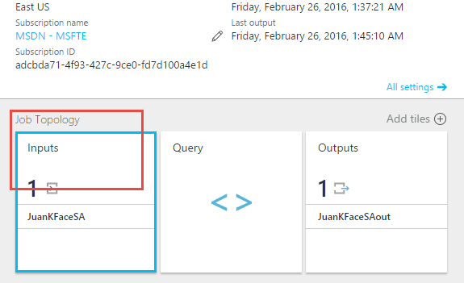
1. Y adicionamos uno nuevo de tipo `iOT Hub` al cual debes asignarle nombre,  los datos copiados anteriormente "Shared Policy Name" = iothubowner Y el key correspondiente. Formato JSON y encoding UTF-8

    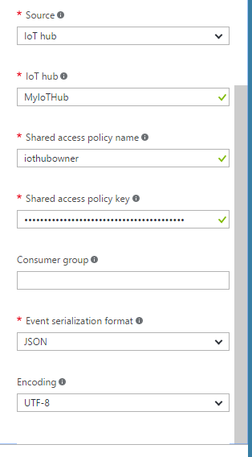
1. Ahora vamos a `Outputs` 

    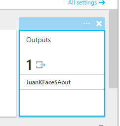
1. Agregamos nu nuevo output de tipo `Table Storage`, con el nombre preferido y con los datos de acceso del Storage ccount creado anteriormente. 
1. Los siguientes campos se dejan como se ve.

    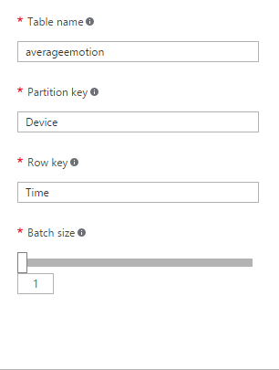
1. Ahora vamos a query

    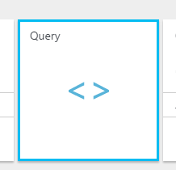
1. Allí colocamos el siguiente query, en el que debemos cambiar `JuanKFaceSA` y `JuanKFAceSAout` por el correspondiente nombre de `input` y `output` creados anteriormente.

    ```SQL
    WITH Sumas AS (
    SELECT Device,
        Sum(CAST(Anger     AS FLOAT)) as Anger, 
        sum(CAST(Contempt  AS FLOAT)) as Contempt , 
        sum(cast(Disgust   AS FLOAT)) as Disgust , 
        sum(cast(Happiness AS FLOAT)) as Happiness, 
        sum(cast(Neutral   AS FLOAT)) as Neutral, 
        sum(cast(Sadness   AS FLOAT)) as Sadness, 
        sum(cast(Surprise  AS FLOAT)) as Surprise
    FROM [JuanKFaceSA]
    WHERE Device is not null
    GROUP BY Device, TumblingWindow(second, 10)
    )
    SELECT Device, System.TimeStamp AS Time , 
    CASE WHEN Anger > Contempt 
        AND Anger > Disgust 
        AND Anger > Happiness 
        AND Anger > Neutral
        AND Anger > Sadness 
        AND Anger > Surprise THEN 'Anger'
        WHEN Contempt > Anger 
        AND Contempt > Disgust
        AND Contempt > Happiness 
        AND Contempt > Neutral
        AND Contempt > Sadness 
        AND Contempt > Surprise THEN 'Contempt'            
        WHEN Disgust > Anger 
        AND Disgust > Contempt
        AND Disgust > Happiness 
        AND Disgust > Neutral
        AND Disgust > Sadness 
        AND Disgust > Surprise THEN 'Disgust'    
        WHEN Happiness > Anger 
        AND Happiness > Contempt
        AND Happiness > Disgust 
        AND Happiness > Neutral
        AND Happiness > Sadness 
        AND Happiness > Surprise THEN 'Happiness'       
        WHEN Neutral > Anger 
        AND Neutral > Contempt
        AND Neutral > Disgust 
        AND Neutral > Happiness
        AND Neutral > Sadness 
        AND Neutral > Surprise THEN 'Neutral'  
        WHEN Sadness > Anger 
        AND Sadness > Contempt
        AND Sadness > Disgust 
        AND Sadness > Happiness
        AND Sadness > Neutral 
        AND Sadness > Surprise THEN 'Sadness'         
        WHEN Surprise > Anger 
        AND Surprise > Contempt
        AND Surprise > Disgust 
        AND Surprise > Happiness
        AND Surprise > Neutral 
        AND Surprise > Sadness THEN 'Surprise'  
        ELSE 'Neutral' END AS Emotion
    INTO [JuanKFAceSAout]       
    FROM Sumas 
    ```
    
1. Guardamos los datos.`
1. Desde el panel de Stream analytics damos play para iniciar el servicio.

   
1. Seguidamente en el panel que se abre damos click en Start.

##Tarea 5 Revisando el proceso desde Visual Studio

1. Desde Visual Studio vamos al `Cloud Explorer` , el cual sino lo encuentras puedes hallarlo en el panel de búsqueda de la superior derecha.

    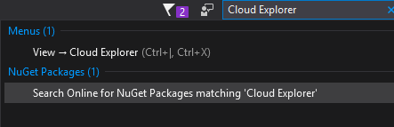
1. Matriculamos nuestra cuenta de Azure y vamos a Storage Accounts donde debemos ya ver la tabla `averageemotion`

    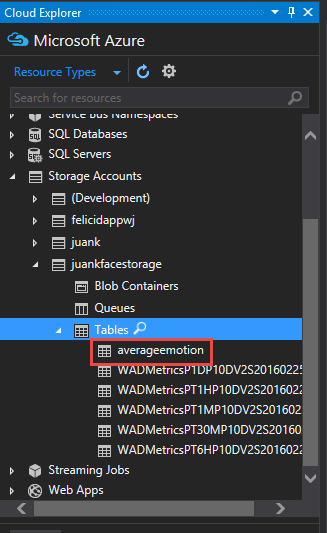
1. Damos doble click a la tabla para que se vea el editor

##Tarea 6 Enviando datos al iOT Hub

1. Regresamos al proyecto y agregamos dos nuevos paquetes de nuget
    * Microsoft.Azure.Devices.Client
    * Newtonsoft.Json
1. En `MainPage.xaml.cs` agregamos estos `using`

    ```csharp
    using Microsoft.Azure.Devices.Client;
    using Newtonsoft.Json;
    ```
    
1. Ahora debemos conectarnos al IoT Hub para ello declaramos el siguiente campo al inicio de la clase, cambiando desde luego "MY_IOT_HUB_CONN_STR" por el connection string del IoT Hub

    ```csharp
        DeviceClient deviceClient = DeviceClient.CreateFromConnectionString(
                "MY_IOT_HUB_CONN_STR",
                TransportType.Http1);
    ```
    
1. Crearemos un método `SendEmotionsToIoTHub` que dada una emoción recibida por la API de Emotion envie esos datos al Azure IoT Hub . La API de Emotion devuelve a parte del rectangulo de cada cara, un conjunto de 8 emociones valoradas con un valor de probabilidad. Subiremos estos valores al IoT Hub en Formato Json.

    ```csharp
        private async Task SendEmotionsToIoTHub(Emotion[] emotions)
        {
            var msgs = new Message[emotions.Length];

            for (int i = 0; i < emotions.Length; i++)
            {
                var emojson = JsonConvert.SerializeObject(
                    new
                    {
                        Device = "JuanKApp",
                        Anger = emotions[i].Scores.Anger,
                        Contempt = emotions[i].Scores.Contempt,
                        Disgust = emotions[i].Scores.Disgust,
                        Fear = emotions[i].Scores.Fear,
                        Happiness = emotions[i].Scores.Happiness,
                        Neutral = emotions[i].Scores.Neutral,
                        Sadness = emotions[i].Scores.Surprise,
                        Surprise = emotions[i].Scores.Anger
                    },
                    Formatting.Indented);
                msgs[i] = new Message(Encoding.UTF8.GetBytes(emojson));
            }
            await deviceClient.SendEventBatchAsync(msgs);
        }
    ```
    
1. Si te fijas el deviceClient puede enviar lotes de mensajes, o enviarlos de uno. En este ejemplo lo hemos hehco en lotes de manera que en cada envio se van tantos mensajes como objetos Emotion se reciban.
1. Regresamos al método `CaptureAndShowUIAsync` y justo al final haremos un llamado a la funcionalidad anterior adicionando.

    ```csharp
            await SendEmotionsToIoTHub(emotionResult);
    ```
    
1. Ejecutamos la aplicación.
1. Desde el "Cloud Explorer" abrimos nuevamente la tabla `averageemotion` y refrescamos los datos. Podemos ver como Stream Analytics esta colocando en la tabla el valor de la emoción promedio cada 10 segundos.
 
     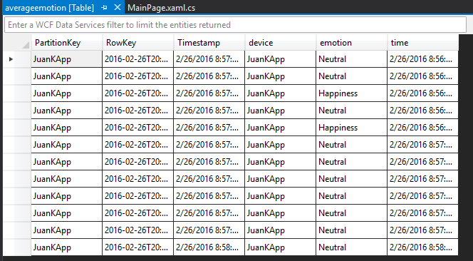
1. Fin NHK :alien: